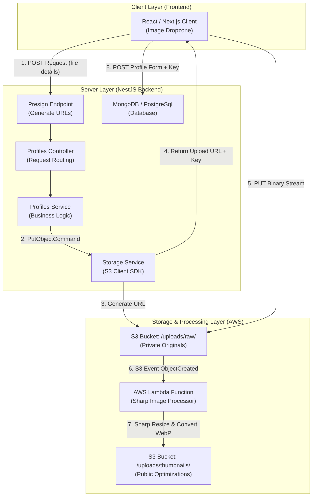
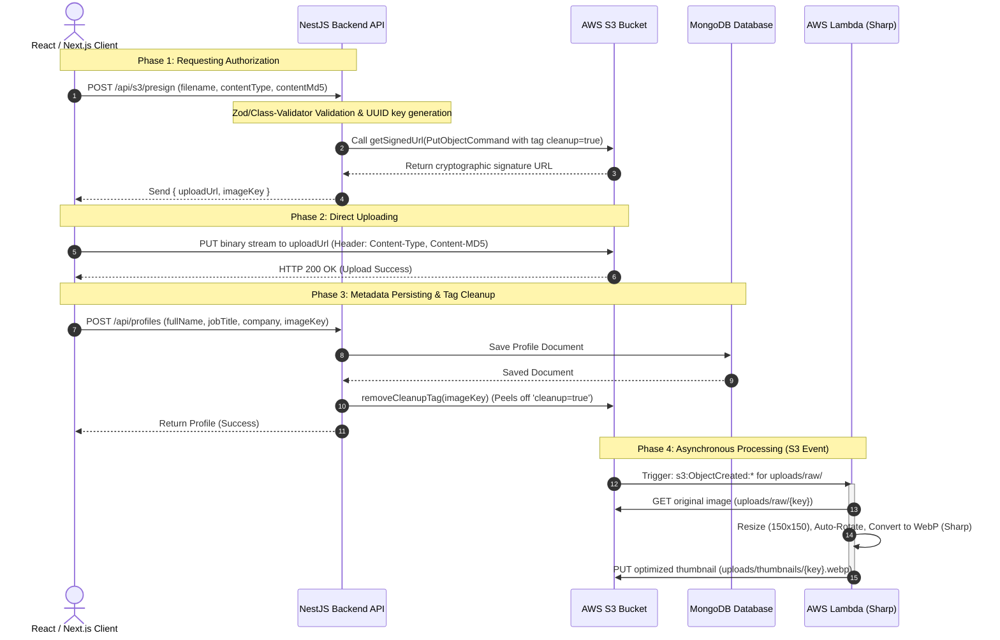
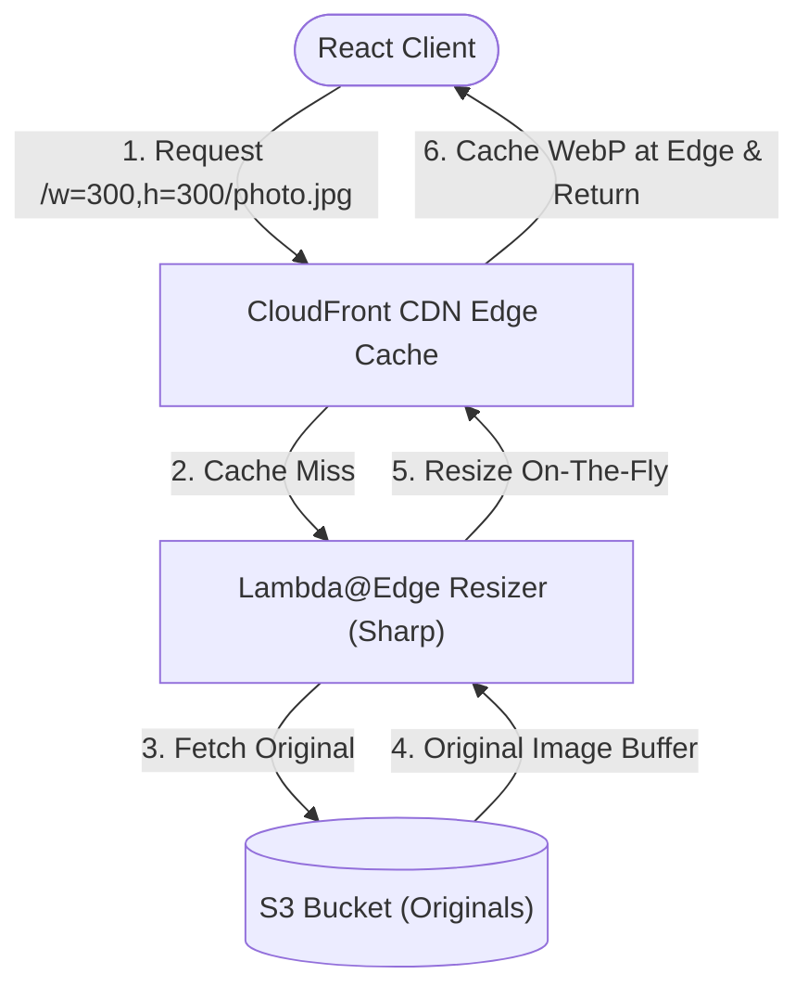

# 🏗️ Core Architecture Blueprint

This document details the system design, flow diagrams, and architectural blueprints for client-side direct uploads and image processing.

---

## 1. System Architecture Flow

In a traditional upload flow, the client sends files directly to the web server, which then processes them and forwards them to storage. While simple, this creates bottlenecks in CPU, memory, and bandwidth. 

Our architecture implements **Client-Side Direct Uploads via S3 Presigned URLs**, decoupled from database creation and processed asynchronously via **AWS Lambda**.

### System Architecture Flow Diagram

---

## 2. Complete Sequence Diagram (Start-to-Finish Lifecycle)

The following sequence details how the React client, NestJS backend, AWS S3, and Sharp Lambda interact to perform secure uploads and processing:

---

## 3. Scale & Architecture Blueprint (Enterprise Corporate Scale)

How do high-traffic tech platforms (e.g. Netflix, Airbnb, Amazon) scale direct-to-S3 uploads and millions of optimized image deliveries globally?

1. **Edge Upload Ingress:** Client uploads bypass the app servers and connect directly to the nearest S3 edge location using **S3 Transfer Acceleration** (Anycast routing over AWS backbone).
2. **On-Demand Dynamic Resizing (CDN pull-based):**
   Instead of preprocessing thumbnails for dozens of screen sizes using S3 Lambda triggers, enterprise systems use **CloudFront + Lambda@Edge/CloudFront Functions + Sharp** to dynamically resize images *on the fly*.
   * Saves petabytes of S3 storage costs.
   * Images are only generated at the exact requested width/height on-demand and cached directly at the CDN edges.

