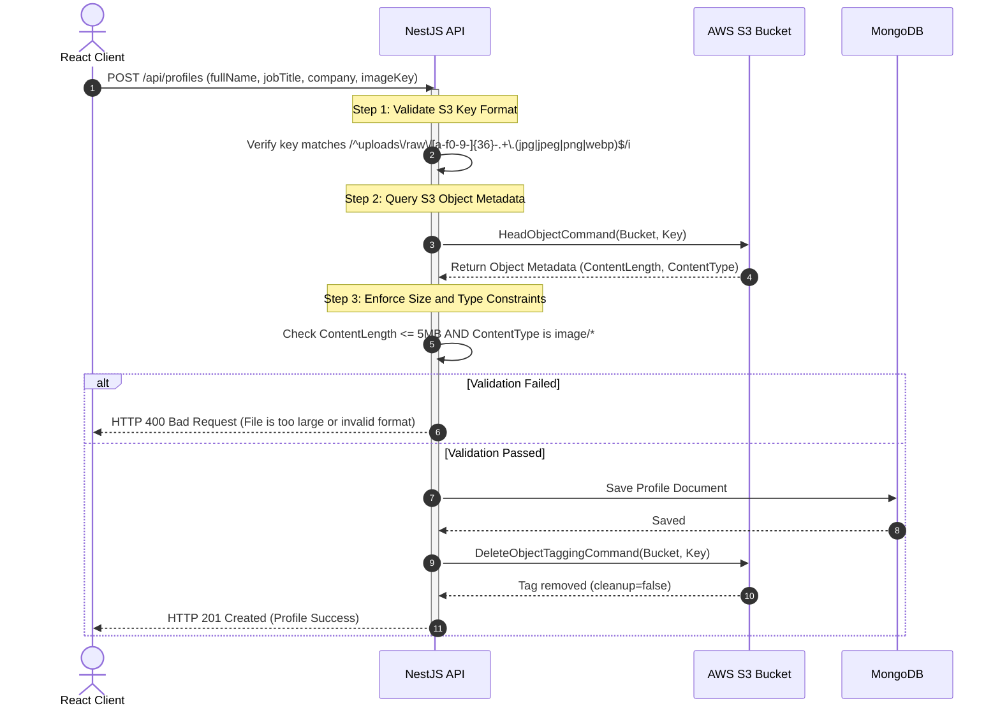
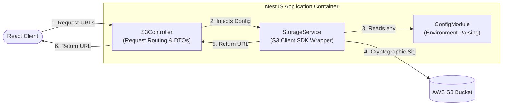

<style>
  code, pre, kbd, samp {
    font-family: 'Fira Code', ui-monospace, SFMono-Regular, "SF Mono", Menlo, Monaco, Consolas, "Liberation Mono", "Courier New", monospace !important;
  }
</style>

# ⚙️ NestJS Backend Caching & Validation Setup

This document details backend validation flows, NestJS controllers, DTO schemas, and storage wrapper services.

---

## 1. Advanced NestJS Backend Verification Checklist

To prevent malicious clients from hacking your storage (e.g., uploading massive videos to image endpoints, executing path-traversal attacks, or bypassing database registrations), NestJS MUST validate files on S3 before finalizing.

### Backend Validation Flow



### Implementing Validation in NestJS Controller

```typescript
// profiles.controller.ts
import { Controller, Post, Body, BadRequestException } from '@nestjs/common';
import { InjectModel } from '@nestjs/mongoose';
import { Model } from 'mongoose';
import { S3Client, HeadObjectCommand, DeleteObjectTaggingCommand } from '@aws-sdk/client-s3';
import { Profile, ProfileDocument } from './profile.schema';

@Controller('profiles')
export class ProfilesController {
  private s3Client = new S3Client({ region: process.env.AWS_REGION });
  private bucketName = process.env.S3_BUCKET_NAME;

  constructor(@InjectModel(Profile.name) private profileModel: Model<ProfileDocument>) {}

  @Post()
  async createProfile(@Body() body: any) {
    const { fullName, jobTitle, company, imageKey } = body;

    // ── STEP 1: VALIDATE S3 KEY REGEX PATTERN ─────────────────────────
    const s3KeyPattern = /^uploads\/raw\/[a-f0-9-]{36}-.+\.(jpg|jpeg|png|webp)$/i;
    if (!s3KeyPattern.test(imageKey)) {
      throw new BadRequestException('Invalid S3 object key format.');
    }

    try {
      // ── STEP 2: QUERY S3 OBJECT METADATA ───────────────────────────
      const s3Metadata = await this.s3Client.send(
        new HeadObjectCommand({
          Bucket: this.bucketName,
          Key: imageKey,
        })
      );

      // ── STEP 3: ENFORCE FILE CONSTRAINTS ON BACKEND ─────────────────
      const maxSize = 5 * 1024 * 1024; // 5MB limit
      const allowedMimes = ['image/jpeg', 'image/png', 'image/webp'];

      if (!s3Metadata.ContentLength || s3Metadata.ContentLength > maxSize) {
        throw new BadRequestException('Uploaded file exceeds the 5MB size limit.');
      }
      
      if (!s3Metadata.ContentType || !allowedMimes.includes(s3Metadata.ContentType)) {
        throw new BadRequestException('Uploaded file type is not allowed.');
      }

      // ── STEP 4: PERSIST TO DATABASE ─────────────────────────────────
      const newProfile = new this.profileModel({ fullName, jobTitle, company, imageKey });
      const savedProfile = await newProfile.save();

      // ── STEP 5: PEEL OFF CLEANUP TAG (SAVE FROM LIFECYCLE) ───────────
      await this.s3Client.send(
        new DeleteObjectTaggingCommand({
          Bucket: this.bucketName,
          Key: imageKey,
        })
      );

      return savedProfile;
    } catch (err: any) {
      if (err.name === 'NotFound' || err.$metadata?.httpStatusCode === 404) {
        throw new BadRequestException('The specified image was not found on S3. Upload might have failed.');
      }
      throw err;
    }
  }
}
```

---

## 2. Porting to NestJS (Enterprise Architecture Blueprint)

When implementing this pattern in a production NestJS backend, we decouple S3 operations, controllers, and schemas using TypeScript, Dependency Injection, and NestJS Config module.

### Layer Boundaries Diagram



### 1. DTO Definitions (`s3.dto.ts`)

```typescript
// s3.dto.ts
import { IsString, IsNotEmpty, IsNumber, IsArray, ValidateNested, IsOptional } from 'class-validator';
import { Type } from 'class-transformer';

export class PresignDto {
  @IsString()
  @IsNotEmpty()
  filename: string;

  @IsString()
  @IsNotEmpty()
  contentType: string;

  @IsString()
  @IsOptional()
  contentMd5?: string;
}

export class InitMultipartDto {
  @IsString()
  @IsNotEmpty()
  filename: string;

  @IsString()
  @IsNotEmpty()
  contentType: string;

  @IsNumber()
  size: number;
}

export class PartDto {
  @IsNumber()
  PartNumber: number;

  @IsString()
  @IsNotEmpty()
  ETag: string;
}

export class CompleteMultipartDto {
  @IsString()
  @IsNotEmpty()
  key: string;

  @IsString()
  @IsNotEmpty()
  uploadId: string;

  @IsArray()
  @ValidateNested({ each: true })
  @Type(() => PartDto)
  parts: PartDto[];
}
```

### 2. S3 Core SDK Wrapper (`storage.service.ts`)

```typescript
// storage.service.ts
import { Injectable } from '@nestjs/common';
import { ConfigService } from '@nestjs/config';
import { 
  S3Client, 
  PutObjectCommand, 
  CreateMultipartUploadCommand, 
  UploadPartCommand, 
  CompleteMultipartUploadCommand,
  DeleteObjectTaggingCommand 
} from '@aws-sdk/client-s3';
import { getSignedUrl } from '@aws-sdk/s3-request-presigner';

@Injectable()
export class StorageService {
  private s3Client: S3Client;
  private bucketName: string;

  constructor(private configService: ConfigService) {
    this.s3Client = new S3Client({
      region: this.configService.get<string>('AWS_REGION'),
      credentials: {
        accessKeyId: this.configService.get<string>('AWS_ACCESS_KEY_ID'),
        secretAccessKey: this.configService.get<string>('AWS_SECRET_ACCESS_KEY'),
      },
    });
    this.bucketName = this.configService.get<string>('S3_BUCKET_NAME');
  }

  async createPutUrl(key: string, contentType: string, contentMd5?: string): Promise<string> {
    const command = new PutObjectCommand({
      Bucket: this.bucketName,
      Key: key,
      ContentType: contentType,
      Tagging: 'cleanup=true',
      ContentMD5: contentMd5,
    });
    
    return getSignedUrl(this.s3Client, command, {
      expiresIn: 300,
      signableHeaders: new Set(['content-type', 'content-md5']),
    });
  }

  async initiateMultipartUpload(key: string, contentType: string): Promise<string> {
    const command = new CreateMultipartUploadCommand({
      Bucket: this.bucketName,
      Key: key,
      ContentType: contentType,
      Tagging: 'cleanup=true',
    });
    const res = await this.s3Client.send(command);
    if (!res.UploadId) throw new Error('Failed to initiate S3 multipart upload.');
    return res.UploadId;
  }

  async createUploadPartUrl(key: string, uploadId: string, partNumber: number): Promise<string> {
    const command = new UploadPartCommand({
      Bucket: this.bucketName,
      Key: key,
      UploadId: uploadId,
      PartNumber: partNumber,
    });
    return getSignedUrl(this.s3Client, command, { expiresIn: 1200 });
  }

  async completeMultipartUpload(key: string, uploadId: string, parts: { PartNumber: number; ETag: string }[]): Promise<void> {
    const command = new CompleteMultipartUploadCommand({
      Bucket: this.bucketName,
      Key: key,
      UploadId: uploadId,
      MultipartUpload: { Parts: parts },
    });
    await this.s3Client.send(command);
  }

  async removeCleanupTag(key: string): Promise<void> {
    const command = new DeleteObjectTaggingCommand({
      Bucket: this.bucketName,
      Key: key,
    });
    await this.s3Client.send(command);
  }
}
```

### 3. Controller Routing Layer (`s3.controller.ts`)

```typescript
// s3.controller.ts
import { Controller, Post, Body, HttpCode, HttpStatus, BadRequestException } from '@nestjs/common';
import { StorageService } from './storage.service';
import { PresignDto, InitMultipartDto, CompleteMultipartDto } from './s3.dto';
import { v4 as uuidv4 } from 'uuid';

@Controller('s3')
export class S3Controller {
  constructor(private readonly storageService: StorageService) {}

  @Post('presign')
  @HttpCode(HttpStatus.OK)
  async presign(@Body() dto: PresignDto) {
    const sanitizedFilename = dto.filename.replace(/\s+/g, '_').replace(/[^a-zA-Z0-9_.-]/g, '');
    const imageKey = `uploads/raw/${uuidv4()}-${sanitizedFilename}`;
    
    const uploadUrl = await this.storageService.createPutUrl(
      imageKey, 
      dto.contentType, 
      dto.contentMd5
    );
    
    return { uploadUrl, imageKey };
  }

  @Post('multipart/init')
  @HttpCode(HttpStatus.OK)
  async initMultipart(@Body() dto: InitMultipartDto) {
    const sanitizedFilename = dto.filename.replace(/\s+/g, '_').replace(/[^a-zA-Z0-9_.-]/g, '');
    const imageKey = `uploads/raw/${uuidv4()}-${sanitizedFilename}`;
    
    const uploadId = await this.storageService.initiateMultipartUpload(imageKey, dto.contentType);
    
    const chunkSize = 5 * 1024 * 1024;
    const numParts = Math.ceil(dto.size / chunkSize);
    
    const partPromises = Array.from({ length: numParts }, async (_, i) => {
      const partNumber = i + 1;
      const uploadUrl = await this.storageService.createUploadPartUrl(imageKey, uploadId, partNumber);
      return { partNumber, uploadUrl };
    });

    const parts = await Promise.all(partPromises);
    return { uploadId, key: imageKey, parts };
  }

  @Post('multipart/complete')
  @HttpCode(HttpStatus.OK)
  async completeMultipart(@Body() dto: CompleteMultipartDto) {
    try {
      await this.storageService.completeMultipartUpload(dto.key, dto.uploadId, dto.parts);
      return { success: true };
    } catch (err: any) {
      throw new BadRequestException('Failed to complete multipart upload: ' + err.message);
    }
  }
}
```

### 4. NestJS Module Setup (`s3.module.ts`)

```typescript
// s3.module.ts
import { Module } from '@nestjs/common';
import { ConfigModule } from '@nestjs/config';
import { S3Controller } from './s3.controller';
import { StorageService } from './storage.service';

@Module({
  imports: [ConfigModule],
  controllers: [S3Controller],
  providers: [StorageService],
  exports: [StorageService],
})
export class S3Module {}
```
