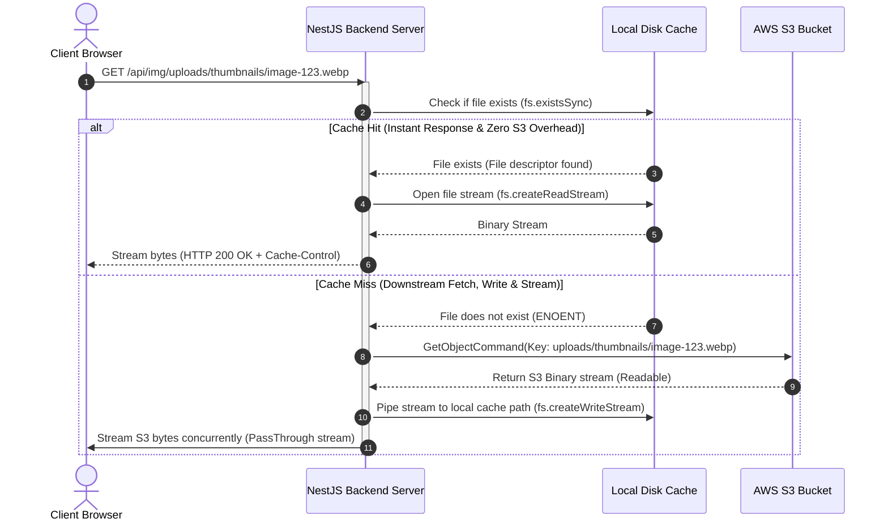
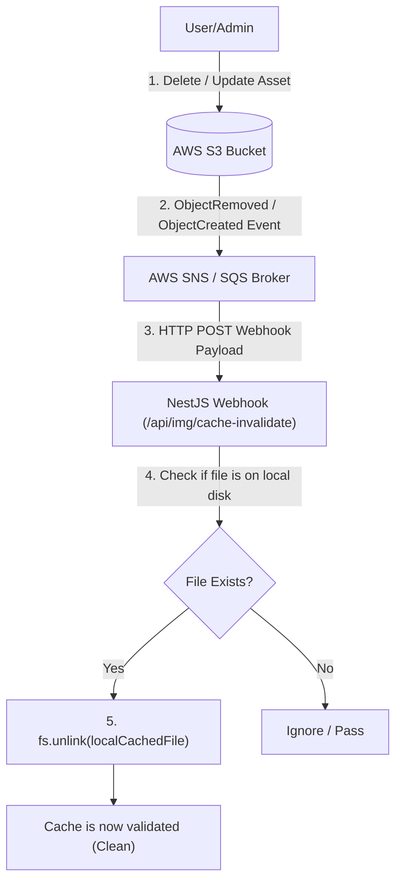
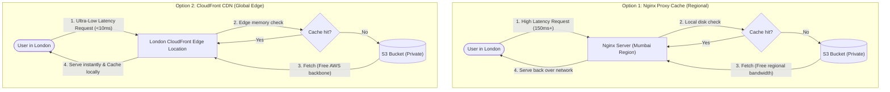

<style>
  code, pre, kbd, samp {
    font-family: 'Fira Code', ui-monospace, SFMono-Regular, "SF Mono", Menlo, Monaco, Consolas, "Liberation Mono", "Courier New", monospace !important;
  }
</style>

# 💾 Caching Strategies: Local Cache vs. Nginx vs. CloudFront CDN

This document provides details on caching strategies, local file system read-through proxies, Nginx proxy configs, and an in-depth cost/performance showdown between Nginx and AWS CloudFront.

---

## 1. Local File System Caching & Production Alternatives

In systems where deploying a Content Delivery Network (CDN) like AWS CloudFront is cost-prohibitive, complex, or unavailable, **Local File System Caching** serves as a powerful alternative. By proxying S3 assets through your backend NestJS/Node server and caching them on the local disk, you can dramatically improve response speeds and eliminate S3 read/egress costs for frequently requested images.

### Caching Architecture (Read-Through Proxy Pattern)

Rather than redirecting the client browser directly to AWS S3, the browser calls an image endpoint hosted on the application server. The backend acts as a **Read-Through Proxy** with a local caching layer:



### NestJS Caching Service Blueprint

#### 1. Local Cache Service (`local-cache.service.ts`)

```typescript
// local-cache.service.ts
import { Injectable, StreamableFile, NotFoundException, InternalServerErrorException } from '@nestjs/common';
import { ConfigService } from '@nestjs/config';
import { S3Client, GetObjectCommand } from '@aws-sdk/client-s3';
import * as fs from 'fs';
import * as path from 'path';
import { Readable, PassThrough } from 'stream';

@Injectable()
export class LocalCacheService {
  private s3Client: S3Client;
  private bucketName: string;
  private cacheDir: string;

  constructor(private configService: ConfigService) {
    this.s3Client = new S3Client({
      region: this.configService.get<string>('AWS_REGION'),
    });
    this.bucketName = this.configService.get<string>('S3_BUCKET_NAME');
    
    this.cacheDir = path.join(process.cwd(), 'cache');
    if (!fs.existsSync(this.cacheDir)) {
      fs.mkdirSync(this.cacheDir, { recursive: true });
    }
  }

  async getCachedImage(imageKey: string): Promise<StreamableFile> {
    const sanitizedKey = path.normalize(imageKey).replace(/^(\.\.(\/|\\))+/, '');
    const localFilePath = path.join(this.cacheDir, sanitizedKey);
    const localFileDir = path.dirname(localFilePath);

    // CACHE HIT
    if (fs.existsSync(localFilePath)) {
      const fileStream = fs.createReadStream(localFilePath);
      return new StreamableFile(fileStream);
    }

    // CACHE MISS
    try {
      const response = await this.s3Client.send(
        new GetObjectCommand({
          Bucket: this.bucketName,
          Key: imageKey,
        })
      );

      const s3Stream = response.Body as Readable;
      if (!s3Stream) {
        throw new NotFoundException('Requested object is empty.');
      }

      if (!fs.existsSync(localFileDir)) {
        fs.mkdirSync(localFileDir, { recursive: true });
      }

      const writeStream = fs.createWriteStream(localFilePath);
      const clientStream = new PassThrough();
      
      s3Stream.pipe(writeStream);
      s3Stream.pipe(clientStream);

      writeStream.on('error', (err) => {
        console.error(`Cache Write Error for file ${imageKey}:`, err);
      });

      return new StreamableFile(clientStream);
    } catch (err: any) {
      if (err.name === 'NoSuchKey' || err.$metadata?.httpStatusCode === 404) {
        throw new NotFoundException('The requested asset does not exist on S3.');
      }
      throw new InternalServerErrorException('Failed to retrieve S3 asset: ' + err.message);
    }
  }

  async invalidateKey(imageKey: string): Promise<void> {
    const sanitizedKey = path.normalize(imageKey).replace(/^(\.\.(\/|\\))+/, '');
    const localFilePath = path.join(this.cacheDir, sanitizedKey);
    
    if (fs.existsSync(localFilePath)) {
      await fs.promises.unlink(localFilePath);
      console.log(`[Cache Invalidation] Evicted: ${imageKey}`);
    }
  }
}
```

#### 2. Local Cache Controller Routing (`local-cache.controller.ts`)

```typescript
// local-cache.controller.ts
import { Controller, Get, Param, Res, Header, StreamableFile, Post, Body, HttpCode, HttpStatus } from '@nestjs/common';
import { LocalCacheService } from './local-cache.service';

@Controller('api/img')
export class LocalCacheController {
  constructor(private readonly cacheService: LocalCacheService) {}

  @Get('uploads/thumbnails/:filename')
  @Header('Cache-Control', 'public, max-age=31536000, immutable')
  @Header('Content-Type', 'image/webp')
  async getThumbnail(@Param('filename') filename: string): Promise<StreamableFile> {
    const s3Key = `uploads/thumbnails/${filename}`;
    return this.cacheService.getCachedImage(s3Key);
  }

  @Get('uploads/raw/:filename')
  @Header('Cache-Control', 'public, max-age=86400')
  @Header('Content-Type', 'image/jpeg')
  async getRawImage(@Param('filename') filename: string): Promise<StreamableFile> {
    const s3Key = `uploads/raw/${filename}`;
    return this.cacheService.getCachedImage(s3Key);
  }

  @Post('cache-invalidate')
  @HttpCode(HttpStatus.OK)
  async invalidateCache(@Body() payload: { key: string }) {
    if (payload.key) {
      await this.cacheService.invalidateKey(payload.key);
      return { status: 'success', evicted: payload.key };
    }
    return { status: 'ignored' };
  }
}
```

### Critical Caching Challenges & Mitigations

#### 1. Disk Space Exhaustion (Least Recently Used Eviction)
Implement a background cron script inside NestJS to audit the cache directory and delete the oldest accessed files (`atime`) once the directory size exceeds the 5GB quota.

```typescript
// cache-pruner.cron.ts
import { Injectable } from '@nestjs/common';
import { Cron, CronExpression } from '@nestjs/schedule';
import * as fs from 'fs';
import * as path from 'path';

@Injectable()
export class CachePrunerCron {
  private cacheDir = path.join(process.cwd(), 'cache');
  private maxCacheSizeInBytes = 5 * 1024 * 1024 * 1024; // 5 GB limit

  @Cron(CronExpression.EVERY_DAY_AT_MIDNIGHT)
  async pruneCache() {
    console.log('[Cache Pruner] Starting audit...');
    const files = await this.getAllCacheFiles(this.cacheDir);
    
    let currentSize = files.reduce((acc, f) => acc + f.size, 0);
    if (currentSize <= this.maxCacheSizeInBytes) return;

    files.sort((a, b) => a.atimeMs - b.atimeMs);

    for (const file of files) {
      if (currentSize <= this.maxCacheSizeInBytes * 0.8) {
        break; // Evict until 80% quota (4GB)
      }
      await fs.promises.unlink(file.path);
      currentSize -= file.size;
      console.log(`[Cache Pruner] Evicted due to disk limits: ${file.path}`);
    }
  }

  private async getAllCacheFiles(dir: string): Promise<{ path: string; size: number; atimeMs: number }[]> {
    // Recursively scans files, calls fs.promises.stat() and returns statistics
    return [];
  }
}
```

#### 2. Event-Driven Cache Invalidation
Whenever S3 objects are updated or deleted, set up an S3 Object Event trigger to issue a POST request payload containing `{ key }` to the `/api/img/cache-invalidate` endpoint, unlinking the file from the local cache folder.



---

## 2. Nginx Reverse Proxy Cache (Alternative Strategy)

Instead of forcing NestJS/Node.js to handle file streaming, Nginx sits in front of S3. When a file is requested, Nginx handles caching the file on its local disk and serving it directly.

```nginx
# nginx.conf (Nginx Reverse Proxy cache for Private S3 origin)
proxy_cache_path /var/cache/nginx levels=1:2 keys_zone=s3_cache:10m max_size=10g inactive=60m use_temp_path=off;

server {
    listen 80;
    server_name images.yourdomain.com;

    location / {
        proxy_cache s3_cache;
        proxy_cache_valid 200 24h;
        proxy_cache_use_stale error timeout updating http_500 http_502 http_503 http_504;
        proxy_cache_lock on;

        # Forward request to S3 bucket
        proxy_pass https://sujankshrestha-bucket.s3.ap-south-1.amazonaws.com;
        proxy_set_header Host sujankshrestha-bucket.s3.ap-south-1.amazonaws.com;
        proxy_hide_header x-amz-id-2;
        proxy_hide_header x-amz-request-id;
        proxy_hide_header x-amz-meta-s3cmd-attrs;
        proxy_hide_header Set-Cookie;
        proxy_ignore_headers Set-Cookie Cache-Control;
        
        add_header X-Cache-Status $upstream_cache_status; # HIT or MISS
    }
}
```

* **Pros:** Nginx performs caching in high-performance C. Offloads Node.js completely.
* **Cons:** Harder to validate user authentication dynamically (requires sub-requests or Lua scripting).

---

## 3. ⚖️ The Caching Showdown: Nginx Cache vs. AWS CloudFront CDN

For high-scale production systems, choosing between **Nginx Reverse Proxy Caching** and **AWS CloudFront CDN** is a critical architectural decision. Below is an in-depth breakdown of their differences, cost efficiencies, performance profiles, and common myths.

### Caching Latency Path Comparison



### 📊 Side-by-Side Architectural Matrix

| Metric | ⚡ Nginx Reverse Proxy Cache | 🚀 AWS CloudFront CDN + OAC |
| :--- | :--- | :--- |
| **Network Reach** | **Single Point (Regional):** Bound to the physical location of the VM hosting Nginx. | **Global Edge Network:** 450+ Points of Presence (PoPs) globally. |
| **Edge Latency** | High for cross-region users (e.g. 150ms–300ms round-trip). | **Minimal ($<10\text{ms}$ globally on cache hits).** |
| **Compute Overhead** | **High VM management:** Needs EC2/VPS instances running, auto-scaling, and OS updates. | **Serverless / Fully Managed:** Zero compute maintenance or scaling configurations. |
| **Disk Storage Costs** | **EBS Volume costs:** You pay for SSD size to store cached files. Disk full = Server crash. | **Zero:** Caches directly at edge nodes, storage is fully managed by AWS at no extra fee. |
| **SSL/TLS Management** | Manual (Let's Encrypt cron scripts, certbot, and config setup). | **Automated:** AWS Certificate Manager handles free wildcard SSL/TLS renewals automatically. |
| **Egress Bandwidth Rates** | Expensive VM Egress rates ($0.09 per GB out of EC2). | **1 TB per month permanent FREE tier**, then cheaper regional rates (average $0.08 per GB). |
| **DDoS / Flood Shielding** | Vulnerable. Attacks consume VM CPU/Network, crashing your application gateway. | **Robust:** Built-in AWS Shield Standard protects the edge network. WAF handles application filtering. |

### 💰 Detailed Production Cost Optimization Analysis

To select the most cost-effective platform, let's examine the pricing models based on traffic tiers:

#### 1. Micro Tier (Startup / Low Traffic): $< 1\text{ TB}$ of data egress per month
* **Nginx Cache:** Requires at least one running t3.small VM ($12/month) + 20GB EBS SSD ($2/month) + 500GB Egress ($45/month). **Total Cost: ~$59/month**.
* **CloudFront CDN:** Zero compute overhead. Since CloudFront includes a **permanent 1 TB/month free tier**, your monthly bill is **$0.00**.
* **Winner:** **CloudFront CDN** (100% Free).

#### 2. Medium Tier (Growing App): $1\text{ TB}$ to $10\text{ TB}$ of data egress per month
* **Nginx Cache:** Auto-scaling cluster of VMs needed ($40/month) + EBS caches ($10/month) + 5TB Egress ($450/month). **Total Cost: ~$500/month**.
* **CloudFront CDN:** Egress charges apply after the first 1TB. 4TB of billed egress at $0.08/GB is **$320.00/month**.
* **Winner:** **CloudFront CDN** (Saves ~$180/month and requires no server maintenance).

#### 3. Large Enterprise Tier: $> 50\text{ TB}$ of egress per month
* **Nginx Cache:** High operational overhead. Large scaling setups, load balancers ($25/month), massive EBS disks, and high engineering hours to configure multi-region Nginx clusters. Egress charges remain expensive.
* **CloudFront CDN:** AWS offers custom private enterprise discounts (often down to $0.02 - $0.04/GB) for high volumes, making it vastly cheaper than self-hosting.
* **Winner:** **CloudFront CDN**.

### 🔍 Caching Myths vs. Logical Realities

#### **Myth 1: "Self-hosting with Nginx saves money because open-source software is free."**
* **Reality:** Software licenses are free, but Cloud compute infrastructure is not. You pay for EBS disk storage, CPU hours, and virtual network interfaces. Most importantly, you pay in **Developer Operations (DevOps) Hours**. If an engineer spends 5 hours a month updating Nginx certs, fixing disk leaks, or debugging cluster sync issues, you are spending hundreds of dollars in labor. CloudFront is serverless and requires near-zero monthly maintenance.

#### **Myth 2: "Nginx is faster because it runs on the same virtual machine as my NestJS backend."**
* **Reality:** For a local developer running on localhost, Nginx is instant. But in production, physical distance matters. If your NestJS/Nginx server is in Oregon (USA), a user in Frankfurt (Germany) will wait over **150ms** just for the packets to travel back and forth over transatlantic cables. A CDN serves the user directly from the Frankfurt edge node in **8ms**, bypassing the transatlantic round-trip.

#### **Myth 3: "CDNs are difficult to configure and require complex routing changes."**
* **Reality:** With AWS OAC, CloudFront integrates directly with S3. All routing is handled at the DNS layer. By wrapping your URLs in a clean utility like `toProxyUrl`, you can switch between local development fallbacks and global CloudFront URLs with a single environment variable change.

### 🛠️ When to Choose Which (Logical Decision Framework)

#### **Choose AWS CloudFront CDN + OAC if:**
1. **Your user base is geographically distributed.**
2. **You want the lowest possible operational complexity** (serverless, no OS maintenance, automatic SSL).
3. **Your traffic patterns are unpredictable or spikey** (spikes are absorbed by edge nodes without affecting backend compute).
4. **You are looking to minimize monthly egress fees** (benefiting from the 1 TB free tier and lower data transfer costs).

#### **Choose Nginx Proxy Cache only if:**
1. **You are running in a restricted intranet/private network environment** with zero public internet access.
2. **You are already paying for massive, under-utilized on-premise compute hardware** where egress and disk costs are fixed/free.
3. **You require highly custom, proprietary header modifications** or Lua script integrations on cache hits that standard CDN edge rules cannot execute.
