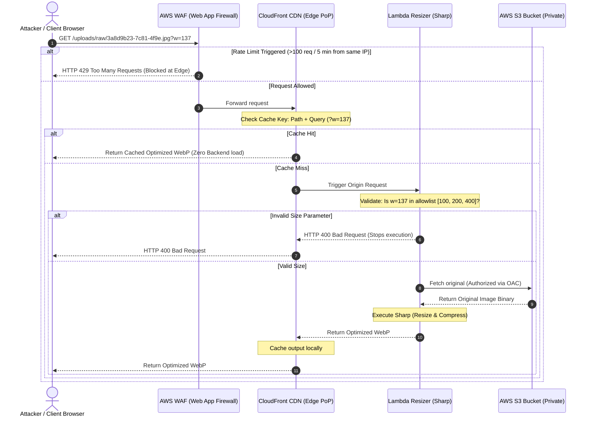
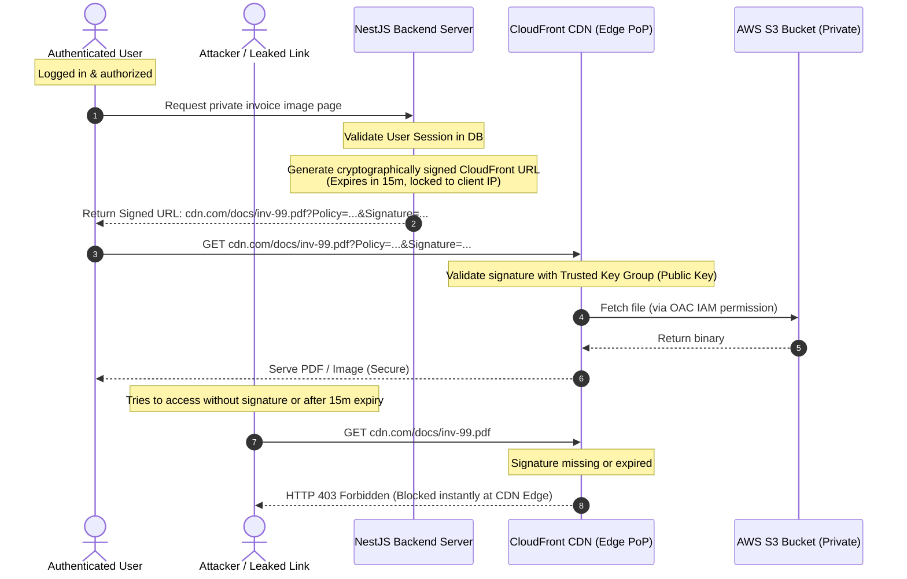

<style>
  code, pre, kbd, samp {
    font-family: 'Fira Code', ui-monospace, SFMono-Regular, "SF Mono", Menlo, Monaco, Consolas, "Liberation Mono", "Courier New", monospace !important;
  }
</style>

# 🔒 CloudFront & S3 Advanced Security Blueprint (Public vs. Private Image Delivery)

This guide details the security best practices for hosting and delivering images using AWS CloudFront, Origin Access Control (OAC), and S3. It contrasts the delivery models of **public images** and **strictly private assets**, illustrates their lifecycles using Mermaid diagrams, and details application-layer proxy protection. It concludes with a **Senior-Level Systems Architect Interview Guide** covering advanced production-grade edge cases.

---

## 1. 🏗️ Architectural Flow Diagrams

### Flow A: Secure Public Image Delivery (Avatars, Product Images)
For public assets, we prioritize **high availability, DDoS protection, and unguessable object paths (UUIDs)** while keeping the files publicly accessible via the CDN.



---

### Flow B: Secure Private Image Delivery (Invoices, Private Documents)
For private assets, we enforce cryptographic validation at the CDN edge using **CloudFront Signed URLs or Signed Cookies**, ensuring S3 is never exposed and unauthorized requests are rejected instantly.



---

## 2. 🛡️ CloudFront CDN Security Best Practices

Implementing these controls safeguards your architecture from data exposure, crawler bots, and billing attacks (DDoS).

### 1. Enforce Origin Access Control (OAC)
* **What it does:** Completely blocks direct public access to your S3 bucket. All requests must go through CloudFront.
* **Why it's secure:** OAC supports AWS Signature Version 4 (SigV4), meaning CloudFront signs requests before sending them to S3. This allows you to keep your S3 bucket fully private and block public ACLs (`block-public-access = true`).
* **S3 Bucket Policy Restriction:**
  ```json
  "Condition": {
    "StringEquals": {
      "AWS:SourceArn": "arn:aws:cloudfront::YOUR_ACCOUNT_ID:distribution/YOUR_CF_DIST_ID"
    }
  }
  ```

### 2. Implement AWS WAF (Web Application Firewall)
To prevent botnets or malicious actors from script-flooding your CDN:
* **Rate Limiting:** Set up a WAF rate limit rule of **100–300 requests per 5 minutes per IP address**.
* **IP Reputation Lists:** Enable AWS Managed Rules for Amazon IP Reputation Lists to auto-block known botnets, anonymous proxies, and tor exit nodes.
* **Geo-Blocking:** If your application only serves specific regions (e.g., USA, Germany), configure CloudFront or WAF to block access from countries outside your business scope.

### 3. Restrict Resizing Dimensions & Protect Compute
If you use an on-the-fly Lambda image resizer:
* **Allowlist Dimensions:** Hardcode approved image dimensions (e.g., `100x100`, `200x200`, `800x600`) in your Lambda code. If an attacker requests a random parameter like `?w=9999` or `?w=133`, immediately abort and return a `400 Bad Request` before running the expensive `sharp` compiler.
* **Filter Query Strings in CloudFront Cache Policy:** Configure CloudFront to only forward specific query parameters (`w`, `h`, `q`) to the origin. Strip out all other random parameters to avoid **Cache Poisoning** and cache-key saturation.

---

## 3. 🛡️ Next.js API Image Proxy Hardening (Application Layer)

If you are proxying S3 assets and performing on-the-fly resizing inside your Next.js application server rather than an AWS Lambda resizer, you must implement these three protections:

### 1. Strict Path Prefix Constraints (Prevent Bucket Disclosure)
* **The Vulnerability:** By default, a proxy endpoint like `/api/img/[...key]` fetches files from S3 based on user input. If your S3 bucket also hosts backups, logs, or private user files, an attacker can input paths like `api/img/backups/db.dump` to extract sensitive content.
* **The Mitigation:** Enforce a strict prefix allowlist:
  ```typescript
  const ALLOWED_PREFIXES = ["uploads/raw/", "uploads/thumbnails/", "uploads/dynamic/"];
  const isPathAllowed = ALLOWED_PREFIXES.some(prefix => s3Key.startsWith(prefix));
  if (!isPathAllowed) return NextResponse.json({ error: "Access Denied" }, { status: 403 });
  ```

### 2. Dimension Parameter Whitelisting (DDoS Protection)
* **The Vulnerability:** Image processing is extremely CPU-bound. If an attacker loops requests from `?w=1` to `?w=2000`, the server is forced to run `sharp` 2000 times, saturating the CPU and crashing your main application thread.
* **The Mitigation:** Allow only specific, pre-determined sizes in a Set for immediate lookup:
  ```typescript
  const ALLOWED_WIDTHS = new Set([40, 100, 150, 225, 300, 450, 600]);
  if (width !== null && !ALLOWED_WIDTHS.has(width)) {
    return NextResponse.json({ error: "Unsupported dimensions" }, { status: 400 });
  }
  ```

### 3. Conditional GET Support (Save Network Bandwidth)
* Always read the client's `If-None-Match` header. Compare it to the S3 object ETag. If they match, abort transfer instantly and return an empty `304 Not Modified` response. This prevents CPU-processing cycles and cuts outbound data transfer rates.

---

## 4. 🔑 Secure Presigned Uploads vs. CloudFront Delivery

A secure architecture separates the concerns of **uploads** and **downloads** using different mechanisms.

| Feature / Goal | 📤 S3 Presigned URLs (Upload Only) | 📥 CloudFront Signed URLs/Cookies (Download Only) |
| :--- | :--- | :--- |
| **Primary Use Case** | Secure, direct client-to-bucket file uploads. | Secure, authenticated file retrieval/streaming. |
| **Target Origin** | Directly targets the AWS S3 Bucket. | Targets the CloudFront CDN Edge Location. |
| **Security Mechanism** | IAM User/Role Credentials sign the HTTP `PUT` action. | A CloudFront Key Group (RSA Public/Private key) signs the request. |
| **Egress Optimization**| Bypasses the CDN (not needed for uploads). | Leverages Edge Caching to prevent backend compute hits. |
| **Typical Expiry** | 5 to 15 minutes (Single use). | Variable (5 mins for downloads, days for streaming). |

### S3 Presigned URLs: Security Checklist for Uploads
If you generate presigned URLs for client-side uploads, enforce these rules:
1. **Explicit HTTP Method:** Restrict the presigned URL to `PUT`. Never use wildcard or `GET` privileges.
2. **Restrict Key Paths (UUIDs):** The backend must dictate the exact file key prefix (e.g., `uploads/raw/UUID.jpg`). Never let the client choose their upload filename, which could lead to path traversal attacks (e.g., uploading to `../../../index.html` to overwrite static files).
3. **Cryptographic Content-Length Enforcements:** Force client requests to match the validated size by passing `ContentLength` in the S3 command and adding `content-length` to the `signableHeaders` list of the getSignedUrl configuration. For multipart uploads, calculate and sign the exact size of each chunk to prevent part-size expansion attacks.
4. **Backend post-upload validation:** Once uploaded, perform a `HeadObject` lookup in the backend to verify the actual size and content-type before saving the record to the database. If validation fails, delete the S3 object immediately.

---

## 5. 🎓 Senior Systems Architect Interview Q&A

These questions target real-world infrastructure failure modes, architectural trade-offs, and mitigation strategies.

### Q1: An attacker is flooding our CloudFront CDN with randomized query parameters (e.g., `avatar.jpg?w=1`, `avatar.jpg?w=2`, ..., `avatar.jpg?w=99999`). Explain the failure mode this causes and how you would design a mitigation.
* **Failure Mode (Cache Key Saturation & Cost Surge):** 
  By default, if CloudFront caches based on query strings, every unique query parameter represents a unique cache key. This bypasses the CDN cache (registering a Cache Miss), forcing CloudFront to forward the request to the Lambda resizer. 
  1. The Lambda executes the heavy `sharp` engine, incurring massive AWS Lambda execution fees.
  2. The CDN cache becomes filled with millions of duplicate images of slightly different widths, pushing out legitimate assets and dropping the cache hit ratio to near zero.
  3. S3 read egress costs skyrocket.
* **Architectural Mitigation:**
  1. **Strict Query String Caching:** Configure the CloudFront Cache Policy to only include specific query keys (e.g. `w` and `q`) and forward them only if they match an allowlist.
  2. **Lambda Parameter Interception:** In the Lambda function, intercept the request and validate the parameter:
     ```javascript
     const allowedWidths = [100, 200, 400, 800];
     const targetWidth = parseInt(queryString.w, 10);
     if (!allowedWidths.includes(targetWidth)) {
         return {
             status: '400',
             statusDescription: 'Bad Request: Unsupported Image Dimension'
         };
     }
     ```
  3. **WAF Custom Regex Rule:** Set up an AWS WAF rule that blocks requests where query strings have non-integer characters or exceed a length of 10 characters.

---

### Q2: Why is CloudFront Origin Access Control (OAC) preferred over the legacy Origin Access Identity (OAI)? Explain from a security and protocol perspective.
* **Security & SSE-KMS Support:**
  Legacy OAI **does not support** AWS KMS customer-managed keys (SSE-KMS) for encrypting S3 buckets. If S3 objects are encrypted at rest with custom KMS keys, OAI cannot decrypt them during retrieval. OAC resolves this by propagating the caller credentials and supports SigV4 request signing, enabling KMS-secured buckets to be read seamlessly by CloudFront.
* **Regional Protocol Coverage:**
  OAI does not support AWS Signature Version 4. This means in newer AWS regions established after 2014 (which require SigV4), OAI configurations could experience intermittent authentication failures. OAC natively supports SigV4 and all global AWS regions.
* **HTTP Methods:**
  OAC allows signing of multiple HTTP methods (including `PUT` and `DELETE`), whereas OAI only supports read-only operations.

---

### Q3: When should a Senior Architect choose CloudFront Signed Cookies instead of CloudFront Signed URLs? What are the implementation trade-offs?
* **Signed Cookies are preferred when:**
  1. **Multi-File Access:** The client needs access to multiple private files (e.g., an entire gallery of private images, a directory of private course videos, or a nested folder of static assets). Generating individual Signed URLs for every single image on a dashboard is highly inefficient.
  2. **URL Integrity:** You want to maintain clean, SEO-friendly, RESTful URLs (e.g., `cdn.com/gallery/img1.jpg`) without appending messy query parameters to every resource string.
  3. **Application Integration:** The frontend is a Single Page Application (SPA) where the credentials can be injected once in an HTTP-only cookie and automatically attached to all downstream image requests.
* **Signed URLs are preferred when:**
  1. The client is a mobile application or IoT device that doesn't have native or easy support for handling browser-style HTTP cookies.
  2. You want to restrict access to a **single file** at a time to prevent users from sharing links or harvesting access.
  3. You want to lock down access to a specific client IP address using the `IpAddress` parameter in the custom policy (easier to enforce dynamically on single links).

---

### Q4: If our application database leaks image paths, how does a UUID-based key prefix protect user privacy compared to structured paths? What is the mathematical probability of a hash collision?
* **Privacy via Obscurity & Non-Enumeration:**
  In a structured database scheme (e.g., `uploads/profiles/user_id/avatar.jpg`), if an attacker accesses user IDs, they can programmatically build the URLs of every user's private images. By using random UUIDv4 paths (`uploads/raw/3a8d9b23-7c81-4f9e-bcde-18471e98dcf1.jpg`), knowing the user's database record or sequential ID gives the attacker **zero information** about the actual URL path on CloudFront/S3.
* **UUIDv4 Key Space & Hash Collision Probability:**
  UUIDv4 has 122 bits of randomness. The total number of possible UUIDs is $2^{122} \approx 5.3 \times 10^{36}$. 
  To have a **1 in a billion (1 in $10^9$)** chance of a single collision, you would need to generate **103 trillion UUIDs**. Even at massive scale (e.g., 100k uploads per second), it would take hundreds of years to hit a single collision, ensuring that every user's key path remains mathematically unique and unguessable.

---

### Q5: How do S3 Path constraints and Dimension allowlists protect a Next.js server acting as an image proxy compared to standard unconstrained proxies?
* **S3 Path Constraints (Prevention of Directory Traversal & Exposure):**
  If the Next.js server proxy receives a request like `/api/img/database/backup.sql` or `/api/img/../../../etc/passwd` (path traversal), it would attempt to fetch this key from S3 and stream it. By implementing a strict allowlist constraint (e.g., key must start with `uploads/raw/`, `uploads/thumbnails/`, or `uploads/dynamic/`), the server blocks access to critical databases, server configurations, or unrelated user files in the same S3 bucket before contacting S3.
* **Resizing Dimension Allowlists (Prevention of Resource Exhaustion):**
  Resizing images using native libraries like `sharp` is a CPU-bound operation. If an attacker makes requests for thousands of different dimensions (e.g. `?w=100`, `?w=101`, ..., `?w=5000`), the Node.js event loop blocks because it spends 100% of its runtime computing image decodes/scales. Restricting the accepted inputs to an explicit Set (e.g. `[40, 100, 300, 600]`) guarantees that the proxy route will return `400 Bad Request` instantly, preventing CPU exhaustion and protecting the responsiveness of other API routes.

---

### Q6: If S3 direct uploads are used, how do we prevent attackers from uploading files that are far larger than our application limits? Explain the cryptographic mechanics at the signature level and post-upload verification.
* **Cryptographic Enforcements (Content-Length Signing in PUT/Multipart Uploads):**
  If we generate standard presigned PUT URLs, S3 does not restrict file size unless we sign the `Content-Length` header. To enforce size restrictions:
  1. The client declares its file size to the backend during the URL request.
  2. The backend validates the size against a schema (e.g. 5MB maximum).
  3. The backend specifies this size in the S3 command (e.g., `ContentLength` in `PutObjectCommand` or `UploadPartCommand`) and explicitly adds `"content-length"` to the list of `signableHeaders` in the presigned options.
  4. S3 Signature Version 4 includes the `Content-Length` header in its cryptographic signature. 
  5. When the client uploads to S3, S3 recalculates the signature. If the HTTP request body's size (and thus its `Content-Length` header) deviates even by one byte from the signed length, the signature check fails, and S3 rejects the request with `403 SignatureDoesNotMatch`.
* **Multipart Upload Part-Size signing:**
  For files uploaded in chunks, we cannot sign a single overall size during initiation because S3 does not check total size during chunk uploads. Instead, we sign the exact expected size of each individual part (e.g., exactly 5MB for parts 1 to N-1, and the remainder for part N) by passing the calculated `ContentLength` and signing `content-length` on the `UploadPartCommand`. This mathematically bounds the sum of the uploaded parts to the exact file size validated during initiation.
* **Post-Upload Backend Verification (Defense-in-Depth):**
  To prevent race conditions, stale files, or misconfigurations, the backend performs a `HeadObject` check before saving the upload association in the database. It verifies that the object exists in S3, its size matches the limit (<= 5MB), and its content type is valid. If it fails validation, the backend deletes the object from S3 and throws a validation error.

