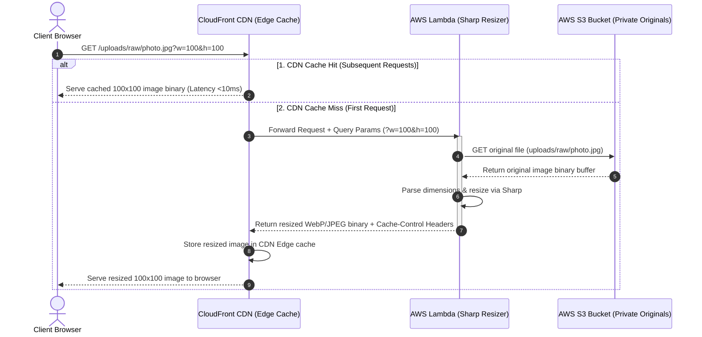

<style>
  code, pre, kbd, samp {
    font-family: 'Fira Code', ui-monospace, SFMono-Regular, "SF Mono", Menlo, Monaco, Consolas, "Liberation Mono", "Courier New", monospace !important;
  }
</style>

# 🖼️ On-Demand Dynamic Image Resizing with AWS CloudFront

This guide details how to implement **on-the-fly dynamic image resizing** (e.g., requesting a `100x100` thumbnail on demand) using AWS CloudFront fronted by an AWS Lambda function running the **Sharp** image processing library.

---

## 1. Core Concept: Initial Setup vs. Final Setup

### Initial Setup (S3 Upload Triggers)
In our initial setup, when a user uploaded an image, an S3 event trigger (`s3:ObjectCreated:*`) invoked an AWS Lambda function. This function resized the image to a fixed `150x150` dimension and stored it in S3 under `/thumbnails/`.

While straightforward, this initial pattern has major limitations:
* **Storage Inefficiency:** Multiplies S3 storage costs for every size you support (e.g., 5 sizes = 5x storage), even if some sizes are never requested.
* **Development Rigidity:** Adding a new profile avatar size (e.g., `50x50` for chat icons) requires a batch migration script to process all historical S3 uploads.
* **Upload Delay:** Resized assets are not instantly available right after the upload finishes because of trigger start latency.

### Final Setup (CloudFront CDN + On-the-Fly Dynamic Resizing)
In our final production architecture, we **transitioned** to a pull-based caching system:
1. The S3 Lambda upload trigger is disabled/removed.
2. Only the raw original image is saved to S3.
3. The frontend requests custom dimensions directly using query parameters (e.g., `?w=300&h=225`).
4. **AWS CloudFront** caches these dynamic resized versions at the Edge. On a cache miss, CloudFront requests the image from our resizer origin (the local Next.js proxy route during local dev, or an Edge Lambda running `sharp` in production). The resizer fetches the original image, scales it on-the-fly, and returns it. CloudFront then caches the result forever.

---

## 2. Dynamic Resizing Architecture Flow

This diagram shows how CloudFront, Lambda, and S3 interact when a user requests a custom dimension (e.g., `https://images.domain.com/uploads/raw/photo.jpg?w=100&h=100`):



---

## 3. Implementation Steps

### Step 1: Deploy the Image Resizing Lambda Function
Create a Node.js Lambda function configured with the **Sharp** library. This function acts as the origin proxy:

```javascript
// index.mjs (Lambda Resizing Origin)
import { S3Client, GetObjectCommand } from "@aws-sdk/client-s3";
import sharp from "sharp";

const s3 = new S3Client({ region: process.env.AWS_REGION });
const BUCKET = process.env.S3_BUCKET_NAME;

export const handler = async (event) => {
  // 1. Parse request parameters
  const request = event.queryStringParameters || {};
  const width = parseInt(request.w) || null;
  const height = parseInt(request.h) || null;
  
  // Extract file key from request path (e.g. /uploads/raw/photo.jpg)
  const key = event.path.replace(/^\//, "");

  try {
    // 2. Fetch original image from S3
    const s3Response = await s3.send(
      new GetObjectCommand({ Bucket: BUCKET, Key: key })
    );
    const bodyBuffer = await streamToBuffer(s3Response.Body);

    // 3. Process image via Sharp
    let pipeline = sharp(bodyBuffer);

    if (width || height) {
      pipeline = pipeline.resize(width, height, {
        fit: "cover",
        withoutEnlargement: true
      });
    }

    // Convert to modern WebP format
    const outputBuffer = await pipeline.webp({ quality: 80 }).toBuffer();

    // 4. Return binary response to CloudFront
    return {
      statusCode: 200,
      headers: {
        "Content-Type": "image/webp",
        "Cache-Control": "public, max-age=31536000, immutable", // Cache for 1 year
      },
      body: outputBuffer.toString("base64"),
      isBase64Encoded: true,
    };
  } catch (err) {
    console.error(err);
    return {
      statusCode: err.name === "NoSuchKey" ? 404 : 500,
      headers: { "Content-Type": "application/json" },
      body: JSON.stringify({ error: "Image processing failed." }),
    };
  }
};

async function streamToBuffer(stream) {
  return new Promise((resolve, reject) => {
    const chunks = [];
    stream.on("data", (chunk) => chunks.push(chunk));
    stream.on("error", reject);
    stream.on("end", () => resolve(Buffer.concat(chunks)));
  });
}
```

### Step 2: Configure CloudFront Caching Key
By default, CloudFront ignores query strings when caching. **This is dangerous for dynamic resizing** because requests for `?w=100` and `?w=500` would return the same cached file.

To fix this:
1. Go to the CloudFront console ➔ **Behaviors** ➔ Edit Behavior.
2. Under **Cache key and origin requests**, ensure query strings are included in the cache key.
3. Create a **Cache Policy**:
   * Under **Query Strings**, select **Include specified query strings** and add `w` and `h` (or select **All** query strings).
   * Set **Minimum TTL** to `0`, **Maximum TTL** to `31536000` (1 year), and **Default TTL** to `86400` (1 day).

---

## 4. Pros & Cons: On-the-Fly Resizing vs. Pre-generated (On-Upload)

| Dimension | 🔄 Pre-Generated (S3 Upload Trigger) | 🖼️ On-Demand (CloudFront + Sharp Lambda) |
| :--- | :--- | :--- |
| **S3 Storage Costs** | High (Multiplied by the number of pre-generated dimensions). | **Minimal (Only the original raw file is stored).** |
| **Computation Costs** | Billed on every upload, even if the image is never viewed. | Billed **ONLY** on the first request (Cache Miss) per Edge location. |
| **Edge Cache Dependency** | Low (Assets are static objects in S3). | **High** (Relies on CDN Caching for optimal latency). |
| **First Load Latency** | Fast (Thumbnail is pre-rendered). | Slow (~500ms on first load to fetch, resize, and store). |
| **Design Flexibility** | Rigid (Adding a new size requires bulk script migrations). | **Flexible (New sizes are requested instantly in code).** |

---

## 5. Cost-Effectiveness Evaluation

### S3 Direct vs. CloudFront Egress & API Costs

Routing requests through CloudFront dramatically lowers AWS operating costs:

1. **Free Data Transfer (S3 ➔ CloudFront):**
   AWS charges up to **$0.09 per GB** for data transferred from S3 directly to the public internet. However, data transfer from S3 to CloudFront is **$0.00 (free)**. You only pay CloudFront's egress rates to the internet, which are cheaper and covered by a **1 TB/month free tier**.
2. **Reduced S3 API Calls:**
   S3 charges per 1,000 `GET` requests ($0.0004). If an image is requested 1,000,000 times:
   * **Without CloudFront:** You pay S3 for 1,000,000 requests + egress.
   * **With CloudFront:** You pay S3 for **1** request (first cache miss). The other 999,999 requests are served directly from CloudFront's edge locations for free or at CDN scale.
3. **Zero Storage Waste:**
   By avoiding pre-generating thumbnails for unviewed images, S3 storage consumption is kept to a strict minimum.

### How Real-World Applications Implement Resizing
In production networks (like Netflix, Airbnb, and Unsplash), **on-the-fly resizing via CDN** is the standard.
* **Edge Functions (Lambda@Edge):** Intercepts requests on CDN cache misses, processes images near the user, and caches them at the edge.
* **Origin Shield Caching:** Adds an extra centralized cache layer between regional edges and S3, reducing cache-miss traffic to origins by up to 99%.

### How to Prevent Abuse (DDOS / High Lambda Bills)
Because query parameters (e.g. `?w=9999&h=9999`) can be manipulated to trigger expensive compute loops, production environments enforce:
1. **Whitelisted Dimensions:** Restricting width and height parameters to a preset array of values (e.g. `50`, `150`, `300`).
2. **Signed URLs:** Appending an HMAC signature to image URLs generated on the backend (e.g., `?w=100&h=100&sig=abcdef123`). The resizing handler verifies this signature before invoking `sharp`.

---

## 6. Codebase Integration Details

The on-demand resizing pattern is fully integrated and functional across the codebase:

### 1. Backend Service Layer Mapping
* **File:** [profiles.service.ts](file:///Users/mac/Developer/Thumbnail-app/src/modules/profiles/profiles.service.ts#L30)
* **Change:** Removed reference to pre-generated `uploads/thumbnails/...` S3 keys. The service now maps all image and thumbnail URLs directly to their raw S3 paths (e.g., `uploads/raw/...`). This gives the frontend complete control to append custom sizing query strings.

### 2. Local Development Proxy Resizing
* **File:** [route.ts](file:///Users/mac/Developer/Thumbnail-app/src/app/api/img/%5B...key%5D/route.ts#L37)
* **Change:** The local proxy route `/api/img/...` parses query parameters `w` and `h`. It fetches the original buffer from S3, uses the local `sharp` node module to resize it, and returns the compressed WebP buffer.

### 3. Dynamic ProfileImage Rendering
* **File:** [ProfileImage.tsx](file:///Users/mac/Developer/Thumbnail-app/src/components/ui/ProfileImage.tsx#L88)
* **Change:** Appends custom query strings `?w=...&h=...` to the image source based on the display variant (`avatar` = 40x40, `card` = 300x225, `hero` = 600x450). It accepts explicit `width` and `height` prop overrides and resets the loading shimmer whenever the dimensions change.

### 4. Interactive Detail Sheet UI
* **File:** [ProfileDetailSheet.tsx](file:///Users/mac/Developer/Thumbnail-app/src/components/profile/ProfileDetailSheet.tsx#L154)
* **Change:** Added an interactive "On-the-Fly CDN Resize" button selector (`Default`, `300x225`, `100x100`, `50x50`) to dynamically demonstrate and request different image sizes from the CDN/proxy.
