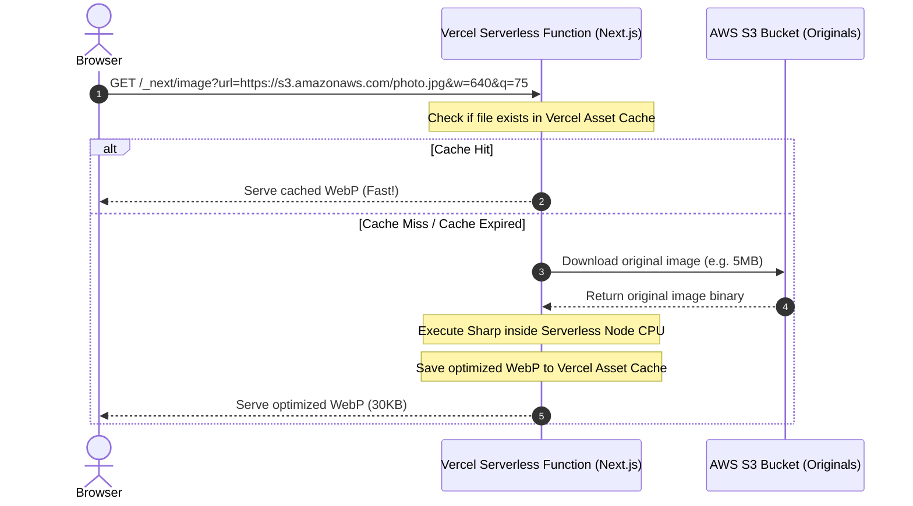
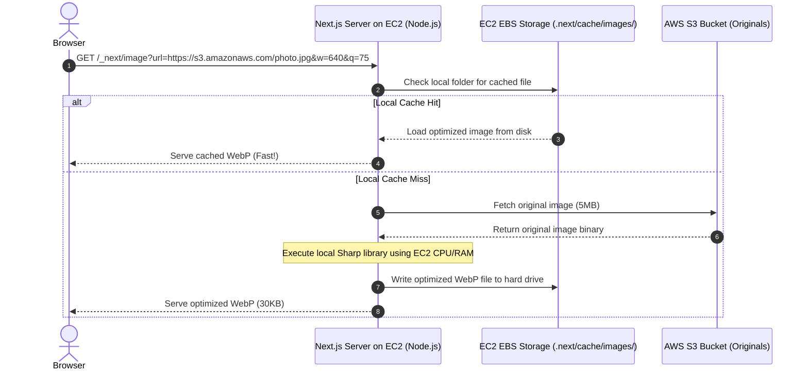
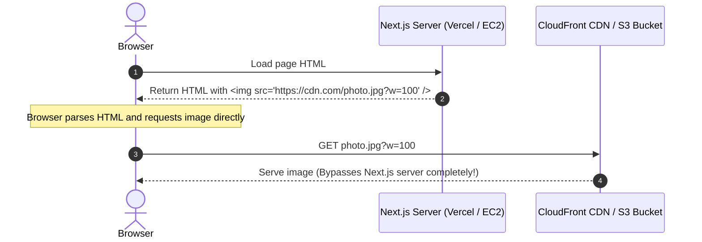

<style>
  code, pre, kbd, samp {
    font-family: 'Fira Code', ui-monospace, SFMono-Regular, "SF Mono", Menlo, Monaco, Consolas, "Liberation Mono", "Courier New", monospace !important;
  }
</style>

# 🚀 Mastering Next.js Image Optimization vs. CDN Caching

This guide provides an in-depth, production-grade explanation of the Next.js `<Image>` component, how its internal optimization server (`_next/image`) functions, and why utilizing the `unoptimized` property is critical when fronted by an external CDN like AWS CloudFront or when serving S3 Presigned URLs on virtual servers like AWS EC2.

---

## 1. The Core Importance of Next.js `<Image>`

The standard HTML `` tag is historically responsible for major web performance issues. The Next.js `<Image>` component (`next/image`) wraps the standard image element with automatic performance optimizations:

* **Cumulative Layout Shift (CLS) Prevention:** Forces you to define `width` and `height` (or use `fill`), allocating immediate layout space in the browser DOM. This prevents page elements from jumping around while images load.
* **Lazy Loading by Default:** Automatically adds `loading="lazy"` and utilizes the browser's Intersection Observer so images are only fetched when they approach the viewport.
* **Modern Formats Support:** Auto-negotiates and converts JPEGs or PNGs to modern formats like WebP or AVIF based on the browser's `Accept` headers.
* **Responsive Visuals (`srcSet`):** Automatically generates a source-set of multiple sizes so mobile devices download small versions while Retina screens get high-resolution copies.

---

## 2. Under the Hood: Default Image Optimization Flow

By default, when you pass a remote image URL to `<Image>`, Next.js routes the request through its internal optimizer. The URL is rewritten in the browser to:
`/_next/image?url=https%3A%2F%2Fimages.domain.com%2Fphoto.jpg&w=640&q=75`

### A. How it Works on Vercel / Serverless (Ephemeral Caching)
On Vercel, the image optimizer runs as a serverless function. Cache storage is temporary and can clear when containers recycle.



### B. How it Works on AWS EC2 / VM (Persistent Caching)
On a virtual server like EC2, the image optimizer runs inside your permanent Node process, and cached files are stored persistently on the EC2 instance's EBS hard drive.



---

## 3. Understanding the "Image Proxy URL" Concept

An **Image Proxy URL** is a URL that points to a **processing service or middleman server** rather than directly to the static storage file (like S3 or local disk). 

### What is a Proxy?
In network engineering, a **proxy** is an intermediary that acts on behalf of a client. In image delivery:
* **Direct URL:** `https://my-bucket.s3.amazonaws.com/photo.jpg` (Loads the raw, unmodified 5MB original directly from S3).
* **Proxy URL:** `https://my-site.com/_next/image?url=https://s3.amazonaws.com/photo.jpg&w=128&q=75` (Instructs the Next.js server to fetch, process, and return an optimized 2KB WebP version).

### The Next.js Built-In Proxy (`/_next/image`)
In a Next.js-only architecture, the **Next.js server itself acts as the Image Proxy**, exposing the default endpoint `/_next/image`. 

When the browser requests this proxy URL, Next.js acts on behalf of the browser:
1. Next.js catches the request.
2. It fetches the original image from S3.
3. It resizes and compresses it in memory using `sharp`.
4. It saves a cached copy to the server's disk (`.next/cache/images/`).
5. It returns the lightweight optimized image to the browser.

---

## 4. What the `unoptimized` Prop Does

Adding the `unoptimized` prop disables the Next.js server-side image processing server (`_next/image`) entirely:
```tsx
<Image src="https://your-cloudfront-url.com/photo.jpg?w=100" fill unoptimized />
```

Instead of rewriting the source, Next.js renders a standard, clean HTML `` tag where the `src` attribute is exactly the URL you provided. The browser communicates directly with your CDN or S3 bucket, bypassing the Next.js server completely:



---

## 5. When to Use `unoptimized` and When to Avoid It

Choosing between Next.js's built-in optimization and `unoptimized={true}` is a critical architectural decision:

### 🟢 When to Use `unoptimized`
* **When using an External CDN (CloudFront/Cloudflare Images/Imgix):** If your CDN is already resizing images, using default optimization creates a **Double-Optimization Anti-Pattern** (caching cached files, running double compute cycles).
* **When serving User-Generated Content (UGC):** Uploads from users should sit on S3 and be resized at the CDN edge rather than consuming your Next.js application server's CPU.
* **When deploying to AWS EC2/ECS:** To prevent heavy, concurrent image resizing tasks from starving your web server's CPU and RAM.
* **When using S3 Presigned URLs:** To prevent S3 signature expiration loops from causing infinite cache misses and disk space bloat.

### 🔴 When to AVOID `unoptimized` (Use default Next.js Image Optimization)
* **Local Static Assets:** Graphic illustrations, hero images, design icons, and logos stored in your `/public` folder. These files benefit from Next.js's build-time pre-resizing.
* **Small-Scale Websites:** Small blogs, portfolios, or low-traffic sites deployed on Vercel without an external cloud backend (e.g. S3).
* **No CDN Setup:** If you do not have a CDN or Lambda resizer, disabling optimization forces the browser to download full-size, uncompressed images, causing high egress bills and slow loads.

---

## 6. In-Depth Q&A: Architectural Troubleshooting

### Q1: What happens if I deploy Next.js to EC2 and use S3 Presigned URLs without the `unoptimized` flag?
This creates a severe bottleneck known as the **Presigned URL Expiration Loop**:
1. Next.js caches images using the **full URL (including the access token and signature query params)** as the Cache Key.
2. S3 Presigned URLs expire (e.g., in 15 minutes or 1 hour).
3. The next time the page is loaded, the backend generates a new signature.
4. Next.js sees a different URL string and registers a **Cache Miss**. It downloads the image from S3 again, executes `sharp` on your EC2 CPU, and writes a duplicate file to the EC2 hard drive.
5. This repeats infinitely, wasting CPU cycles and **eventually filling up the EC2 EBS storage volume until the operating system crashes.**

---

### Q2: Why is the "Double-Optimization" flow an anti-pattern on Vercel?
When you route image requests through Vercel's `_next/image` to an external CDN (like CloudFront + Sharp Lambda):
1. **Bandwidth Costs:** Vercel charges high egress fees for data transfer out of serverless functions. Routing images through Vercel makes it the final delivery node, inflating your bills.
2. **Double Compute Billing:** You are paying for Lambda executions on AWS to resize the image, and then paying Vercel for serverless function executions to download and optimize it a second time.
3. **High Latency:** The client experiences higher load times because the request must travel from the browser ➔ Vercel ➔ CloudFront ➔ S3, and back.

---

### Q3: How does local image resizing impact an EC2 instance's web traffic handling?
Image processing is heavily CPU-bound. If your EC2 instance is a smaller tier (like `t3.micro` or `t3.medium`):
* Under concurrent traffic (e.g. 50 users loading pages with multiple avatars), the Node.js event loop will be blocked by `sharp` CPU calculations.
* **Your API endpoints will stop responding, page transitions will fail, and database queries will time out** because the server is starved of CPU and RAM resources.

---

### Q4: What is the optimal production-grade architecture to solve these issues?
The industry-standard solution is to decouple **application serving** from **image processing**:
1. **Disable S3 Presigned URLs for Reads:** Block public bucket access and connect a **CloudFront Distribution with Origin Access Control (OAC)** to securely fetch raw images from the private S3 bucket.
2. **Serve Public CDN URLs:** Generate permanent, clean CDN URLs (e.g. `https://cdn.yoursite.com/uploads/dynamic/image.jpg?w=100`).
3. **Deploy a Lambda Resizer:** Configure an AWS Lambda origin behind CloudFront to handle cache misses on-the-fly.
4. **Use `unoptimized` in Next.js:** Ensure all dynamic avatars use `<Image unoptimized>` so your EC2 instance only serves lightweight HTML/JSON, while CloudFront handles the image scaling and caching at the edge.

---

## 7. The `sharp` Engine Detection & Configuration

Next.js is designed to be zero-config, but it utilizes native optimizations if they are present in the environment.

### How Next.js Automatically Detects the Optimizer
When you start the Next.js process (`next dev` or `next start`), the framework runs a check inside `node_modules` for the `sharp` library:

* **Case 1: `sharp` is installed (Recommended):**
  Next.js loads the native Node-API bindings for the `sharp` image library. 
  * **Multi-threaded Architecture:** `sharp` is written in C++ and sits on top of `libvips` (a fast image processing library). It is **highly multi-threaded** by default, utilizing a dedicated thread pool to process multiple images in parallel across all available CPU cores. This allows it to handle heavy concurrent request traffic with very low latency and memory overhead.
  
* **Case 2: `sharp` is NOT installed:**
  * **Development (`next dev`):** Next.js falls back to **Squoosh** (a JavaScript library compiled to WebAssembly). It operates on a **single-threaded model** inside Node.js, meaning it can only process one image at a time per Node process, blocking the main thread. It works for local development, but is significantly slower.
  * **Production (`next start`):** Next.js prints a warning at startup:
    > `Warning: For production Image Optimization with Next.js, the optional 'sharp' package is strongly recommended.`
    Without it, large concurrent requests in production will experience high CPU latency spikes and bottlenecked event loops due to Squoosh's single-threaded performance limits.

---

## 8. Configuring Next.js Image Optimization (`next.config.mjs`)

You configure Next.js's internal image optimizer parameters inside `next.config.mjs`. When `unoptimized` is set to `false`, Next.js passes these parameters directly to the underlying `sharp` engine:

```javascript
// next.config.mjs
const nextConfig = {
  images: {
    // 1. Target Formats: Next.js negotiates with the browser Accept header 
    // to output the most optimized format supported.
    formats: ["image/webp", "image/avif"],

    // 2. Cache TTL: Duration in seconds to cache the resized output on the server disk.
    // Set to 31,536,000 (1 year) to mirror CDN immutable caches.
    minimumCacheTTL: 31536000,

    // 3. Domain Whitelisting: Ensures external origins cannot be abused 
    // to trigger DDOS requests on your server.
    remotePatterns: [
      {
        protocol: "https",
        hostname: "**.cloudfront.net",
      },
    ],

    // 4. Global Override: If set to true, disables all local server-side resizing.
    unoptimized: false, 
  },
};

export default nextConfig;
```

---

## 9. Why We Removed `sharp` from the Project Root

In our architecture, we uninstalled `sharp` from the Next.js root `package.json` dependencies.

### The Rationale:
Since all profile avatar components in the UI now use `<Image unoptimized={true}>` and route directly to CloudFront, the EC2 server running Next.js never executes `_next/image` resizing loops. 

By removing `sharp` from the EC2 Next.js project:
1. **Saves Server RAM/CPU:** Your EC2 instance does zero heavy image processing, preserving 100% of memory for handling API routes and web traffic.
2. **Lighter Builds:** The deployment build zip is significantly smaller because it doesn't need to package the heavy native C++ binaries for `sharp`.
3. **Dedicated Processing:** Only your AWS Lambda function (`lambda/dynamic-resizer/`) contains the `sharp` dependency to process cache misses securely in the cloud.


