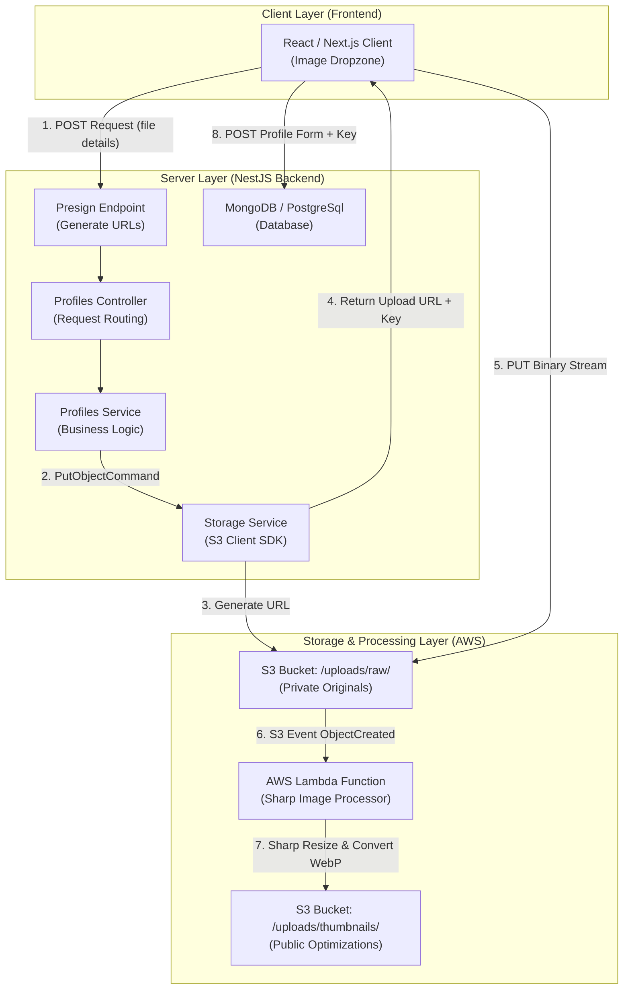
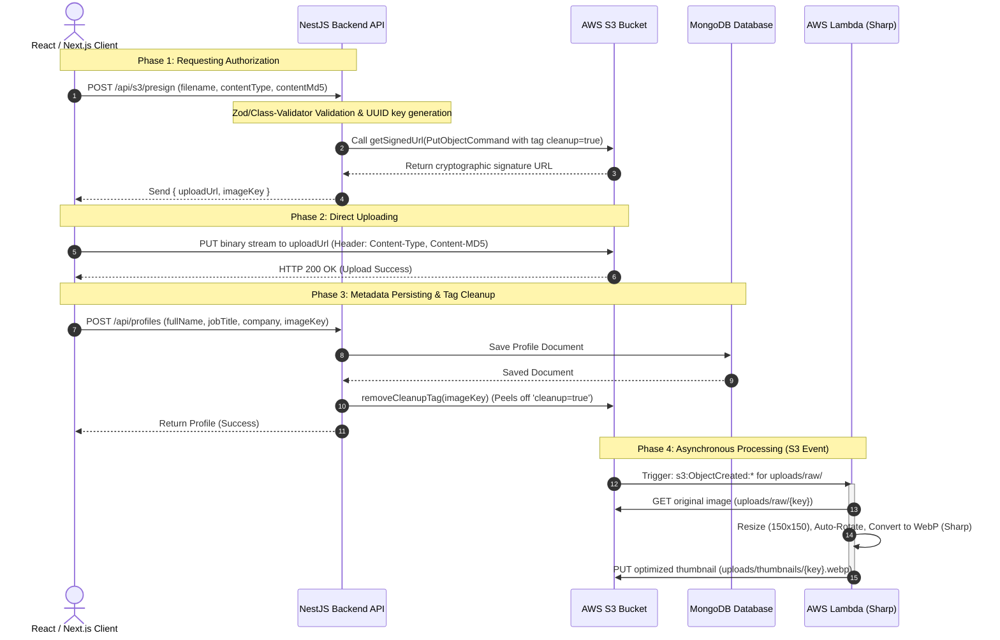
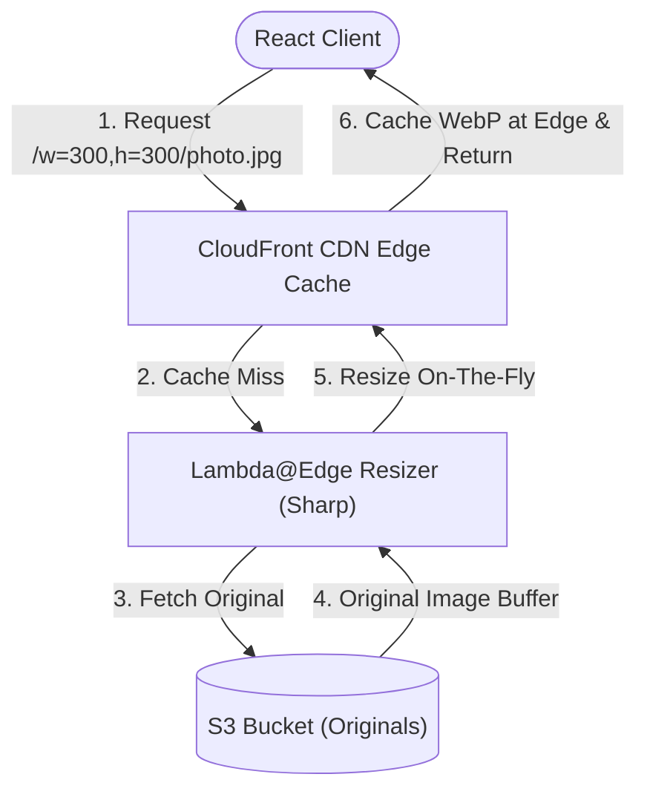
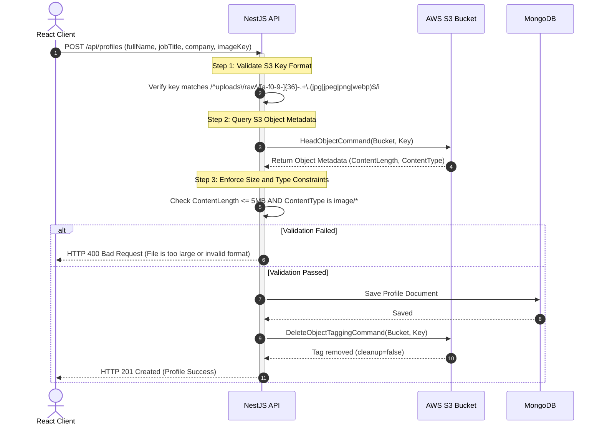
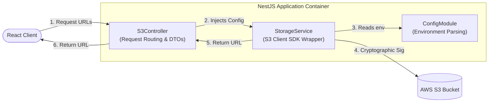
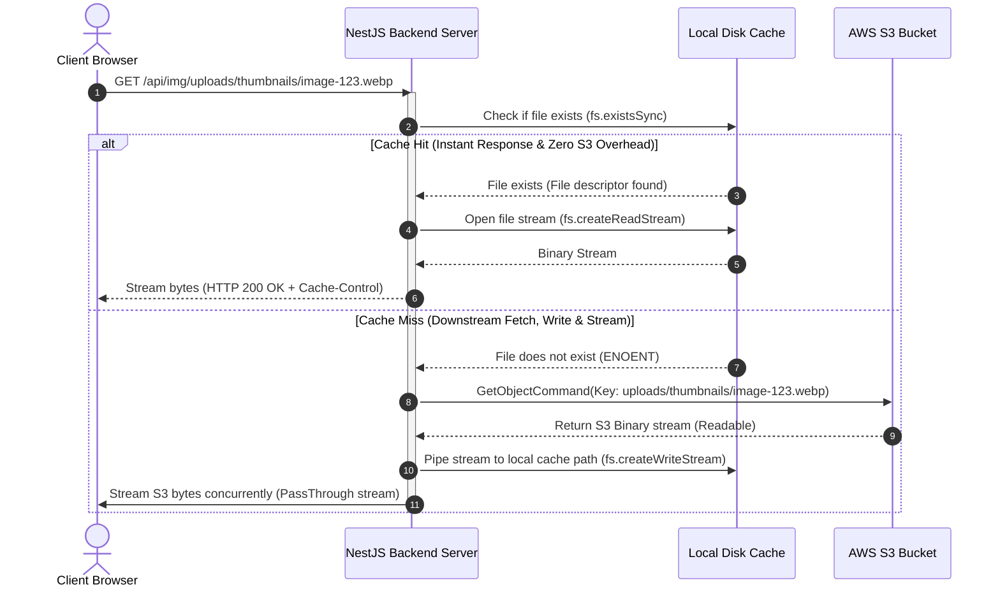
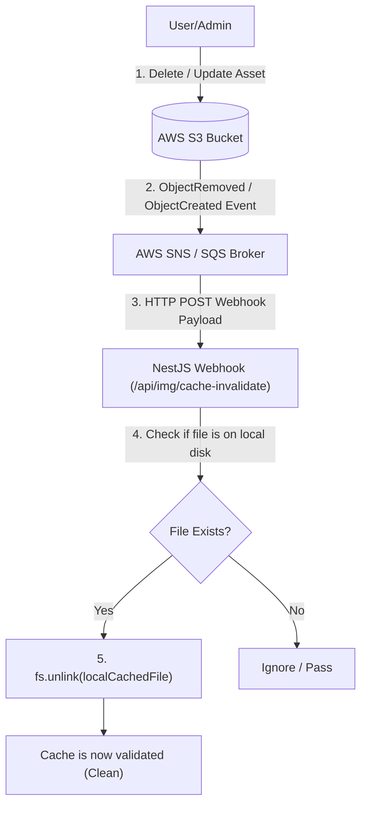

<style>
  code, pre, kbd, samp {
    font-family: 'Fira Code', ui-monospace, SFMono-Regular, "SF Mono", Menlo, Monaco, Consolas, "Liberation Mono", "Courier New", monospace !important;
  }
</style>

# 🚀 System Design Guide: Secure Client-Side Uploads using S3 Presigned URLs

This comprehensive guide details the design, implementation flow, security details, and optimization strategies for the **S3 Presigned URL Upload & Serverless Image Processing System** implemented in this project.

Whether you are a beginner looking to understand the fundamentals or an advanced engineer looking for optimization strategies, this document serves as a self-contained blueprint.

---

## <span style="color:#0f766e; background-color:#e6f4ea; padding: 4px 8px; border-radius: 4px; display: inline-block;">1. Core Architecture Design</span>

In a traditional upload flow, the client sends files directly to the web server, which then processes them and forwards them to storage. While simple, this creates bottlenecks in CPU, memory, and bandwidth.

Our architecture implements **Client-Side Direct Uploads via S3 Presigned URLs**, decoupled from database creation and processed asynchronously via **AWS Lambda**.

### System Architecture Flow Diagram



### Complete Sequence Diagram (Start-to-Finish Lifecycle)



---

## <span style="color:#b45309; background-color:#fffbeb; padding: 4px 8px; border-radius: 4px; display: inline-block;">2. Why & How: System Design Questions</span>

### <span style="color:#d97706">Q1: Why not upload files directly to the server first?</span>

1. **Serverless Execution Limits:** Most serverless platforms (e.g. Vercel) have payload limits (e.g. Vercel has a hard limit of **4.5 MB** on API request bodies). Large uploads will crash the route.
2. **Server Thread Blocking & Memory Bloat:** Handling multipart form data consumes server CPU and RAM. Direct uploading offloads this completely.
3. **Bandwidth Costs:** Paying twice for ingress bandwidth (Client $\rightarrow$ Server $\rightarrow$ S3) is costly. Direct uploading uploads once (Client $\rightarrow$ S3).

### <span style="color:#d97706">Q2: How does S3 verify the signature without calling our server?</span>

When the server generates the presigned URL, it uses the **AWS Signature Version 4 (SigV4)** protocol. It creates a cryptographic signature containing:
- The HTTP verb (`PUT`)
- The target bucket and object key
- Expiration time of the URL
- Date of generation
- Headers that must be present (e.g., `Content-Type`, `Content-MD5`)

This data is signed using our private `AWS_SECRET_ACCESS_KEY`. When the client hits the URL, S3 recalculates the hash. If the hashes match and the timestamp has not expired, S3 grants write access.

### <span style="color:#d97706">Q3: Why use PUT instead of POST for presigned uploads?</span>

- **PUT:** Uploads a raw binary stream. The file is sent directly as the request body. It matches S3's standard `PutObject` API, requires very simple header configuration, and is easier to sign and manage.
- **POST:** Requires multipart form-data uploads (S3 Presigned Post). While it allows enforcing maximum file size limits directly in the policy, it requires building complex HTML forms with specific input fields matching the policy keys.

### <span style="color:#d97706">Q4: How do we prevent users from modifying files after uploading?</span>

- We generate a secure `UUID` on the server: `uploads/raw/<uuid>-<sanitized_filename>`.
- The client cannot inject arbitrary S3 keys because S3 rejects the upload if the path does not exactly match the key signed in the URL.

### <span style="color:#d97706">Q5: What is the "Auto-Delete / Tag Cleanup" pattern, and how does it handle tab closures and file overrides?</span>

**The Problem: Orphaned & Abandoned Uploads**
Because we upload files instantly on selection to optimize performance, there are two primary waste scenarios:
1. **Tab Closure / Abandonment:** The user selects an image (triggering S3 upload) but closes the tab or browser before submitting the form.
2. **File Overrides:** The user uploads a file, decides they don't like it, and selects a different file. The first file remains in S3 but is no longer linked to anything.

**The Solution: A 3-Tier Production Cleanup Strategy**

To prevent S3 bucket bloat and save costs, production architectures implement a tiered approach:

```mermaid
stateDiagram-v2
    [*] --> FileSelected : User selects image in UI
    FileSelected --> S3Uploaded : Instant PUT upload with 'cleanup=true' Tag
    
    state S3Uploaded {
        [*] --> WaitingForSubmit : Image key stored in state
        WaitingForSubmit --> FileOverridden : User selects a new file
        FileOverridden --> S3Uploaded : Upload new file, queue old key
        FileOverridden --> ImmediateDelete : Frontend triggers secure DELETE for old key
        ImmediateDelete --> [*] : Deleted from S3 immediately
    }
    
    WaitingForSubmit --> FormSubmitted : User clicks "Submit"
    FormSubmitted --> DBRegistered : Profile saved in DB
    DBRegistered --> TagRemoved : Backend calls removeCleanupTag()
    TagRemoved --> PermanentStorage : File preserved permanently
    
    WaitingForSubmit --> TabClosed : User closes tab or abandons form
    TabClosed --> LifecycleTriggered : 24 hours pass
    LifecycleTriggered --> S3AutoDelete : S3 Lifecycle Rule deletes tagged object
    S3AutoDelete --> [*]
```

#### Tier 1: S3 Object Tagging + Lifecycle Rules (The Fail-Safe Net)
- **Why:** Covers tab closures, network disconnections, app crashes, and abandoned forms.
- **How:** During presigned URL generation, S3 objects are automatically tagged with `cleanup=true`. An S3 Lifecycle Policy is set to automatically delete any object in `uploads/raw/` with `cleanup=true` after **24 hours**. When the form is submitted, the backend calls `DeleteObjectTaggingCommand` to remove the tag, saving it from deletion.

#### Tier 2: Client-Initiated Immediate Deletion (The Immediate Cleanup)
- **Why:** Covers the file override scenario (selecting a new image or clearing the selection).
- **How:** If `uploadedKey` is not null and the user uploads a new file or clears the input, the frontend makes an immediate HTTP request to a secure backend endpoint `/api/s3/delete` with the old key. The backend validates the user and key, then calls `DeleteObjectCommand` on S3 to remove the abandoned file immediately, avoiding waiting 24 hours.

#### Tier 3: Incomplete Multipart Upload Expiration
- **Why:** Covers aborted or failed large uploads where chunk uploads stopped halfway.
- **How:** S3 buckets are configured with a Lifecycle Rule to "Abort incomplete multipart uploads" after **7 days**, which automatically garbage-collects temporary chunk uploads that were never completed.

### <span style="color:#d97706">Q6: What are the alternatives to calculating MD5 client-side?</span>

Ensuring payload integrity prevents half-uploaded or corrupted files from being saved. Standard `Content-MD5` header checks require calculating the MD5 hash in the client.

**Alternatives:**
1. **SHA-256 Checksums (Web Crypto API):**
   - The browser calculates a SHA-256 checksum natively using the Web Crypto API: `await crypto.subtle.digest("SHA-256", fileBuffer)`.
   - Web Crypto is natively supported by modern browsers, avoiding custom, bug-prone JS hashing functions.
   - S3 supports signing the `x-amz-checksum-sha256` header instead of `Content-MD5`.
2. **Using a Pre-Compiled Client-Side Library:**
   - Instead of writing custom bit-shifting algorithms for MD5, use battle-tested libraries like `spark-md5` or `js-md5`. 
   - `spark-md5` supports **incremental hashing** which allows hashing large files block-by-block without loading the entire file into memory.
3. **TLS/TCP Layer Checks (No custom checksum header):**
   - You can completely skip signing a checksum header. S3 will still perform integrity checks at the transport layer (SSL/TLS). However, this does not protect against client-side browser corruption before packet transmission.

---

## <span style="color:#0284c7; background-color:#e0f2fe; padding: 4px 8px; border-radius: 4px; display: inline-block;">3. Architectural Analysis: CDN vs. S3 Direct vs. Server Proxy</span>

When building a system that serves assets stored in S3, choosing the right delivery channel directly affects **performance, security, hosting costs, and server load**.

Below, we detail the three primary architectural strategies, why a **React SPA** strictly requires a CDN compared to **Next.js**, and the security/billing vulnerabilities of S3 direct URLs.

---

### Delivery Architecture Comparison

```mermaid
flowchart TD
    %% Path A: S3 Direct (Vulnerable)
    subgraph PathA ["Path A: S3 Direct (Vulnerable)"]
        ClientA([React Client]) -->|"1. GET /img.jpg?Sig=xyz"| S3Direct[("AWS S3 Bucket (Private)")]
        S3Direct -->|"2. Egress raw file (No Cache)"| ClientA
    end

    %% Path B: Server-Side Stream Proxy (High CPU/Memory Load)
    subgraph PathB ["Path B: Server Stream Proxy"]
        ClientB([React Client]) -->|"1. GET /api/img/photo.jpg"| ServerB["Backend Server (NestJS / Node)"]
        ServerB -->|"2. Fetch binary"| S3PrivateB[("AWS S3 Bucket (Private)")]
        S3PrivateB -->|"3. Stream bytes"| ServerB
        ServerB -->|"4. Stream to Client (Consumes Node RAM)"| ClientB
    end

    %% Path C: CDN Caching (Optimal & Secure)
    subgraph PathC ["Path C: CDN Edge Caching"]
        ClientC([React Client]) -->|"1. GET images.domain.com/photo.jpg"| CDN["CDN Edge Cache (CloudFront / Cloudflare)"]
        CDN -->|"2. Cache Hit (Instantly served)"| ClientC
        CDN -.->|"3. Cache Miss (Only once)"| S3PrivateC[("AWS S3 Bucket (Private)")]
        S3PrivateC -.->|"4. Cache it & serve"| CDN
    end
```



---

### side-by-side Architectural Comparison

| Dimension | 🌐 Path A: Direct AWS S3 URLs | ⚡ Path B: Server-Side Stream Proxy | 🚀 Path C: CDN (CloudFront / Cloudflare) |
| :--- | :--- | :--- | :--- |
| **S3 Access Control** | Must sign temporary GET URLs or make S3 public. | 100% Private. Backend accesses S3 securely via IAM roles. | 100% Private. CDN accesses S3 securely via **OAC (Origin Access Control)**. |
| **Browser Caching** | **Zero Caching.** Rotating signature parameters (`?Signature=...`) bypass browser cache. | **Good.** Server can send static headers (`Cache-Control: public, immutable`). | **Optimal.** Edge nodes cache assets globally, serving them in microseconds. |
| **Server Load** | Zero backend server load. | **High CPU & RAM.** Server buffers and streams binary files (Node.js thread blocks). | Zero backend server load. |
| **Egress Bandwidth Costs** | **Extremely High.** AWS S3 egress charges are expensive ($0.09/GB). | Medium (Server hosting traffic bandwidth rates apply). | **Low.** CDN bandwidth is much cheaper (often with a generous free tier). |
| **Security (DoW Protection)** | **Vulnerable to Denial of Wallet.** Anyone can scrape/flood your bucket. | Good. Handled via application rate-limiters. | **Optimal.** CDN handles DDoS protection at the network edge (AWS Shield / WAF). |
| **Domain Customization** | No custom domains (must use `s3.amazonaws.com`). | Fully integrated with your own domain name. | Fully supports custom domains (`images.yourcompany.com`). |

---

### Deep Dive: React SPA vs. Next.js (Why the difference?)

#### Why React SPA (Client-only) strictly requires a CDN:
A React SPA is static client-side code running in the browser. Since there is no server-side Node.js executor, the React client cannot directly authenticate with S3 without exposing credentials.
* **The Presigned URL Flood:** If your React application does not use a CDN and your S3 bucket is private, your backend must generate a presigned GET URL for every single image layout. If a user loads a directory containing 100 profiles, the client must trigger 100 API signature requests. This creates huge latency.
* **The Rotating Signature Cache Buster:** Because presigned URLs expire, the signature parameters in the query string (`?X-Amz-Signature=...`) change on every signature request. The browser treats each signed URL as a unique resource. Consequently, **the browser cannot cache the image locally**, forcing the client to download the image binary repeatedly. This results in slow page renders and spikes your AWS egress bandwidth bills.

#### Why Next.js (Hybrid) has a built-in alternative:
Next.js is a hybrid framework running a backend Node.js server. Next.js can act as the image proxy itself via API routes (e.g. `/api/img/[...key]`). The server pulls the image buffer from S3 using IAM credentials and streams it to the browser with fixed caching headers (`Cache-Control: public, immutable`).
* Next.js's built-in image optimizer (`next/image`) automatically handles resizing, WebP conversion, and stores the optimized results on the server's local disk cache. Sub-requests are served instantly from Next.js memory, mitigating the need for an external CDN in small-to-medium systems.

---

### Security Myths & "Denial of Wallet" Risks of S3 Direct URLs

#### Myth 1: "I can just make my S3 bucket public, it's just user avatars."
**Vulnerability: Data Harvesting & Privacy Violations**
If you make your S3 bucket public:
* Anyone can list all the files in your bucket by hitting the root URL (`https://yourbucket.s3.amazonaws.com/`). This allows bots to harvest user photos and construct user lists.
* Attackers can upload files to your bucket if permissions are misconfigured, or delete existing objects.

#### Myth 2: "Presigned GET URLs protect my bucket from public abuse."
**Vulnerability: Denial of Wallet (DoW) / Financial Attacks**
Even if S3 remains private and you generate presigned GET URLs:
* S3 has **no built-in rate limiting**. If an attacker scrapes the presigned URLs (which are valid for, say, 1 hour), they can write a script to request those URLs millions of times. 
* S3 charges per GET request ($0.0004 per 1,000 requests) and for data egress ($0.09 per GB). An attacker downloading a 50MB file 100,000 times will cost you **$450.00** in a few minutes. This is called a **Denial of Wallet (DoW) attack**.
* A CDN (like CloudFront) shields S3 behind edge caches. The file is requested from S3 only once. Future requests are served from the CDN edge cache, meaning your S3 bucket is never hit directly, protecting you from massive billing spikes.

---

## <span style="color:#3b82f6; background-color:#eff6ff; padding: 4px 8px; border-radius: 4px; display: inline-block;">4. Next.js vs. ReactJS Frontend Implementations (Side-by-Side)</span>

While Next.js provides hybrid (server/client) runtime rendering out of the box, ReactJS runs strictly as a Single Page Application (SPA) inside the client browser. 

### Comparison Table

| Architecture Dimension | 🌐 ReactJS (SPA) | ⚡ Next.js (Hybrid Framework) |
| :--- | :--- | :--- |
| **API Domain & Routing** | External API (e.g. `api.domain.com`). Needs explicit backend **CORS** configuration. | Local API path proxy (`/api/...`). Avoids CORS complications. |
| **Image Rendering** | Standard raw `` tag. Optimization must be handled by CloudFront CDN or custom tools. | Built-in `<Image />` component. Performs on-the-fly resizing & lazy loading. |
| **Environment Variables** | Build-time injected (`VITE_API_URL` / `REACT_APP_`). No server-side runtime variables. | Both build-time public variables (`NEXT_PUBLIC_`) and runtime server variables. |
| **Local Dev Server Proxy** | Configured in `vite.config.ts` or `webpack.config.js`. | Configured in `next.config.js`. |

---

### ReactJS SPA Implementation Blueprint (Vite-based)

#### 1. Dev Server Proxy Configuration (`vite.config.ts`)
To prevent CORS blockers during local development, configure a proxy that routes client `/api` requests directly to your NestJS server.

```typescript
// vite.config.ts
import { defineConfig } from 'vite';
import react from '@vitejs/plugin-react';

export default defineConfig({
  plugins: [react()],
  server: {
    proxy: {
      '/api': {
        target: 'http://localhost:3000', // Path to NestJS backend
        changeOrigin: true,
        rewrite: (path) => path.replace(/^\/api/, ''),
      },
    },
  },
});
```

#### 2. React Direct S3 Upload Hook (`useReactProfileUpload.ts`)
This React hook initiates pre-signing against the external NestJS API, PUTs the raw binary directly to S3, and saves metadata.

```typescript
// useReactProfileUpload.ts
import { useState, useRef, FormEvent } from 'react';

// Read API base URL from build-time configuration
const API_BASE = import.meta.env.VITE_API_URL || '/api';

export function useReactProfileUpload() {
  const fileInputRef = useRef<HTMLInputElement | null>(null);
  const [form, setForm] = useState({ fullName: '', jobTitle: '', company: '' });
  const [file, setFile] = useState<File | null>(null);
  const [status, setStatus] = useState<'idle' | 'presigning' | 'uploading' | 'saving' | 'complete'>('idle');
  const [error, setError] = useState<string | null>(null);

  const handleFileChange = (e: React.ChangeEvent<HTMLInputElement>) => {
    const selected = e.target.files?.[0];
    if (selected) setFile(selected);
  };

  const handleSubmit = async (e: FormEvent) => {
    e.preventDefault();
    if (!file) return setError('Please select an image first.');
    setError(null);
    setStatus('presigning');

    try {
      // 1. Fetch pre-signed PUT URL from NestJS backend
      const presignRes = await fetch(`${API_BASE}/s3/presign`, {
        method: 'POST',
        headers: { 'Content-Type': 'application/json' },
        body: JSON.stringify({ filename: file.name, contentType: file.type }),
      });
      if (!presignRes.ok) throw new Error('Failed to get presigned URL.');
      const { uploadUrl, imageKey } = await presignRes.json();

      // 2. Upload file binary directly to AWS S3
      setStatus('uploading');
      const uploadRes = await fetch(uploadUrl, {
        method: 'PUT',
        headers: { 'Content-Type': file.type },
        body: file, // Send raw file binary body
      });
      if (!uploadRes.ok) throw new Error('S3 direct upload failed.');

      // 3. Persist profile document to MongoDB via NestJS
      setStatus('saving');
      const profileRes = await fetch(`${API_BASE}/profiles`, {
        method: 'POST',
        headers: { 'Content-Type': 'application/json' },
        body: JSON.stringify({ ...form, imageKey }),
      });
      if (!profileRes.ok) throw new Error('Failed to save profile details.');

      setStatus('complete');
      setFile(null);
    } catch (err: any) {
      setError(err.message || 'Something went wrong.');
      setStatus('idle');
    }
  };

  return { form, setForm, file, handleFileChange, fileInputRef, status, error, handleSubmit };
}
```

#### 3. Optimized React Image Component with Async Fallbacks (`OptimizedImage.tsx`)
Unlike Next.js which has a built-in `<Image />` component, React uses standard HTML `` tags. Since thumbnails are generated asynchronously in S3 by Lambda, the client should query the CloudFront CDN paths with fallback triggers.

```tsx
// OptimizedImage.tsx
import React, { useState } from 'react';

interface OptimizedImageProps {
  imageKey: string;
  alt: string;
}

export const OptimizedImage: React.FC<OptimizedImageProps> = ({ imageKey, alt }) => {
  const CLOUDFRONT_URL = import.meta.env.VITE_CDN_URL || 'https://cdn.mycompany.com';
  
  // Point raw tag to CloudFront thumbnail path (processed asynchronously by Lambda)
  const thumbnailUrl = `${CLOUDFRONT_URL}/uploads/thumbnails/${imageKey.replace('uploads/raw/', '')}.webp`;
  const originalUrl = `${CLOUDFRONT_URL}/${imageKey}`;

  const [src, setSrc] = useState(thumbnailUrl);

  return (
     {
        // If the optimized thumbnail doesn't exist yet (still processing in Lambda),
        // fallback to the original raw image URL temporarily
        if (src !== originalUrl) {
          setSrc(originalUrl);
        }
      }}
      style={{
        width: '150px',
        height: '150px',
        objectFit: 'cover',
        borderRadius: '50%',
        backgroundColor: '#e2e8f0',
      }}
    />
  );
};
```

---

## <span style="color:#059669; background-color:#ecfdf5; padding: 4px 8px; border-radius: 4px; display: inline-block;">5. Enterprise Production Flow (Corporate Architecture)</span>

How do high-traffic tech platforms (e.g. Netflix, Airbnb, Amazon) scale direct-to-S3 uploads and millions of optimized image deliveries globally?

### Scale & Architecture Blueprint
1. **Edge Upload Ingress:** Client uploads bypass the app servers and connect directly to the nearest S3 edge location using **S3 Transfer Acceleration** (Anycast routing over AWS backbone).
2. **On-Demand Dynamic Resizing (CDN pull-based):**
   Instead of preprocessing thumbnails for dozens of screen sizes using S3 Lambda triggers, enterprise systems use **CloudFront + Lambda@Edge/CloudFront Functions + Sharp** to dynamically resize images *on the fly*.
   - Saves petabytes of S3 storage costs.
   - Images are only generated at the exact requested width/height on-demand and cached directly at the CDN edges.



---

## <span style="color:#4f46e5; background-color:#e0e7ff; padding: 4px 8px; border-radius: 4px; display: inline-block;">6. Advanced NestJS Backend Verification Checklist</span>

To prevent malicious clients from hacking your storage (e.g., uploading massive videos to image endpoints, executing path-traversal attacks, or bypassing database registrations), NestJS MUST validate files on S3 before finalizing.

### Backend Validation Flow



### Implementing Validation in NestJS Controller

```typescript
// profiles.controller.ts
import { Controller, Post, Body, BadRequestException } from '@nestjs/common';
import { InjectModel } from '@nestjs/mongoose';
import { Model } from 'mongoose';
import { S3Client, HeadObjectCommand, DeleteObjectTaggingCommand } from '@aws-sdk/client-s3';
import { Profile, ProfileDocument } from './profile.schema';

@Controller('profiles')
export class ProfilesController {
  private s3Client = new S3Client({ region: process.env.AWS_REGION });
  private bucketName = process.env.S3_BUCKET_NAME;

  constructor(@InjectModel(Profile.name) private profileModel: Model<ProfileDocument>) {}

  @Post()
  async createProfile(@Body() body: any) {
    const { fullName, jobTitle, company, imageKey } = body;

    // ── STEP 1: VALIDATE S3 KEY REGEX PATTERN ─────────────────────────
    // Prevent path traversal attacks (../) and ensure S3 key namespace is correct
    const s3KeyPattern = /^uploads\/raw\/[a-f0-9-]{36}-.+\.(jpg|jpeg|png|webp)$/i;
    if (!s3KeyPattern.test(imageKey)) {
      throw new BadRequestException('Invalid S3 object key format.');
    }

    try {
      // ── STEP 2: QUERY S3 OBJECT METADATA ───────────────────────────
      const s3Metadata = await this.s3Client.send(
        new HeadObjectCommand({
          Bucket: this.bucketName,
          Key: imageKey,
        })
      );

      // ── STEP 3: ENFORCE FILE CONSTRAINTS ON BACKEND ─────────────────
      const maxSize = 5 * 1024 * 1024; // 5MB limit
      const allowedMimes = ['image/jpeg', 'image/png', 'image/webp'];

      if (!s3Metadata.ContentLength || s3Metadata.ContentLength > maxSize) {
        throw new BadRequestException('Uploaded file exceeds the 5MB size limit.');
      }
      
      if (!s3Metadata.ContentType || !allowedMimes.includes(s3Metadata.ContentType)) {
        throw new BadRequestException('Uploaded file type is not allowed.');
      }

      // ── STEP 4: PERSIST TO DATABASE ─────────────────────────────────
      const newProfile = new this.profileModel({ fullName, jobTitle, company, imageKey });
      const savedProfile = await newProfile.save();

      // ── STEP 5: PEEL OFF CLEANUP TAG (SAVE FROM LIFECYCLE) ───────────
      // Removing this tag exempts the object from automatic 24h cleanup deletion
      await this.s3Client.send(
        new DeleteObjectTaggingCommand({
          Bucket: this.bucketName,
          Key: imageKey,
        })
      );

      return savedProfile;
    } catch (err: any) {
      if (err.name === 'NotFound' || err.$metadata?.httpStatusCode === 404) {
        throw new BadRequestException('The specified image was not found on S3. Upload might have failed.');
      }
      throw err;
    }
  }
}
```

---

## <span style="color:#c026d3; background-color:#fae8ff; padding: 4px 8px; border-radius: 4px; display: inline-block;">7. Porting to NestJS (Enterprise Architecture Blueprint)</span>

When implementing this pattern in a production NestJS backend, we decouple S3 operations, controllers, and schemas using TypeScript, Dependency Injection, and NestJS Config module.

### Layer Boundaries Diagram



### 1. DTO Definitions (`s3.dto.ts`)
We use `class-validator` and `class-transformer` to parse and validate client parameters before execution.

```typescript
// s3.dto.ts
import { IsString, IsNotEmpty, IsNumber, IsArray, ValidateNested, IsOptional } from 'class-validator';
import { Type } from 'class-transformer';

export class PresignDto {
  @IsString()
  @IsNotEmpty()
  filename: string;

  @IsString()
  @IsNotEmpty()
  contentType: string;

  @IsString()
  @IsOptional()
  contentMd5?: string;
}

export class InitMultipartDto {
  @IsString()
  @IsNotEmpty()
  filename: string;

  @IsString()
  @IsNotEmpty()
  contentType: string;

  @IsNumber()
  size: number;
}

export class PartDto {
  @IsNumber()
  PartNumber: number;

  @IsString()
  @IsNotEmpty()
  ETag: string;
}

export class CompleteMultipartDto {
  @IsString()
  @IsNotEmpty()
  key: string;

  @IsString()
  @IsNotEmpty()
  uploadId: string;

  @IsArray()
  @ValidateNested({ each: true })
  @Type(() => PartDto)
  parts: PartDto[];
}
```

### 2. S3 Core SDK Wrapper (`storage.service.ts`)
This low-level service abstracts AWS SDK commands. Note the implementation of `removeCleanupTag`.

```typescript
// storage.service.ts
import { Injectable } from '@nestjs/common';
import { ConfigService } from '@nestjs/config';
import { 
  S3Client, 
  PutObjectCommand, 
  CreateMultipartUploadCommand, 
  UploadPartCommand, 
  CompleteMultipartUploadCommand,
  DeleteObjectTaggingCommand 
} from '@aws-sdk/client-s3';
import { getSignedUrl } from '@aws-sdk/s3-request-presigner';

@Injectable()
export class StorageService {
  private s3Client: S3Client;
  private bucketName: string;

  constructor(private configService: ConfigService) {
    this.s3Client = new S3Client({
      region: this.configService.get<string>('AWS_REGION'),
      credentials: {
        accessKeyId: this.configService.get<string>('AWS_ACCESS_KEY_ID'),
        secretAccessKey: this.configService.get<string>('AWS_SECRET_ACCESS_KEY'),
      },
    });
    this.bucketName = this.configService.get<string>('S3_BUCKET_NAME');
  }

  /**
   * Generates a presigned PUT URL for standard uploads
   */
  async createPutUrl(key: string, contentType: string, contentMd5?: string): Promise<string> {
    const command = new PutObjectCommand({
      Bucket: this.bucketName,
      Key: key,
      ContentType: contentType,
      Tagging: 'cleanup=true', // Tags object for cleanup
      ContentMD5: contentMd5,
    });
    
    return getSignedUrl(this.s3Client, command, {
      expiresIn: 300, // 5 minutes expiration
      signableHeaders: new Set(['content-type', 'content-md5']),
    });
  }

  /**
   * Initiates multipart upload session
   */
  async initiateMultipartUpload(key: string, contentType: string): Promise<string> {
    const command = new CreateMultipartUploadCommand({
      Bucket: this.bucketName,
      Key: key,
      ContentType: contentType,
      Tagging: 'cleanup=true',
    });
    const res = await this.s3Client.send(command);
    if (!res.UploadId) throw new Error('Failed to initiate S3 multipart upload.');
    return res.UploadId;
  }

  /**
   * Generates a pre-signed URL for a specific multipart block
   */
  async createUploadPartUrl(key: string, uploadId: string, partNumber: number): Promise<string> {
    const command = new UploadPartCommand({
      Bucket: this.bucketName,
      Key: key,
      UploadId: uploadId,
      PartNumber: partNumber,
    });
    return getSignedUrl(this.s3Client, command, { expiresIn: 1200 }); // 20 minutes
  }

  /**
   * Completes the multipart upload session
   */
  async completeMultipartUpload(key: string, uploadId: string, parts: { PartNumber: number; ETag: string }[]): Promise<void> {
    const command = new CompleteMultipartUploadCommand({
      Bucket: this.bucketName,
      Key: key,
      UploadId: uploadId,
      MultipartUpload: { Parts: parts },
    });
    await this.s3Client.send(command);
  }

  /**
   * Peels off the cleanup tag, saving the object from automatic deletion
   */
  async removeCleanupTag(key: string): Promise<void> {
    const command = new DeleteObjectTaggingCommand({
      Bucket: this.bucketName,
      Key: key,
    });
    await this.s3Client.send(command);
  }
}
```

### 3. Controller Routing Layer (`s3.controller.ts`)
Receives incoming payloads, generates keys, and coordinates with `StorageService` to return URLs.

```typescript
// s3.controller.ts
import { Controller, Post, Body, HttpCode, HttpStatus, BadRequestException } from '@nestjs/common';
import { StorageService } from './storage.service';
import { PresignDto, InitMultipartDto, CompleteMultipartDto } from './s3.dto';
import { v4 as uuidv4 } from 'uuid';

@Controller('s3')
export class S3Controller {
  constructor(private readonly storageService: StorageService) {}

  @Post('presign')
  @HttpCode(HttpStatus.OK)
  async presign(@Body() dto: PresignDto) {
    const sanitizedFilename = dto.filename.replace(/\s+/g, '_').replace(/[^a-zA-Z0-9_.-]/g, '');
    const imageKey = `uploads/raw/${uuidv4()}-${sanitizedFilename}`;
    
    const uploadUrl = await this.storageService.createPutUrl(
      imageKey, 
      dto.contentType, 
      dto.contentMd5
    );
    
    return { uploadUrl, imageKey };
  }

  @Post('multipart/init')
  @HttpCode(HttpStatus.OK)
  async initMultipart(@Body() dto: InitMultipartDto) {
    const sanitizedFilename = dto.filename.replace(/\s+/g, '_').replace(/[^a-zA-Z0-9_.-]/g, '');
    const imageKey = `uploads/raw/${uuidv4()}-${sanitizedFilename}`;
    
    const uploadId = await this.storageService.initiateMultipartUpload(imageKey, dto.contentType);
    
    // Chunk size: 5MB minimum
    const chunkSize = 5 * 1024 * 1024;
    const numParts = Math.ceil(dto.size / chunkSize);
    
    const partPromises = Array.from({ length: numParts }, async (_, i) => {
      const partNumber = i + 1;
      const uploadUrl = await this.storageService.createUploadPartUrl(imageKey, uploadId, partNumber);
      return { partNumber, uploadUrl };
    });

    const parts = await Promise.all(partPromises);

    return { uploadId, key: imageKey, parts };
  }

  @Post('multipart/complete')
  @HttpCode(HttpStatus.OK)
  async completeMultipart(@Body() dto: CompleteMultipartDto) {
    try {
      await this.storageService.completeMultipartUpload(dto.key, dto.uploadId, dto.parts);
      return { success: true };
    } catch (err) {
      throw new BadRequestException('Failed to complete multipart upload: ' + err.message);
    }
  }
}
```

### 4. NestJS Module Setup (`s3.module.ts`)
Integrates the ConfigModule and registers the components inside the NestJS Dependency Injection container.

```typescript
// s3.module.ts
import { Module } from '@nestjs/common';
import { ConfigModule } from '@nestjs/config';
import { S3Controller } from './s3.controller';
import { StorageService } from './storage.service';

@Module({
  imports: [ConfigModule],
  controllers: [S3Controller],
  providers: [StorageService],
  exports: [StorageService], // Expose to let other modules (e.g., ProfilesModule) perform tag cleanup
})
export class S3Module {}
```

---

## <span style="color:#0284c7; background-color:#e0f2fe; padding: 4px 8px; border-radius: 4px; display: inline-block;">8. AWS Cloud Infrastructure Setup</span>

For this to work smoothly, configure **CORS** and **IAM Policies** correctly in AWS.

### 1. S3 Bucket CORS Policy
Browsers reject direct `PUT` requests to S3 due to CORS. Add this policy in S3 Bucket $\rightarrow$ **Permissions** $\rightarrow$ **CORS configuration**:

```json
[
  {
    "AllowedHeaders": ["*"],
    "AllowedMethods": ["PUT", "GET", "HEAD"],
    "AllowedOrigins": ["http://localhost:3000", "https://yourdomain.com"],
    "ExposeHeaders": ["ETag"],
    "MaxAgeSeconds": 3000
  }
]
```

### 2. IAM Policy (Security Principle of Least Privilege)
Ensure the API credentials do not have full admin access. Use an IAM policy with only the minimum required S3 permissions:

```json
{
  "Version": "2012-10-17",
  "Statement": [
    {
      "Sid": "S3PresignedUploadPermissions",
      "Effect": "Allow",
      "Action": [
        "s3:PutObject",
        "s3:GetObject",
        "s3:HeadObject",
        "s3:DeleteObjectTagging"
      ],
      "Resource": "arn:aws:s3:::YOUR_BUCKET_NAME/uploads/*"
    }
  ]
}
```

---

## <span style="color:#a21caf; background-color:#fdf4ff; padding: 4px 8px; border-radius: 4px; display: inline-block;">9. Local File System Caching & Production Alternatives</span>

In systems where deploying a Content Delivery Network (CDN) like AWS CloudFront is cost-prohibitive, complex, or unavailable, **Local File System Caching** serves as a powerful alternative. By proxying S3 assets through your backend NestJS/Node server and caching them on the local disk, you can dramatically improve response speeds and eliminate S3 read/egress costs for frequently requested images.

---

### Caching Architecture (Read-Through Proxy Pattern)

Rather than redirecting the client browser directly to AWS S3, the browser calls an image endpoint hosted on the application server. The backend acts as a **Read-Through Proxy** with a local caching layer:



---

### Implementation Blueprint in NestJS

This enterprise implementation sets up a dedicated caching directory, intercepts image GET requests, reads from disk if available, or streams from S3 while asynchronously writing to disk concurrently.

#### 1. Local Cache Service (`local-cache.service.ts`)

```typescript
// local-cache.service.ts
import { Injectable, StreamableFile, NotFoundException, InternalServerErrorException } from '@nestjs/common';
import { ConfigService } from '@nestjs/config';
import { S3Client, GetObjectCommand } from '@aws-sdk/client-s3';
import * as fs from 'fs';
import * as path from 'path';
import { Readable, PassThrough } from 'stream';

@Injectable()
export class LocalCacheService {
  private s3Client: S3Client;
  private bucketName: string;
  private cacheDir: string;

  constructor(private configService: ConfigService) {
    this.s3Client = new S3Client({
      region: this.configService.get<string>('AWS_REGION'),
    });
    this.bucketName = this.configService.get<string>('S3_BUCKET_NAME');
    
    // Configure cache directory under workspace root
    this.cacheDir = path.join(process.cwd(), 'cache');
    if (!fs.existsSync(this.cacheDir)) {
      fs.mkdirSync(this.cacheDir, { recursive: true });
    }
  }

  async getCachedImage(imageKey: string): Promise<StreamableFile> {
    // Prevent directory traversal attacks (e.g., key containing ../../)
    const sanitizedKey = path.normalize(imageKey).replace(/^(\.\.(\/|\\))+/, '');
    const localFilePath = path.join(this.cacheDir, sanitizedKey);
    const localFileDir = path.dirname(localFilePath);

    // ── STEP 1: CACHE HIT (SERVE DIRECTLY FROM DISK) ──────────────────
    if (fs.existsSync(localFilePath)) {
      const fileStream = fs.createReadStream(localFilePath);
      return new StreamableFile(fileStream);
    }

    // ── STEP 2: CACHE MISS (PULL FROM S3 & WRITE TO DISK) ──────────────
    try {
      const response = await this.s3Client.send(
        new GetObjectCommand({
          Bucket: this.bucketName,
          Key: imageKey,
        })
      );

      const s3Stream = response.Body as Readable;
      if (!s3Stream) {
        throw new NotFoundException('Requested object is empty.');
      }

      // Ensure target cache subdirectory exists
      if (!fs.existsSync(localFileDir)) {
        fs.mkdirSync(localFileDir, { recursive: true });
      }

      // Open a write stream to save the file locally
      const writeStream = fs.createWriteStream(localFilePath);
      
      // Use PassThrough to write to disk and stream to client concurrently
      const clientStream = new PassThrough();
      
      s3Stream.pipe(writeStream);
      s3Stream.pipe(clientStream);

      // Handle stream logging & errors
      writeStream.on('error', (err) => {
        console.error(`Cache Write Error for file ${imageKey}:`, err);
      });

      return new StreamableFile(clientStream);
    } catch (err: any) {
      if (err.name === 'NoSuchKey' || err.$metadata?.httpStatusCode === 404) {
        throw new NotFoundException('The requested asset does not exist on S3.');
      }
      throw new InternalServerErrorException('Failed to retrieve S3 asset: ' + err.message);
    }
  }

  /**
   * Invalidates a specific cached key (called when S3 objects are updated/deleted)
   */
  async invalidateKey(imageKey: string): Promise<void> {
    const sanitizedKey = path.normalize(imageKey).replace(/^(\.\.(\/|\\))+/, '');
    const localFilePath = path.join(this.cacheDir, sanitizedKey);
    
    if (fs.existsSync(localFilePath)) {
      await fs.promises.unlink(localFilePath);
      console.log(`[Cache Invalidation] Evicted: ${imageKey}`);
    }
  }
}
```

#### 2. Local Cache Controller Routing (`local-cache.controller.ts`)

```typescript
// local-cache.controller.ts
import { Controller, Get, Param, Res, Header, StreamableFile, Post, Body, HttpCode, HttpStatus } from '@nestjs/common';
import { LocalCacheService } from './local-cache.service';

@Controller('api/img')
export class LocalCacheController {
  constructor(private readonly cacheService: LocalCacheService) {}

  @Get('uploads/thumbnails/:filename')
  @Header('Cache-Control', 'public, max-age=31536000, immutable') // Cache in browser for 1 year
  @Header('Content-Type', 'image/webp')
  async getThumbnail(@Param('filename') filename: string): Promise<StreamableFile> {
    const s3Key = `uploads/thumbnails/${filename}`;
    return this.cacheService.getCachedImage(s3Key);
  }

  @Get('uploads/raw/:filename')
  @Header('Cache-Control', 'public, max-age=86400') // Cache raw images locally for 24h
  @Header('Content-Type', 'image/jpeg')
  async getRawImage(@Param('filename') filename: string): Promise<StreamableFile> {
    const s3Key = `uploads/raw/${filename}`;
    return this.cacheService.getCachedImage(s3Key);
  }

  // Webhook Receiver for S3 Object Events to automate invalidation
  @Post('cache-invalidate')
  @HttpCode(HttpStatus.OK)
  async invalidateCache(@Body() payload: { key: string }) {
    if (payload.key) {
      await this.cacheService.invalidateKey(payload.key);
      return { status: 'success', evicted: payload.key };
    }
    return { status: 'ignored' };
  }
}
```

---

### Critical Challenges & Production Mitigations

#### 1. Disk Space Exhaustion (Least Recently Used Eviction)
**The Problem:** In a high-traffic app, local disk space is finite. If millions of thumbnails are written to the `cache/` directory, the server hard drive will run out of space and crash.

**The Solution:** Implement a background Cron worker inside NestJS that audits the cache folder weekly or daily. It inspects file access times (`atime`) and evicts the least recently accessed files until the directory size falls below a target threshold (e.g. 5GB).

```typescript
// cache-pruner.cron.ts (Pseudocode for Cache Eviction)
import { Injectable } from '@nestjs/common';
import { Cron, CronExpression } from '@nestjs/schedule';
import * as fs from 'fs';
import * as path from 'path';

@Injectable()
export class CachePrunerCron {
  private cacheDir = path.join(process.cwd(), 'cache');
  private maxCacheSizeInBytes = 5 * 1024 * 1024 * 1024; // 5 GB limit

  @Cron(CronExpression.EVERY_DAY_AT_MIDNIGHT)
  async pruneCache() {
    console.log('[Cache Pruner] Starting audit...');
    const files = await this.getAllCacheFiles(this.cacheDir);
    
    let currentSize = files.reduce((acc, f) => acc + f.size, 0);
    if (currentSize <= this.maxCacheSizeInBytes) return;

    // Sort files by last accessed time (oldest first)
    files.sort((a, b) => a.atimeMs - b.atimeMs);

    for (const file of files) {
      if (currentSize <= this.maxCacheSizeInBytes * 0.8) {
        break; // Evict until we are down to 80% quota (4GB)
      }
      await fs.promises.unlink(file.path);
      currentSize -= file.size;
      console.log(`[Cache Pruner] Evicted due to disk limits: ${file.path}`);
    }
  }

  private async getAllCacheFiles(dir: string): Promise<{ path: string; size: number; atimeMs: number }[]> {
    // Recursively scans files, calls fs.promises.stat() and returns statistics
    // ...
    return [];
  }
}
```

#### 2. Event-Driven Cache Invalidation (Handling Updates/Deletions)
**The Problem:** If a profile avatar is deleted or updated directly in S3, the NestJS server will continue serving the old image from disk.

**The Solution:** Set up an AWS EventBridge or S3 SNS/SQS event listener. Whenever a modification occurs (`s3:ObjectRemoved:*` or `s3:ObjectCreated:*`), S3 issues a notification message. We configure a webhook endpoint in NestJS (`/api/img/cache-invalidate`) that receives this payload and deletes the local cached file.



#### 3. Scaling out (Multi-Instance / Cluster Desynchronization)
**The Problem:** If you run NestJS on a cluster of multiple servers (e.g. Kubernetes with multiple pods or PM2 processes), each server has its own isolated file system. If Pod A invalidates its local cache, Pod B still has a stale cache copy. Similarly, cache hits are not shared.

**The Solutions:**
1. **Shared Persistent Volumes (NFS / EFS):** Mount a shared network drive (like AWS EFS) under the `cache/` directory. All NestJS pods will read and write to the same shared disk.
2. **CDN Bypass:** In multi-server enterprise settings, local caching is abandoned in favor of pushing the cache to the CDN edge.

---

### Alternative Production Caching Strategies (Industry Comparisons)

For high-scale applications, you should evaluate these alternatives to see how big companies achieve sub-millisecond delivery:

#### 1. Nginx Reverse Proxy Cache (High Performance, Low Server Overhead)
Instead of forcing NestJS/Node.js to handle file streaming (which blocks Node's single-threaded event loop), Nginx sits in front of S3. When a file is requested, Nginx handles caching the file on its local disk and serving it directly.

```nginx
# nginx.conf (Nginx Reverse Proxy cache for Private S3 origin)
proxy_cache_path /var/cache/nginx levels=1:2 keys_zone=s3_cache:10m max_size=10g inactive=60m use_temp_path=off;

server {
    listen 80;
    server_name images.yourdomain.com;

    location / {
        proxy_cache s3_cache;
        proxy_cache_valid 200 24h;
        proxy_cache_use_stale error timeout updating http_500 http_502 http_503 http_504;
        proxy_cache_lock on;

        # Forward request to S3 bucket
        proxy_pass https://sujankshrestha-bucket.s3.ap-south-1.amazonaws.com;
        proxy_set_header Host sujankshrestha-bucket.s3.ap-south-1.amazonaws.com;
        proxy_hide_header x-amz-id-2;
        proxy_hide_header x-amz-request-id;
        proxy_hide_header x-amz-meta-s3cmd-attrs;
        proxy_hide_header Set-Cookie;
        proxy_ignore_headers Set-Cookie Cache-Control;
        
        add_header X-Cache-Status $upstream_cache_status; # Hits display: HIT / MISS
    }
}
```

* **Pros:** Nginx performs caching in high-performance C. Offloads Node.js completely.
* **Cons:** Harder to validate user authentication dynamically (requires sub-requests or Lua scripting).

#### 2. CloudFront CDN + Origin Access Control (OAC) (The Standard Cloud Native Pattern)
This is the recommended standard for enterprise AWS apps. 
- S3 is configured to block all public access.
- CloudFront has an **OAC (Origin Access Control)** credential configured.
- S3 allows access **only** from the CloudFront Service Principal.
- **Caching & DDoS protection** are handled by CloudFront at edge locations globally.

#### 3. In-Memory Distributed Cache (Redis Cache)
- Excellent for caching metadata (such as signed URLs themselves).
- Storing entire image binaries in Redis is generally discouraged because Redis runs in memory (RAM), which is 10x–100x more expensive than SSD disk storage. If used, limit it to tiny micro-avatars or base64 previews.

```
