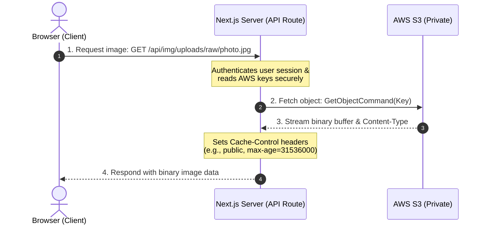
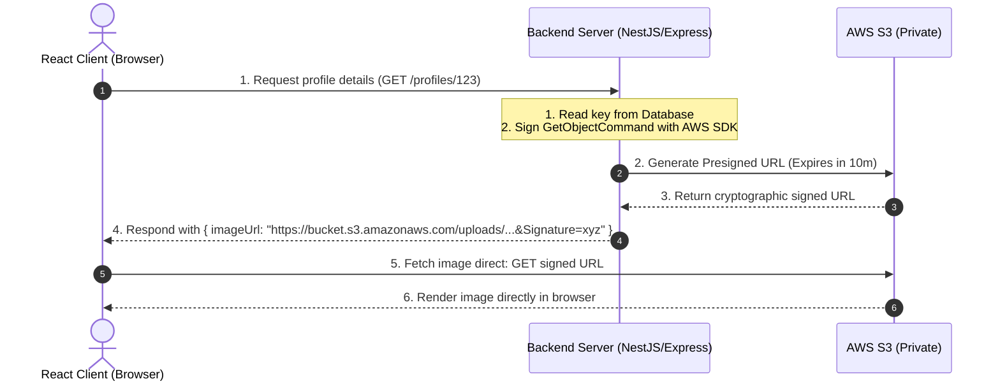
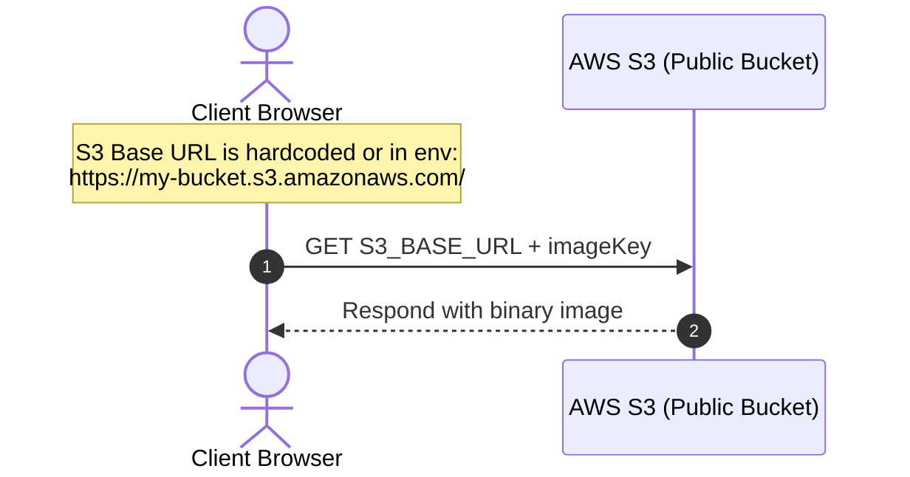
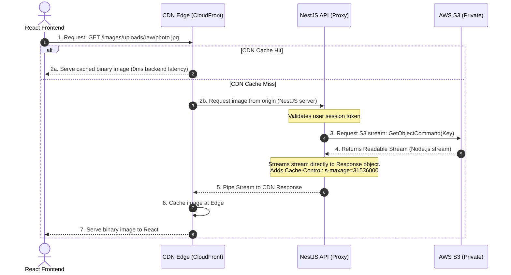

<style>
  code, pre, kbd, samp {
    font-family: 'Fira Code', ui-monospace, SFMono-Regular, "SF Mono", Menlo, Monaco, Consolas, "Liberation Mono", "Courier New", monospace !important;
  }
</style>

# <span style="color:#0f766e;">🖼️ Architectural Guide: S3 Image Rendering Patterns in Next.js vs. React</span>

When building applications that store assets in AWS S3, a common architectural question is: **How do we render private S3 images in the browser?**

If the backend API returns only S3 object keys (e.g., `uploads/raw/image.jpg`), rendering works differently in a **full-stack framework (like Next.js)** compared to a **client-only library (like React)**.

This document covers the three main rendering patterns, their execution flows, and key production caveats.

---

## 🗺️ Architectural Decision Matrix

| Pattern | 🔒 Security | ⚡ Performance | 🛠️ Implementation Complexity |
| :--- | :--- | :--- | :--- |
| **Pattern 1: Server-Side Image Proxy** | **Highest** (All S3 logic and keys hidden behind server). | **Medium** (Backend streams bytes; can be optimized with CDN caching). | **Medium** (Requires writing an endpoint to stream S3 objects). |
| **Pattern 2: Presigned GET URLs** | **High** (Short-lived signed access URLs). | **High** (Direct download from S3/CDN bypassing backend). | **Medium** (Backend must sign URLs dynamically during DB queries). |
| **Pattern 3: Public Bucket URLs** | **None** (Everyone can access any file). | **Highest** (Direct fetch from S3 edge). | **Lowest** (Concatenate Bucket URL with the key). |

---

## 🏷️ Pattern 1: Server-Side Image Proxy (The Next.js Way)

In a full-stack framework like Next.js, the backend API can return **only the S3 keys** because Next.js has a built-in server-side API layer to act as a secure proxy.

### 🔄 Execution Flow


### 💻 Code Representation
1. **API Response (Lightweight JSON):**
   ```json
   { "id": "user_123", "imageKey": "uploads/raw/photo.jpg" }
   ```
2. **Frontend Rendering:**
   ```tsx
   // Next.js maps the S3 key to the local API proxy route
   
   ```
3. **Backend Proxy Route (`src/app/api/img/[...key]/route.ts`):**
   Securely streams S3 objects to the client. See implementation in [route.ts](file:///Users/mac/Developer/Thumbnail-app/src/app/api/img/%5B...key%5D/route.ts).

---

## 🏷️ Pattern 2: Presigned GET URLs (The React SPA Way)

In a pure client-side React app (e.g. Vite or Create React App), the browser has no server side to fetch private images. If the API returns only keys, React **cannot** fetch them directly from a private bucket. 

Instead, the backend generates a **presigned GET URL** (which embeds temporary authorization signatures) and sends the full URL to the client.

### 🔄 Execution Flow


### 💻 Code Representation
1. **API Response (Full signed URL):**
   ```json
   {
     "id": "user_123",
     "imageUrl": "https://my-bucket.s3.amazonaws.com/uploads/raw/photo.jpg?AWSAccessKeyId=AKIA...&Expires=1700000&Signature=abc123xyz"
   }
   ```
2. **Frontend Rendering:**
   ```tsx
   // React sets the src directly to the S3 URL
   
   ```

---

## 🏷️ Pattern 3: Public Bucket URLs (Simple but Unsecure)

If the data is completely public (e.g. product photos, public blog thumbnails), you can make the S3 bucket public. The backend only returns the key, and the frontend concatenates the base bucket URL with the key.

### 🔄 Execution Flow


---

## 🚀 Industrial-Grade Pattern: NestJS Proxy + React Client + CDN Caching

In high-traffic production environments, downloading entire S3 objects into backend memory as Buffers (e.g., `Buffer.concat`) is an **anti-pattern** that leads to high CPU usage and Out-Of-Memory (OOM) crashes. 

Instead, the **industrial standard** streams the file bytes directly from S3 to the client, utilizing a Content Delivery Network (CDN) like CloudFront or Cloudflare to cache the images at the edge.

### 🔄 Execution Flow


### 🛠️ NestJS Controller Implementation (Memory-Efficient Streaming)

This NestJS controller uses Express's `@Res()` parameter to pipe the S3 stream directly to the response without loading the entire file into Node.js memory.

```typescript
import { Controller, Get, Param, Res, HttpStatus, HttpException, UseGuards } from '@nestjs/common';
import { Response } from 'express';
import { Readable } from 'stream';
import { StorageService } from './storage.service';
import { AuthGuard } from '../auth/auth.guard'; // Example guard

@Controller('images')
export class ImageProxyController {
  constructor(private readonly storageService: StorageService) {}

  @Get(':folder/:subfolder/:filename')
  @UseGuards(AuthGuard) // Protect private images
  async getProxiedImage(
    @Param('folder') folder: string,
    @Param('subfolder') subfolder: string,
    @Param('filename') filename: string,
    @Res() res: Response,
  ) {
    const s3Key = `${folder}/${subfolder}/${filename}`;

    try {
      // 1. Request stream from AWS S3
      const s3Response = await this.storageService.getS3ReadableStream(s3Key);
      
      if (!s3Response.Body) {
        throw new HttpException('Image body is empty', HttpStatus.NOT_FOUND);
      }

      // 2. Set proxy & browser caching headers
      res.setHeader('Content-Type', s3Response.ContentType || 'image/jpeg');
      
      // CDN Cache for 1 year (s-maxage), Browser cache for 10 minutes (max-age)
      res.setHeader('Cache-Control', 'public, max-age=600, s-maxage=31536000, immutable');
      if (s3Response.ETag) {
        res.setHeader('ETag', s3Response.ETag);
      }

      // 3. Pipe the S3 readable stream directly to the Express response
      const stream = s3Response.Body as Readable;
      stream.pipe(res);

    } catch (err: any) {
      if (err.name === 'NoSuchKey') {
        throw new HttpException('Image not found', HttpStatus.NOT_FOUND);
      }
      throw new HttpException('Failed to stream image', HttpStatus.BAD_GATEWAY);
    }
  }
}
```

### 💻 React Frontend Rendering Patterns

#### Pattern A: Public / Standard Cookied Assets
If your NestJS API uses session-based HTTP-only cookies for authentication, the browser automatically attaches them to standard `` tags. You don't need any Javascript to load them:

```tsx
export function Avatar({ imageKey }: { imageKey: string }) {
  // Directly point to the NestJS proxy
  return (
    
  );
}
```

#### Pattern B: Protected Assets (JWT / Bearer Token)
If your NestJS API requires a `Bearer <JWT>` token in the header, standard `` tags cannot append headers. You must fetch the image as a Blob in React:

```tsx
import { useEffect, useState } from 'react';

export function SecureImage({ imageKey }: { imageKey: string }) {
  const [imageUrl, setImageUrl] = useState<string>('');
  const [loading, setLoading] = useState(true);

  useEffect(() => {
    let objectUrl = '';
    async function loadSecureImage() {
      try {
        const token = localStorage.getItem('jwt_token');
        const response = await fetch(`https://api.yourdomain.com/images/${imageKey}`, {
          headers: {
            'Authorization': `Bearer ${token}`
          }
        });
        
        if (!response.ok) throw new Error('Unauthorized');
        
        const blob = await response.blob();
        objectUrl = URL.createObjectURL(blob);
        setImageUrl(objectUrl);
      } catch (err) {
        console.error('Failed to load private image:', err);
      } finally {
        setLoading(false);
      }
    }

    loadSecureImage();

    // Clean up memory URL on unmount
    return () => {
      if (objectUrl) URL.revokeObjectURL(objectUrl);
    };
  }, [imageKey]);

  if (loading) return <div className="skeleton-loader animate-pulse" />;
  return imageUrl ?  : <span>Failed to load image.</span>;
}
```

---

## ⚠️ Critical Production Caveats

### 1. Caching & CDN Costs
* **Image Proxy:** Since all requests go through your server, you can cache them using a CDN (like Cloudflare or CloudFront) in front of your `/api/img/*` route. This reduces AWS S3 GET costs to near zero for popular images.
* **Presigned URLs:** Presigned URLs **cannot be easily cached** by CDNs because the query parameters (signature, expiration timestamp) change every time they are generated. The browser has to download the image from S3 again when the signature expires, resulting in higher AWS data transfer costs.

### 2. S3 Bucket Security (Access Control)
* **Image Proxy / Presigned URLs:** Keep S3 bucket public access **blocked entirely**. This prevents malicious actors from downloading your entire user asset directory or guessing object keys.
* **Public Bucket:** If public access is enabled, make sure you configure your S3 bucket policy to allow **ONLY read permissions** (`s3:GetObject`), never write or delete permissions.

### 3. Expiration Management
* When using **Presigned GET URLs**, keep the expiration window short (e.g., 5 to 15 minutes). 
* Do not save presigned URLs in your database. Always save the **raw key** in the database, and generate the presigned URL *on the fly* during the API request handler.

### 4. CORS configuration
* If rendering images inside a `<canvas>` element (e.g., for resizing or cropping on the client side) or fetching them via Javascript `fetch()`, S3 must have a CORS policy configured to allow requests from your frontend domain. See standard S3 CORS setup in [nestjs-s3-presigned-upload-guide.md](file:///Users/mac/Developer/Thumbnail-app/docs/nestjs-s3-presigned-upload-guide.md#L702-L717).
