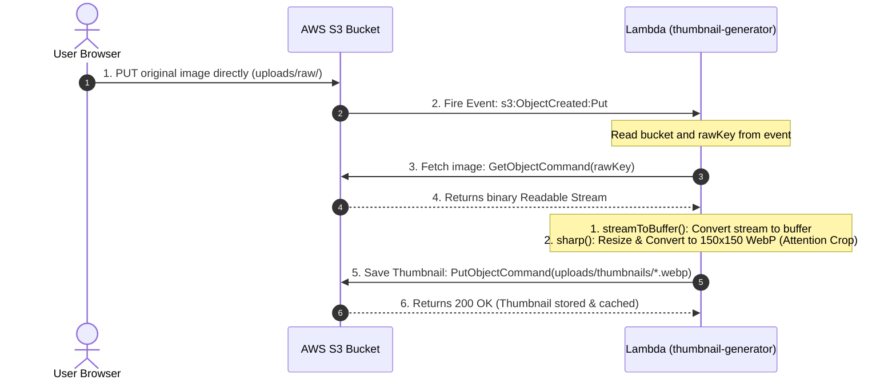

<style>
  code, pre, kbd, samp {
    font-family: 'Fira Code', ui-monospace, SFMono-Regular, "SF Mono", Menlo, Monaco, Consolas, "Liberation Mono", "Courier New", monospace !important;
  }
</style>

# <span style="color:#853b90; background-color:#fae8ff; padding: 6px 12px; border-radius: 6px; display: inline-block;">⚡ S3 ➔ Lambda Thumbnail Generator: Setup & Operations Guide</span>

This module provides a standalone, production-ready AWS Lambda function that automatically generates compressed **150x150 WebP thumbnails** whenever an image is uploaded to your S3 bucket.

---

## 📂 File Structure

The Lambda directory is structured as follows:

```text
lambda/thumbnail-generator/
├── index.mjs             # AWS Lambda entry point (ES Module)
├── package.json          # Node dependencies & bundling script
├── .npmrc                # Lock file for cross-compilation binaries
└── README.md             # Complete setup and operations guide (this file)
```

---

## ⚙️ How the Lambda Execution Flow Works



---

## 📜 Lambda Code Syntax (`index.mjs`)

Below is the complete ES Module code for the image processor:

```javascript
/**
 * S3 → Lambda Thumbnail Generator
 * ─────────────────────────────────────────────────────────────
 * RAW_PREFIX   – S3 folder where original uploads land
 * THUMB_PREFIX – S3 folder where thumbnails are written
 * ─────────────────────────────────────────────────────────────
 */

const RAW_PREFIX   = "uploads/raw/";       // must end with /
const THUMB_PREFIX = "uploads/thumbnails/"; // must end with /
const THUMB_EXT    = ".webp";              // output extension
const THUMB_WIDTH  = 150;                  // width (px)
const THUMB_HEIGHT = 150;                  // height (px)
const THUMB_QUALITY = 78;                  // WebP compression quality (1-100)

import { GetObjectCommand, PutObjectCommand, S3Client } from "@aws-sdk/client-s3";
import sharp from "sharp";

// S3 Client automatically uses the IAM Lambda execution role credentials
const s3 = new S3Client({});

/** Convert a readable stream from S3 response to a Buffer */
async function streamToBuffer(stream) {
  const chunks = [];
  for await (const chunk of stream) {
    chunks.push(Buffer.isBuffer(chunk) ? chunk : Buffer.from(chunk));
  }
  return Buffer.concat(chunks);
}

/**
 * Derives the thumbnail key from the raw upload key.
 * Returns null if the object is uploaded outside the RAW_PREFIX folder.
 */
function getThumbnailKey(rawKey) {
  const decodedKey = decodeURIComponent(rawKey.replace(/\+/g, " "));
  if (!decodedKey.startsWith(RAW_PREFIX)) return null;

  const filename = decodedKey.split("/").pop();
  if (!filename) return null;

  return {
    rawKey: decodedKey,
    thumbnailKey: `${THUMB_PREFIX}${filename}${THUMB_EXT}`
  };
}

export const handler = async (event) => {
  const results = [];

  for (const record of event.Records ?? []) {
    const bucket  = record.s3?.bucket?.name;
    const keyInfo = getThumbnailKey(record.s3?.object?.key ?? "");

    if (!bucket || !keyInfo) {
      results.push({ status: "skipped", reason: "unsupported-record" });
      continue;
    }

    try {
      // 1. Stream the original from S3
      const object = await s3.send(
        new GetObjectCommand({ Bucket: bucket, Key: keyInfo.rawKey })
      );

      if (!object.Body) throw new Error(`Empty body for ${keyInfo.rawKey}`);
      const sourceBuffer = await streamToBuffer(object.Body);

      // 2. Perform smart attention cropping and convert to WebP
      const thumbnail = await sharp(sourceBuffer, { failOn: "none", limitInputPixels: false })
        .rotate() // Handles EXIF rotation automatically
        .resize(THUMB_WIDTH, THUMB_HEIGHT, {
          fit: "cover",
          position: "attention", // Focuses automatically on faces and key details
          withoutEnlargement: true
        })
        .webp({ quality: THUMB_QUALITY, effort: 4 })
        .toBuffer();

      // 3. Upload the thumbnail back to S3
      await s3.send(
        new PutObjectCommand({
          Bucket: bucket,
          Key: keyInfo.thumbnailKey,
          Body: thumbnail,
          ContentType: "image/webp",
          CacheControl: "public, max-age=31536000, immutable",
          Metadata: { source: keyInfo.rawKey }
        })
      );

      results.push({
        status: "created",
        sourceKey: keyInfo.rawKey,
        thumbnailKey: keyInfo.thumbnailKey
      });

      console.log(`Thumbnail created successfully: ${keyInfo.thumbnailKey}`);
    } catch (error) {
      console.error("Thumbnail generation failed:", { bucket, key: keyInfo.rawKey, error });
      throw error; // Propagate the error so Lambda marks this execution as failed
    }
  }

  return { results };
};
```

---

## 🛠️ Step-by-Step Setup Guide

Follow these steps in order to set up, deploy, and monitor the S3 Lambda trigger.

### Step 1: Create the AWS S3 Bucket
1. Open the **AWS Console ➔ S3 ➔ Create bucket**.
2. **Bucket name:** Choose a globally unique name (e.g. `my-app-profile-assets`).
3. **AWS Region:** Choose the region closest to your users.
4. **Object Ownership:** Select **ACLs disabled (recommended)**.
5. **Block Public Access:** Tick **Block all public access (ON)**.

---

### Step 2: Configure S3 CORS (Prevents CORS Errors in Browser)
Go to **S3 ➔ your-bucket ➔ Permissions ➔ CORS configuration ➔ Edit**, and paste:

```json
[
  {
    "AllowedHeaders": [
      "Content-Type",
      "Content-Length",
      "Authorization",
      "x-amz-date",
      "x-amz-content-sha256",
      "x-amz-security-token",
      "x-amz-tagging"
    ],
    "AllowedMethods": ["PUT", "GET", "HEAD"],
    "AllowedOrigins": ["http://localhost:3000", "https://yourdomain.com"],
    "ExposeHeaders": ["ETag", "x-amz-request-id"],
    "MaxAgeSeconds": 3000
  }
]
```

---

### Step 3: Create the IAM Role for Lambda
Go to **IAM ➔ Roles ➔ Create role**:
1. **Trusted entity type:** Select **AWS service** ➔ **Lambda** ➔ Next.
2. **Attach permissions policies:** Search and select `AWSLambdaBasicExecutionRole` (writes logs to CloudWatch).
3. **Role name:** `lambda-thumbnail-generator-role` ➔ **Create role**.
4. **Add Scoped Permissions (Least Privilege):** 
   Under **Permissions ➔ Add permissions ➔ Create inline policy ➔ JSON**:
   ```json
   {
     "Version": "2012-10-17",
     "Statement": [
       {
         "Sid": "S3Access",
         "Effect": "Allow",
         "Action": [
           "s3:GetObject"
         ],
         "Resource": "arn:aws:s3:::your-bucket-name/uploads/raw/*"
       },
       {
         "Sid": "S3Write",
         "Effect": "Allow",
         "Action": [
           "s3:PutObject"
         ],
         "Resource": "arn:aws:s3:::your-bucket-name/uploads/thumbnails/*"
       }
     ]
   }
   ```
   Name the policy `lambda-s3-policy` and save it.

---

### Step 4: Project Initialization & Packaging (Solving Native Binary Compatibility)

Because S3 Lambda executes in a containerized **Linux environment** (AL2023 / Amazon Linux 2), the image-resizing library `sharp` must be compiled for Linux. If you compile it on your local macOS or Windows machine, the Lambda will crash with a loading error.

Follow these step-by-step commands to initialize, configure, install, and bundle the Lambda package from scratch.

---

#### 4.1 Initialize the Project & Create `package.json`
If creating this module from scratch, navigate to your folder and initialize it:
```bash
# 1. Create a clean project directory and navigate into it
mkdir -p lambda/thumbnail-generator
cd lambda/thumbnail-generator

# 2. Initialize a default npm project
npm init -y
```

Open `package.json` and replace its content with the following configuration. Note that `"type": "module"` is **required** to support ES Module imports (`import` instead of `require`) used in `index.mjs`:

```json
{
  "name": "thumbnail-generator-lambda",
  "version": "1.0.0",
  "private": true,
  "type": "module",
  "scripts": {
    "install:lambda": "npm install --os=linux --cpu=x64 --libc=glibc sharp",
    "bundle": "npm run install:lambda && zip -r ../thumbnail-generator.zip index.mjs node_modules package.json"
  },
  "dependencies": {
    "@aws-sdk/client-s3": "^3.600.0",
    "sharp": "^0.33.5"
  }
}
```

---

#### 4.2 Create S3 Platform Constraints (`.npmrc`)
Create a file named `.npmrc` in the same directory as `package.json`. This tells `npm` to always fetch the correct binaries for AWS Lambda, even if you run a plain `npm install` on a Mac or Windows machine:

```ini
# Force sharp to always install the Linux x64 binary
# so the deployment ZIP works on AWS Lambda regardless of dev machine OS.
os=linux
cpu=x64
libc=glibc
```

---

#### 4.3 Install Dependencies
To fetch the correct Linux-compatible binaries, execute the custom install command:

```bash
# Run the scoped install command
npm run install:lambda
```
This downloads and compiles `sharp` targeting S3 Lambda's Linux container CPU architecture (`x64`).

---

#### 4.4 Create the Deployment ZIP
Run the bundler script to zip the files:

```bash
# Run the bundling script
npm run bundle
```

##### ℹ️ Key Details on the Zip Command:
* **The Command:** `zip -r ../thumbnail-generator.zip index.mjs node_modules package.json`
* **Why the Parent Folder (`../`)?:** We output the ZIP file to the parent folder (`../`) so that the generated `.zip` file is **not** inside the folder being compressed. Otherwise, the zip tool would attempt to recursively zip the zip file into itself, causing infinite file bloat.
* **Included Files:** We only zip the files needed for execution: the handler (`index.mjs`), the dependencies (`node_modules`), and the configuration (`package.json`). We exclude guides, `.npmrc`, or source maps to keep the package lightweight.

---

### Step 5: Deploy the Lambda Function
1. Go to **AWS Lambda ➔ Functions ➔ Create function**.
2. Select **Author from scratch**.
3. **Function name:** `thumbnail-generator`
4. **Runtime:** `Node.js 20.x` or `Node.js 22.x`
5. **Architecture:** `x86_64`
6. **Execution role:** Select **Use an existing role** ➔ `lambda-thumbnail-generator-role`.
7. Click **Create function**.
8. **Upload code:** Go to **Code ➔ Upload from ➔ .zip file** and select `thumbnail-generator.zip`.
9. **Configure Timeout & Memory:** Under **Configuration ➔ General configuration ➔ Edit**:
   - Set **Memory** to `512 MB` (sharp needs memory space to decode and scale images).
   - Set **Timeout** to `30 seconds` (to ensure larger images have enough execution time).

---

### Step 6: Create the S3 Event Trigger (Important!)
Go to **AWS Lambda ➔ Functions ➔ thumbnail-generator ➔ Triggers ➔ Add trigger**:
1. Select **S3** as the source.
2. Select your asset bucket.
3. **Event types:** Check `All object create events` (or specifically `PUT` and `CompleteMultipartUpload`).
4. **Prefix:** `uploads/raw/` (Crucial! If this is empty, Lambda writing to `uploads/thumbnails/` will trigger another event notification, resulting in an infinite recursion loop).
5. Tick the acknowledgement box ➔ **Add**.

---

### Step 7: Testing the Execution Flow

#### Option A: Manual Test Event
Inside the Lambda AWS Console, navigate to **Test ➔ Create test event**:
```json
{
  "Records": [
    {
      "s3": {
        "bucket": { "name": "your-bucket-name" },
        "object": { "key": "uploads/raw/test-image.jpg" }
      }
    }
  ]
}
```
Click **Test** and confirm the response details.

#### Option B: CloudWatch Logging
Monitor logs inside **Monitor ➔ View CloudWatch logs**. It will output generation statements:
```text
Thumbnail created successfully: uploads/thumbnails/test-image.jpg.webp
```

---

### Step 8: Configure S3 Lifecycle Rules (Clean up abandoned files)
To automatically delete raw uploads that were never saved in the database (e.g. if the user abandoned the form registration page):
1. Go to **S3 ➔ your-bucket ➔ Management ➔ Create lifecycle rule**.
2. **Rule name:** `DeleteOrphanedRawUploads`
3. **Scope:** **Limit the scope using one or more filters**.
4. **Prefix:** `uploads/raw/`
5. **Object tags:** Key: `cleanup`, Value: `true`
6. **Lifecycle actions:** Check **Expire current versions of objects**.
7. **Days after creation:** `1` (marks raw uploads for deletion 24 hours after being stored).
8. **Create rule**.
