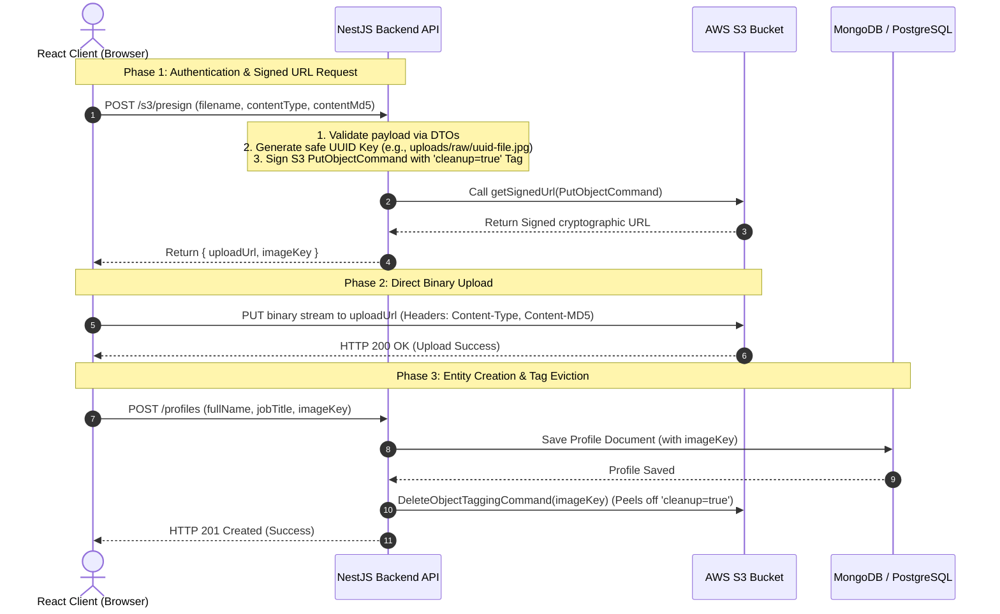

<style>
  code, pre, kbd, samp {
    font-family: 'Fira Code', ui-monospace, SFMono-Regular, "SF Mono", Menlo, Monaco, Consolas, "Liberation Mono", "Courier New", monospace !important;
  }
</style>

# <span style="color:#0f766e;">🚀 Complete Blueprint: Direct S3 Presigned Uploads with React & NestJS</span>

This step-by-step guide details how to build a production-grade, direct-to-S3 file upload system using a **React SPA Frontend** and a **NestJS Backend**. 

We will extract the pattern from your current Next.js application and port it into a proper NestJS Modular Architecture utilizing dependency injection, strong validation DTOs, and AWS SDK v3.

---

## <span style="color:#0f766e; background-color:#e6f4ea; padding: 4px 8px; border-radius: 4px; display: inline-block;">1. System Architecture Flow</span>

Instead of uploading files directly to your application server (which blocks threads and bloats memory), the client fetches a cryptographically signed write URL from NestJS, uploads the binary file directly to S3, and then registers the file key in the database.



---

## <span style="color:#b45309; background-color:#fffbeb; padding: 4px 8px; border-radius: 4px; display: inline-block;">2. Prerequisites & Environment Setup</span>

### Install Dependencies (NestJS Backend)
Run the following command inside your NestJS backend codebase:
```bash
npm install @aws-sdk/client-s3 @aws-sdk/s3-request-presigner uuid class-validator class-transformer @nestjs/config
npm install --save-dev @types/uuid
```

### Environment Variables (`.env`)
Add these credentials to your NestJS `.env` file:
```env
AWS_REGION=ap-south-1
AWS_ACCESS_KEY_ID=your-aws-access-key-id
AWS_SECRET_ACCESS_KEY=your-aws-secret-access-key
S3_BUCKET_NAME=your-s3-bucket-name
PORT=3000
```

---

## <span style="color:#3b82f6; background-color:#eff6ff; padding: 4px 8px; border-radius: 4px; display: inline-block;">3. NestJS Step-by-Step Implementation</span>

### Step 1: Create the S3 Module & Service
Create the core storage wrapper class. This service wraps the AWS SDK and implements dependency injection through NestJS’s `ConfigService`.

```typescript
// src/modules/storage/storage.service.ts
import { Injectable, InternalServerErrorException } from '@nestjs/common';
import { ConfigService } from '@nestjs/config';
import { 
  S3Client, 
  PutObjectCommand, 
  DeleteObjectTaggingCommand,
  CreateMultipartUploadCommand,
  UploadPartCommand,
  CompleteMultipartUploadCommand,
  AbortMultipartUploadCommand
} from '@aws-sdk/client-s3';
import { getSignedUrl } from '@aws-sdk/s3-request-presigner';

@Injectable()
export class StorageService {
  private s3Client: S3Client;
  private bucketName: string;

  constructor(private readonly configService: ConfigService) {
    this.s3Client = new S3Client({
      region: this.configService.get<string>('AWS_REGION'),
      requestChecksumCalculation: 'WHEN_REQUIRED',
      credentials: {
        accessKeyId: this.configService.get<string>('AWS_ACCESS_KEY_ID')!,
        secretAccessKey: this.configService.get<string>('AWS_SECRET_ACCESS_KEY')!,
      },
    });
    this.bucketName = this.configService.get<string>('S3_BUCKET_NAME')!;
  }

  /**
   * Generates a presigned PUT URL for standard file uploads
   */
  async createPutUrl(key: string, contentType: string, contentMd5?: string): Promise<string> {
    const command = new PutObjectCommand({
      Bucket: this.bucketName,
      Key: key,
      ContentType: contentType,
      Tagging: 'cleanup=true', // Tagged for automatic lifecycle deletion if abandoned
      ContentMD5: contentMd5,
    });

    try {
      // Generate signed URL. Headers specified in signableHeaders MUST be sent by the client.
      return await getSignedUrl(this.s3Client, command, {
        expiresIn: 300, // URL expires in 5 minutes
        signableHeaders: new Set(['content-type', 'content-md5']),
      });
    } catch (err: any) {
      throw new InternalServerErrorException('Failed to generate S3 upload URL: ' + err.message);
    }
  }

  /**
   * Removes 'cleanup=true' tag to exempt successfully registered uploads from lifecycle deletion
   */
  async removeCleanupTag(key: string): Promise<void> {
    try {
      await this.s3Client.send(
        new DeleteObjectTaggingCommand({
          Bucket: this.bucketName,
          Key: key,
        })
      );
    } catch (err: any) {
      throw new InternalServerErrorException('Failed to remove S3 cleanup tag: ' + err.message);
    }
  }

  /**
   * Initiates multipart upload session for large files (> 50MB)
   */
  async initiateMultipartUpload(key: string, contentType: string): Promise<string> {
    try {
      const res = await this.s3Client.send(
        new CreateMultipartUploadCommand({
          Bucket: this.bucketName,
          Key: key,
          ContentType: contentType,
          Tagging: 'cleanup=true',
        })
      );
      if (!res.UploadId) throw new Error('UploadId missing from AWS response.');
      return res.UploadId;
    } catch (err: any) {
      throw new InternalServerErrorException('Failed to initialize S3 multipart upload: ' + err.message);
    }
  }

  /**
   * Generates a signed URL for a specific chunk/part
   */
  async createUploadPartUrl(key: string, uploadId: string, partNumber: number): Promise<string> {
    const command = new UploadPartCommand({
      Bucket: this.bucketName,
      Key: key,
      UploadId: uploadId,
      PartNumber: partNumber,
    });
    return getSignedUrl(this.s3Client, command, { expiresIn: 1200 }); // 20 minutes expiration
  }

  /**
   * Finalizes the S3 Multipart session, joining all parts together
   */
  async completeMultipartUpload(key: string, uploadId: string, parts: { PartNumber: number; ETag: string }[]): Promise<void> {
    try {
      await this.s3Client.send(
        new CompleteMultipartUploadCommand({
          Bucket: this.bucketName,
          Key: key,
          UploadId: uploadId,
          MultipartUpload: { Parts: parts },
        })
      );
    } catch (err: any) {
      throw new InternalServerErrorException('Failed to complete S3 multipart upload: ' + err.message);
    }
  }

  /**
   * Aborts a multipart session to clean up temporary chunks
   */
  async abortMultipartUpload(key: string, uploadId: string): Promise<void> {
    await this.s3Client.send(
      new AbortMultipartUploadCommand({
        Bucket: this.bucketName,
        Key: key,
        UploadId: uploadId,
      })
    );
  }
}
```

---

### Step 2: DTO Definition & Payload Validation
DTOs ensure parameters sent by the client are present and properly typed before running any cryptographic operations.

```typescript
// src/modules/storage/dto/storage.dto.ts
import { IsString, IsNotEmpty, IsOptional, IsNumber, IsArray, ValidateNested } from 'class-validator';
import { Type } from 'class-transformer';

export class PresignDto {
  @IsString()
  @IsNotEmpty()
  filename: string;

  @IsString()
  @IsNotEmpty()
  contentType: string;

  @IsString()
  @IsOptional()
  contentMd5?: string; // Client MD5 checksum for file integrity
}

export class InitMultipartDto {
  @IsString()
  @IsNotEmpty()
  filename: string;

  @IsString()
  @IsNotEmpty()
  contentType: string;

  @IsNumber()
  size: number;
}

export class PartDto {
  @IsNumber()
  PartNumber: number;

  @IsString()
  @IsNotEmpty()
  ETag: string;
}

export class CompleteMultipartDto {
  @IsString()
  @IsNotEmpty()
  key: string;

  @IsString()
  @IsNotEmpty()
  uploadId: string;

  @IsArray()
  @ValidateNested({ each: true })
  @Type(() => PartDto)
  parts: PartDto[];
}
```

---

### Step 3: Create the S3 Controller
The controller intercepts API requests, sanitizes the filename to prevent malicious path inputs, generates a secure UUID key, and requests signature creation.

```typescript
// src/modules/storage/storage.controller.ts
import { Controller, Post, Body, HttpCode, HttpStatus } from '@nestjs/common';
import { StorageService } from './storage.service';
import { PresignDto, InitMultipartDto, CompleteMultipartDto } from './dto/storage.dto';
import { v4 as uuidv4 } from 'uuid';

@Controller('s3')
export class StorageController {
  constructor(private readonly storageService: StorageService) {}

  @Post('presign')
  @HttpCode(HttpStatus.OK)
  async getPresignedUrl(@Body() dto: PresignDto) {
    // 1. Sanitize filename to remove spaces & special characters (prevent inject exploits)
    const sanitizedName = dto.filename.replace(/\s+/g, '_').replace(/[^a-zA-Z0-9_.-]/g, '');
    
    // 2. Generate a secure, unique object storage key
    const imageKey = `uploads/raw/${uuidv4()}-${sanitizedName}`;

    // 3. Generate signature
    const uploadUrl = await this.storageService.createPutUrl(
      imageKey, 
      dto.contentType, 
      dto.contentMd5
    );

    return { uploadUrl, imageKey };
  }

  @Post('multipart/init')
  @HttpCode(HttpStatus.OK)
  async initMultipart(@Body() dto: InitMultipartDto) {
    const sanitizedName = dto.filename.replace(/\s+/g, '_').replace(/[^a-zA-Z0-9_.-]/g, '');
    const imageKey = `uploads/raw/${uuidv4()}-${sanitizedName}`;

    const uploadId = await this.storageService.initiateMultipartUpload(imageKey, dto.contentType);
    
    // Chunk size: 5MB minimum required by AWS S3
    const chunkSize = 5 * 1024 * 1024;
    const totalParts = Math.ceil(dto.size / chunkSize);

    const partPromises = Array.from({ length: totalParts }, async (_, i) => {
      const partNumber = i + 1;
      const uploadUrl = await this.storageService.createUploadPartUrl(imageKey, uploadId, partNumber);
      return { partNumber, uploadUrl };
    });

    const parts = await Promise.all(partPromises);

    return { uploadId, key: imageKey, parts };
  }

  @Post('multipart/complete')
  @HttpCode(HttpStatus.OK)
  async completeMultipart(@Body() dto: CompleteMultipartDto) {
    await this.storageService.completeMultipartUpload(dto.key, dto.uploadId, dto.parts);
    return { success: true };
  }
}
```

---

### Step 4: Register S3 Module
Wire everything together inside `storage.module.ts`. Make sure to export the `StorageService` so other modules (like `ProfilesModule` or `UsersModule`) can import it to perform **Tag Cleanup** when database saves complete.

```typescript
// src/modules/storage/storage.module.ts
import { Module } from '@nestjs/common';
import { ConfigModule } from '@nestjs/config';
import { StorageController } from './storage.controller';
import { StorageService } from './storage.service';

@Module({
  imports: [ConfigModule],
  controllers: [StorageController],
  providers: [StorageService],
  exports: [StorageService], // Critical: Exports StorageService to allow tag cleaning in other services
})
export class StorageModule {}
```

---

## <span style="color:#10b981; background-color:#ecfdf5; padding: 4px 8px; border-radius: 4px; display: inline-block;">4. Frontend React Integration</span>

In standard React, there is no built-in `next/image` proxy engine. The React SPA must handle MD5 calculation natively or via libraries, fetch the URL from NestJS, upload directly, and complete the save.

### Client-Side MD5 Calculation Hook
To calculate the MD5 hash of files in React without bloating RAM, use `spark-md5` to hash the file block-by-block.

Install `spark-md5`:
```bash
npm install spark-md5
npm install --save-dev @types/spark-md5
```

```typescript
// src/hooks/useProfileUpload.ts
import { useState } from 'react';
import SparkMD5 from 'spark-md5';

export function useProfileUpload() {
  const [loading, setLoading] = useState(false);
  const [error, setError] = useState<string | null>(null);

  // Helper function to read file blocks and generate MD5 hash
  const calculateMd5 = (file: File): Promise<string> => {
    return new Promise((resolve, reject) => {
      const blobSlice = File.prototype.slice || (File.prototype as any).mozSlice || (File.prototype as any).webkitSlice;
      const chunkSize = 2097152; // Read file in 2MB chunks
      const chunks = Math.ceil(file.size / chunkSize);
      let currentChunk = 0;
      const spark = new SparkMD5.ArrayBuffer();
      const fileReader = new FileReader();

      fileReader.onload = (e) => {
        spark.append(e.target?.result as ArrayBuffer);
        currentChunk++;
        if (currentChunk < chunks) {
          loadNext();
        } else {
          // Resolve with base64 encoded MD5 hash (required by S3 Content-MD5)
          const rawHash = spark.end(true); // Return raw binary string
          const base64Hash = btoa(rawHash);
          resolve(base64Hash);
        }
      };

      fileReader.onerror = () => reject('MD5 calculation failed.');

      const loadNext = () => {
        const start = currentChunk * chunkSize;
        const end = start + chunkSize >= file.size ? file.size : start + chunkSize;
        fileReader.readAsArrayBuffer(blobSlice.call(file, start, end));
      };

      loadNext();
    });
  };

  const uploadFile = async (file: File, profileData: { fullName: string; jobTitle: string }) => {
    setLoading(true);
    setError(null);

    try {
      // 1. Calculate File Checksum
      const fileMd5 = await calculateMd5(file);

      // 2. Fetch Presigned URL from NestJS API
      const response = await fetch('/api/s3/presign', {
        method: 'POST',
        headers: { 'Content-Type': 'application/json' },
        body: JSON.stringify({
          filename: file.name,
          contentType: file.type,
          contentMd5: fileMd5,
        }),
      });

      if (!response.ok) throw new Error('Failed to fetch presigned URL.');
      const { uploadUrl, imageKey } = await response.json();

      // 3. PUT binary data directly to Amazon S3
      // Custom headers signed by the server (Content-Type & Content-MD5) MUST be included
      const s3Response = await fetch(uploadUrl, {
        method: 'PUT',
        headers: {
          'Content-Type': file.type,
          'Content-MD5': fileMd5, // AWS will verify MD5 integrity match
        },
        body: file,
      });

      if (!s3Response.ok) throw new Error('S3 Direct Upload Failed.');

      // 4. Register Profile & Metadata with backend
      const dbResponse = await fetch('/api/profiles', {
        method: 'POST',
        headers: { 'Content-Type': 'application/json' },
        body: JSON.stringify({
          ...profileData,
          imageKey: imageKey, // File path key registered in database
        }),
      });

      if (!dbResponse.ok) throw new Error('Failed to register profile data.');

      setLoading(false);
      return await dbResponse.json();
    } catch (err: any) {
      setError(err.message || 'Something went wrong.');
      setLoading(false);
      throw err;
    }
  };

  return { uploadFile, loading, error };
}
```

---

## <span style="color:#853b90; background-color:#fae8ff; padding: 4px 8px; border-radius: 4px; display: inline-block;">5. S3 Client SDK Commands Guide</span>

When writing a backend in NestJS, you interact with AWS S3 using the modular **AWS SDK v3**. Below is a reference of the core commands, explaining when and how to use them with short, concise code examples.

### 1. `PutObjectCommand`
* **When to use:** Used to upload files, text strings, or buffers directly from the backend server to S3 (bypassing client-side presigning). Recommended for saving system configs, server-rendered reports, or small JSON state payloads.
* **Example:**
```typescript
import { S3Client, PutObjectCommand } from '@aws-sdk/client-s3';

const s3Client = new S3Client({ region: 'ap-south-1' });

async function uploadSystemReport(key: string, csvData: string) {
  await s3Client.send(
    new PutObjectCommand({
      Bucket: 'my-bucket-name',
      Key: key,
      Body: csvData, // Can be buffer, string, or stream
      ContentType: 'text/csv',
    })
  );
}
```

### 2. `GetObjectCommand`
* **When to use:** Used to download or stream files from a private S3 bucket to your backend server. Necessary when implementing file proxies or checking files before processing them.
* **Example:**
```typescript
import { S3Client, GetObjectCommand } from '@aws-sdk/client-s3';
import { Readable } from 'stream';

async function downloadConfig(key: string): Promise<string> {
  const response = await s3Client.send(
    new GetObjectCommand({
      Bucket: 'my-bucket-name',
      Key: key,
    })
  );
  
  const stream = response.Body as Readable;
  return new Promise((resolve, reject) => {
    let data = '';
    stream.on('data', (chunk) => (data += chunk));
    stream.on('end', () => resolve(data));
    stream.on('error', reject);
  });
}
```

### 3. `DeleteObjectCommand`
* **When to use:** Permanently deletes an object from S3. Critical for cleaning up storage when users delete files, close accounts, or upload replacement files (e.g. overwriting an avatar should trigger deletion of the old one).
* **Example:**
```typescript
import { S3Client, DeleteObjectCommand } from '@aws-sdk/client-s3';

async function permanentlyDeleteImage(imageKey: string) {
  await s3Client.send(
    new DeleteObjectCommand({
      Bucket: 'my-bucket-name',
      Key: imageKey,
    })
  );
  console.log(`Successfully deleted ${imageKey} from S3.`);
}
```

### 4. `HeadObjectCommand`
* **When to use:** Queries S3 for metadata about a specific file (size, content type, upload timestamp, custom headers) **without** downloading the actual file bytes. Highly efficient for validation (e.g. checking file existence, verifying sizes under 5MB).
* **Example:**
```typescript
import { S3Client, HeadObjectCommand } from '@aws-sdk/client-s3';

async function validateUploadedFile(key: string): Promise<boolean> {
  try {
    const metadata = await s3Client.send(
      new HeadObjectCommand({
        Bucket: 'my-bucket-name',
        Key: key,
      })
    );
    // Limit to 5MB
    return metadata.ContentLength ? metadata.ContentLength < 5 * 1024 * 1024 : false;
  } catch (error: any) {
    if (error.name === 'NotFound') return false; // File doesn't exist
    throw error;
  }
}
```

### 5. Tagging Commands (`PutObjectTaggingCommand` / `DeleteObjectTaggingCommand`)
S3 object tags are key-value pairs associated with files. They are typically used to mark files for different policies (like automatic lifecycle deletion rules).

#### Adding Tags (`PutObjectTaggingCommand`):
* **When to use:** Manually categorizing existing files or changing their lifecycle status.
* **Example:**
```typescript
import { S3Client, PutObjectTaggingCommand } from '@aws-sdk/client-s3';

async function markForReview(key: string) {
  await s3Client.send(
    new PutObjectTaggingCommand({
      Bucket: 'my-bucket-name',
      Key: key,
      Tagging: {
        TagSet: [
          { Key: 'needsReview', Value: 'true' }
        ]
      }
    })
  );
}
```

#### Removing Tags (`DeleteObjectTaggingCommand`):
* **When to use:** Confirming that a file is registered in the database, peeling off temporary flags (like `cleanup=true`) to rescue the file from automated lifecycle deletes.
* **Example:**
```typescript
import { S3Client, DeleteObjectTaggingCommand } from '@aws-sdk/client-s3';

async function exemptFromCleanup(key: string) {
  await s3Client.send(
    new DeleteObjectTaggingCommand({
      Bucket: 'my-bucket-name',
      Key: key,
    })
  );
}
```

---

## <span style="color:#dc2626; background-color:#fee2e2; padding: 4px 8px; border-radius: 4px; display: inline-block;">6. Crucial Caveats & Debugging Tips</span>

### 1. S3 Bucket CORS Failures
If you get `CORS error` in the browser console when calling S3 PUT:
- Open your AWS Console $\rightarrow$ S3 $\rightarrow$ Bucket $\rightarrow$ Permissions $\rightarrow$ **CORS configuration**.
- Add a CORS rule allowing your local and production domains, explicitly granting access to the `PUT` method and headers:

```json
[
  {
    "AllowedHeaders": ["*"],
    "AllowedMethods": ["PUT", "GET", "HEAD"],
    "AllowedOrigins": ["http://localhost:3000", "https://yourfrontend.com"],
    "ExposeHeaders": ["ETag"],
    "MaxAgeSeconds": 3000
  }
]
```

### 2. SignatureDoesNotMatch (HTTP 403 Forbidden)
This occurs if the client fails to provide the exact header values that were signed during URL generation:
- **Solution:** If you sign `Content-MD5` and `Content-Type` on the backend, the React client **must** pass those exact same headers during the S3 `PUT` fetch call. S3 calculates hashes matching these parameters; any mismatch results in a signature rejection.

### 3. S3 Lifecycle Rule for Cleanups
To clean up abandoned uploads (e.g. user selects file, S3 upload succeeds, but user closes browser tab before submitting profile form):
1. Configure an S3 Lifecycle Rule targeting the `uploads/raw/` prefix.
2. Select **Delete objects with specific tags**.
3. Set filter tag: `cleanup=true`.
4. Configure rule to expire/delete matching objects after **1 day**.

When a profile is successfully saved to MongoDB/PostgreSQL, the NestJS controller calls `StorageService.removeCleanupTag(imageKey)`. This peels the `cleanup=true` tag off the object, saving the file from automatic deletion.
