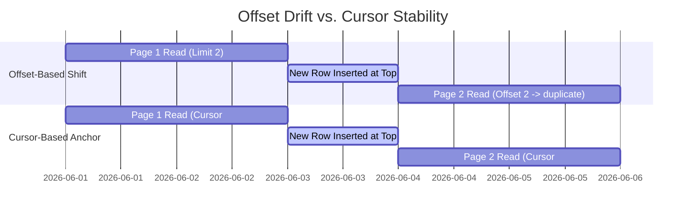
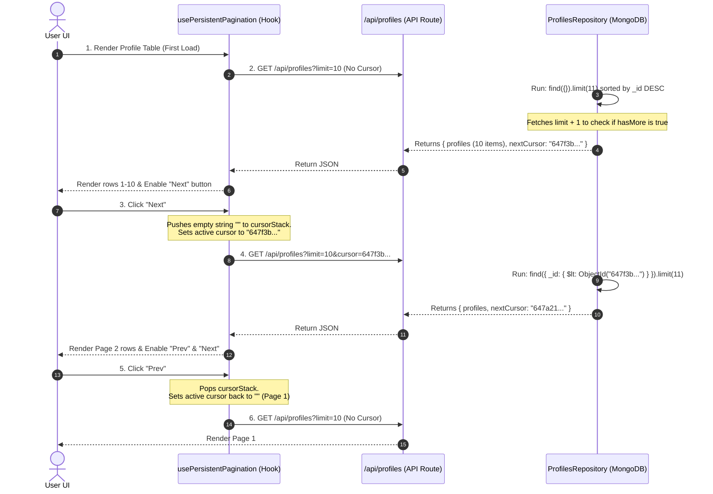

<style>
  code, pre, kbd, samp {
    font-family: ui-monospace, SFMono-Regular, "SF Mono", Menlo, Monaco, Consolas, "Liberation Mono", "Courier New", monospace !important;
  }
</style>

# 🚀 System Design Guide: High-Performance Pagination (Cursor-Based)

This guide provides an exhaustive analysis of database pagination models, comparing **Offset-based** vs. **Cursor-based** pagination from both database-engine and application-level perspectives.

It explains how the cursor-based approach works in this codebase and details how you can implement it in any other database project.

---

## <span style="color:#0f766e; background-color:#e6f4ea; padding: 4px 8px; border-radius: 4px; display: inline-block;">1. Comparison of Pagination Types</span>

Choosing the correct pagination pattern depends on your scaling requirements, access patterns, and user experience goals.

| Pagination Type                 | How It Works                                                                                                          | Best For                                                                                            | When to Avoid                                                                        | Performance                                                                        |
| :------------------------------ | :-------------------------------------------------------------------------------------------------------------------- | :-------------------------------------------------------------------------------------------------- | :----------------------------------------------------------------------------------- | :--------------------------------------------------------------------------------- |
| **Offset-Based**                | Skips $N$ records using `LIMIT X OFFSET Y` or `skip(Y).limit(X)`                                                      | Admin panels with low traffic, small datasets where page jumping (e.g. "Go to Page 4") is required. | High-volume APIs, large datasets (over 10,000 records), feeds with frequent writes.  | **Bad (O(N))**<br/>Reads and discards all skipped records.                         |
| **Cursor-Based (Keyset)**       | Filters using a unique pointer from the last record: `WHERE id > cursor LIMIT X`                                      | Mobile infinite scrolls, public feeds (Twitter, Instagram), large-scale read-heavy systems.         | Interfaces requiring direct page numbers, complex dynamic multi-column sorting.      | **Excellent (O(log N))**<br/>Point-seek index scan.                                |
| **Seek Method (Compound Keys)** | Similar to Keyset, but uses values from multiple columns as the cursor: `WHERE (sort_col, id) < (val, last_id)`       | Paginated lists sorted by dynamic non-unique fields (e.g., `score`, `updatedAt`).                   | When composite indexing cannot be set up, or when random page access is required.    | **Excellent (O(log N))**<br/>Composite index seek.                                 |
| **GraphQL Relay Connection**    | Standardized cursor-based wrapper. Exposes nodes inside `edges`, metadata inside `pageInfo` (cursors, `hasNextPage`). | GraphQL APIs, complex federated graphs, applications using Apollo/Relay clients.                    | Simple REST APIs where the Relay spec boilerplate creates unnecessary payload bloat. | **Excellent (O(log N))**<br/>Under the hood uses Keyset/Seek method.               |
| **Client-Side / Windowing**     | Fetches the entire dataset in a single API call and splits/paginates entirely in the browser memory.                  | Small, static lists (e.g. country codes, settings options, dropdown lists).                         | Large datasets, dynamic datasets with frequent updates, memory-constrained devices.  | **Excellent (Client-Side)**<br/>Instant UI changes, but high initial network load. |

---

## <span style="color:#b45309; background-color:#fffbeb; padding: 4px 8px; border-radius: 4px; display: inline-block;">2. The Database Performance Problem: Offset vs. Cursor</span>

To understand why cursor pagination is superior, we must look at how database indexes work under the hood.

### The Offset Pagination Bottleneck: $O(N)$ Scan

When executing an offset query:

```sql
SELECT * FROM profiles ORDER BY createdAt DESC LIMIT 10 OFFSET 100000;
```

The database engine **cannot** jump directly to row 100,000. It must traverse the index, load the first 100,000 rows into memory, discard them, and return only the next 10 rows. As the offset increases, performance degrades linearly ($O(N)$ time complexity).

```
Index Leaf Nodes (Ordered by createdAt)
[Row 1] -> [Row 2] -> ... -> [Row 100,000] -> [Row 100,001 ... 100,010]
└──────────────── DISCARDED ────────────────┘  └───── RETURNED ─────┘
  (High CPU, Memory Bloat, Disk I/O overhead)
```

---

### The Cursor Pagination Solution: $O(\log N)$ Point-Seek

When executing a cursor query:

```sql
SELECT * FROM profiles WHERE id < '647a...' ORDER BY id DESC LIMIT 10;
```

The database uses the B-Tree index to find the exact node matching the cursor (`'647a...'`) in $O(\log N)$ steps, then reads the next 10 adjacent rows directly. No records are discarded. Performance remains constant regardless of depth.

```
                  [B-Tree Root]
                 /             \
         [Branch]               [Branch]
         /      \               /      \
    [Leaf 1]  [Leaf 2]   [Leaf 3 (Cursor)] -> [Direct Read 10 Rows]
                          ^ Found instantly
```

---

### The Consistency Problem (Drift / Duplicate Records)

- **Offset Pagination:** If new rows are inserted while a user is browsing, records shift down. The user sees duplicate items on the next page. If items are deleted, the user skips records.
- **Cursor Pagination:** The cursor is a fixed checkpoint anchored to a specific record. Insertions or deletions above or below the cursor do not shift the cursor relative to the data, ensuring zero duplication.



---

## <span style="color:#4f46e5; background-color:#e0e7ff; padding: 4px 8px; border-radius: 4px; display: inline-block;">3. Core Architecture Flow Diagram</span>

This diagram shows how the Next.js frontend navigates pages by building and populating a cursor stack.



---

## <span style="color:#c026d3; background-color:#fae8ff; padding: 4px 8px; border-radius: 4px; display: inline-block;">4. Code File Connection: Start-to-Finish</span>

Here is the exact implementation used in this project.

### Step 1: The React Hook (Client State Stack)

Because cursor-based pagination does not support random skips, going backward requires maintaining a history stack of visited cursors.

```typescript
// Location: src/shared/usePersistentPagination.ts
import { useState, useCallback } from "react";

export function usePersistentPagination() {
  // cursor === undefined means "first page"
  const [cursor, setCursor] = useState<string | undefined>(undefined);
  const [cursorStack, setCursorStack] = useState<string[]>([]);

  const goNext = useCallback(
    (nextCursor: string) => {
      // Record where we came from, so we can return
      setCursorStack((stack) => [...stack, cursor ?? ""]);
      setCursor(nextCursor);
    },
    [cursor],
  );

  const goPrev = useCallback(() => {
    setCursorStack((stack) => {
      const next = [...stack];
      const prev = next.pop(); // Pop the top cursor
      setCursor(prev || undefined); // Empty string means page 1
      return next;
    });
  }, []);

  const reset = useCallback(() => {
    setCursor(undefined);
    setCursorStack([]);
  }, []);

  return { cursor, cursorStack, goNext, goPrev, reset };
}
```

---

### Step 2: The Controller Validation (Next.js Server)

The server validates incoming queries using Zod to ensure query limits remain within safety boundaries.

```typescript
// Location: src/modules/profiles/profiles.schema.ts
import { z } from "zod";

export const listQuerySchema = z.object({
  limit: z.coerce.number().min(1).max(50).default(10),
  cursor: z
    .string()
    .regex(/^[0-9a-fA-F]{24}$/, "Invalid Mongo ObjectId")
    .optional(),
});
```

---

### Step 3: Service Layer Transformation

The service formats the data returned from the repository into clean, REST-compliant DTO structures.

```typescript
// Location: src/modules/profiles/profiles.service.ts
export const ProfilesService = {
  async list(query: ListQueryDto) {
    const { profiles, nextCursor } = await ProfilesRepository.findMany({
      limit: query.limit,
      cursor: query.cursor,
    });

    return {
      profiles: profiles.map((p) => ({
        id: p.id,
        fullName: p.fullName,
        jobTitle: p.jobTitle,
        company: p.company,
        imageKey: p.imageKey,
        thumbnailUrl: toProxyUrl(toThumbnailKey(p.imageKey)),
        createdAt: p.createdAt.toISOString(),
      })),
      nextCursor,
    };
  },
};
```

---

### Step 4: Database Repository Implementation (MongoDB)

This contains the core logic of cursor pagination. We query for objects whose `_id` is less than (`$lt`) the cursor object ID. We request `limit + 1` records; if we get that extra record, we know a next page exists, and we use that record's ID as our `nextCursor`.

```typescript
// Location: src/modules/profiles/profiles.repository.ts
import { ObjectId, type Filter } from "mongodb";

export const ProfilesRepository = {
  async findMany(opts: { limit: number; cursor?: string }) {
    const limit = Math.min(Math.max(opts.limit, 1), 50);

    // If cursor is provided, retrieve documents created BEFORE it
    const filter =
      opts.cursor && ObjectId.isValid(opts.cursor)
        ? ({ _id: { $lt: new ObjectId(opts.cursor) } } as Filter<ProfileDoc>)
        : {};

    const c = await col(); // Database collection helper

    // Fetch one extra item (limit + 1) to determine if there is a next page
    const docs = await c
      .find(filter)
      .sort({ createdAt: -1, _id: -1 })
      .limit(limit + 1)
      .toArray();

    const hasMore = docs.length > limit;
    const visible = hasMore ? docs.slice(0, limit) : docs;

    return {
      profiles: visible.map(toRecord),
      nextCursor:
        hasMore && visible.at(-1)?._id
          ? visible.at(-1)!._id!.toHexString()
          : null,
    };
  },
};
```

> [!IMPORTANT]
> To achieve true $O(\log N)$ seek performance, the database collection **must** be indexed on the fields used for sorting and filtering. In our repository setup:
> `await c.createIndex({ createdAt: -1, _id: -1 });`
> This creates a compound index matching our exact sorting structure. Since MongoDB `ObjectId` embeds a timestamp natively, filtering by `_id: { $lt: cursor }` uses this index directly.

---

## <span style="color:#0284c7; background-color:#e0f2fe; padding: 4px 8px; border-radius: 4px; display: inline-block;">5. Drawbacks of Cursor-Based Pagination</span>

While highly performant, cursor pagination is not a silver bullet. You must design around these limitations:

1. **No Direct Page Jumping:** Users cannot jump to "Page 10" or "Page 45" because the server must calculate each checkpoint sequentially.
2. **Dynamic Sorting Constraints:** The cursor must be tied directly to the sorting keys. If you want to sort by `jobTitle`, your cursor must contain both `jobTitle` and `_id` values (serialized as a compound base64 string, e.g. `base64(jobTitle + '|' + id)`) to maintain uniqueness.
3. **Write-Only/Hidden Fields:** You cannot paginate easily using fields that change constantly (like `viewCount`) or fields that users shouldn't see if the database doesn't index them.

---

## <span style="color:#16a34a; background-color:#dcfce7; padding: 4px 8px; border-radius: 4px; display: inline-block;">6. Porting Checklist (SQL / PostgreSQL Example)</span>

If you are implementing this in a relational database (PostgreSQL/MySQL) instead of MongoDB, follow this pattern:

### 1. Database Schema & Indexing

Create a composite index on your sort column and unique identifier:

```sql
CREATE INDEX idx_profiles_created_id ON profiles (created_at DESC, id DESC);
```

### 2. SQL Cursor Query

Retrieve records using compound comparison:

```sql
SELECT * FROM profiles
WHERE (created_at, id) < ('2026-06-10 07:00:00', 1042)
ORDER BY created_at DESC, id DESC
LIMIT 11;
```

### 3. Check for Next Page

Just like in MongoDB, retrieve `limit + 1` (11) items. If the returned list size is 11, the 11th item is removed and its values become the next cursor.
