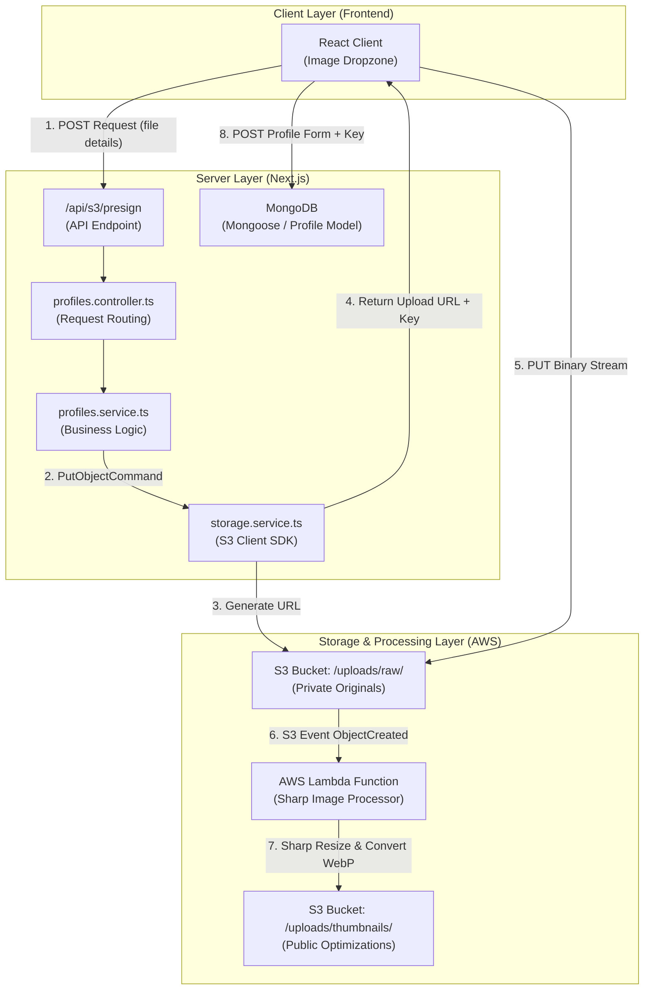
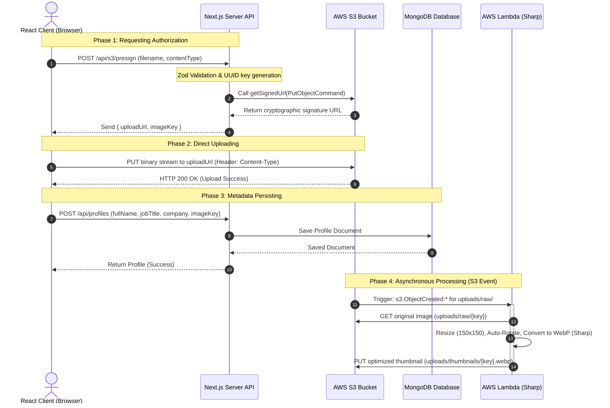
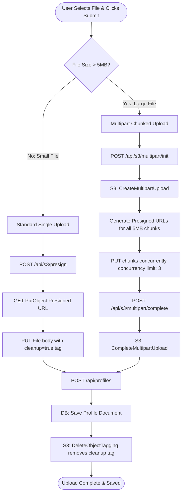

<style>
  code, pre, kbd, samp {
    font-family: ui-monospace, SFMono-Regular, "SF Mono", Menlo, Monaco, Consolas, "Liberation Mono", "Courier New", monospace !important;
  }
</style>

# 🚀 System Design Guide: Secure Client-Side Uploads using S3 Presigned URLs

This comprehensive guide details the design, implementation flow, security details, and optimization strategies for the **S3 Presigned URL Upload & Serverless Image Processing System** implemented in this project.

Whether you are a beginner looking to understand the fundamentals or an advanced engineer looking for optimization strategies, this document serves as a self-contained blueprint.

---

## <span style="color:#0f766e; background-color:#e6f4ea; padding: 4px 8px; border-radius: 4px; display: inline-block;">1. Core Architecture Design</span>

In a traditional upload flow, the client sends files directly to the web server, which then processes them and forwards them to storage. While simple, this creates bottlenecks in CPU, memory, and bandwidth.

Our architecture implements **Client-Side Direct Uploads via S3 Presigned URLs**, decoupled from database creation and processed asynchronously via **AWS Lambda**.

### System Architecture Flow Diagram



### Complete Sequence Diagram (Start-to-Finish Lifecycle)



---

## <span style="color:#b45309; background-color:#fffbeb; padding: 4px 8px; border-radius: 4px; display: inline-block;">2. Why & How: System Design Questions</span>

### <span style="color:#d97706">Q1: Why not upload files directly to the Next.js server first?</span>

1. **Serverless Execution Limits:** Most Next.js projects deploy to serverless environments (like Vercel). Serverless functions have strict execution duration limits (e.g., 10-15s for hobby tiers, up to 60s for pro tiers) and payload size limits (Vercel has a hard limit of **4.5 MB** on API request payloads). Large uploads will crash the serverless route.
2. **Server Thread Blocking & Memory Bloat:** Handling multipart form data consumes server memory, as the server must buffer file chunks to disk or RAM.
3. **Bandwidth Costs:** Paying twice for ingress bandwidth (Client $\rightarrow$ Server $\rightarrow$ S3) is costly. Direct uploading uploads once (Client $\rightarrow$ S3).

### <span style="color:#d97706">Q2: How does S3 verify the signature without calling our server?</span>

When the server generates the presigned URL, it uses the **AWS Signature Version 4 (SigV4)** protocol. It creates a cryptographic hash containing:

- The HTTP verb (`PUT`)
- The target bucket and object key
- Expiration time of the URL
- Date of generation
- Headers that must be present (e.g., `Content-Type`)

This data is signed using our private `AWS_SECRET_ACCESS_KEY`. When the client hits the URL, S3 uses its own knowledge of our secret key to recalculate the hash. If the hashes match and the timestamp has not expired, S3 grants write access.

### <span style="color:#d97706">Q3: Why use PUT instead of POST for presigned uploads?</span>

- **PUT:** Uploads a raw binary stream. The file is sent directly as the request body. It matches S3's standard `PutObject` API, requires very simple header configuration, and is easier to sign and manage.
- **POST:** Requires multipart form-data uploads (`POST` presigning is actually called **S3 Presigned Post**). While it allows enforcing maximum file size limits directly in the policy, it requires building complex HTML forms with specific input fields matching the policy keys.

### <span style="color:#d97706">Q4: How do we prevent users from modifying files after uploading?</span>

The profile image is never referenceable by the user's local name directly.

- We generate a secure `UUID` on the server: `uploads/raw/<uuid>-<sanitized_filename>`.
- The client cannot inject arbitrary S3 keys because S3 rejects the upload if the path does not exactly match the key signed in the URL.

---

## <span style="color:#4f46e5; background-color:#e0e7ff; padding: 4px 8px; border-radius: 4px; display: inline-block;">3. Folder Architecture & Layout</span>

To make this implementation completely portable, we structure the backend into decoupled domain directories:

```
src/
├── app/
│   └── api/
│       ├── s3/
│       │   └── presign/
│       │       └── route.ts         # Router endpoint (Next.js App Router)
│       └── profiles/
│           └── route.ts             # Metadata storage endpoint
├── modules/
│   ├── storage/
│   │   └── storage.service.ts       # Low-level AWS SDK wrapper (reusable)
│   └── profiles/
│       ├── profiles.controller.ts   # Next.js API Request/Response parser
│       ├── profiles.service.ts      # App business logic (links storage + repo)
│       ├── profiles.repository.ts   # Database CRUD operations
│       └── profiles.schema.ts       # Zod schemas for input validation
├── shared/
│   ├── env.ts                       # Environment variable parser
│   └── useProfileUpload.ts          # Frontend Custom React Hook
lambda/
└── thumbnail-generator/
    ├── index.mjs                    # Asynchronous image optimization Lambda
    └── SETUP.md                     # Lambda deploy instructions
```

---

## <span style="color:#c026d3; background-color:#fae8ff; padding: 4px 8px; border-radius: 4px; display: inline-block;">4. Code File Connection: Start-to-Finish</span>

Here is the exact code trace of the upload process.

### Step 1: The Request for Auth (Client)

The frontend triggers the file upload hook when a user submits a profile creation form.

```typescript
// Location: src/shared/useProfileUpload.ts
// Requesting a signed URL from the backend
const presignRes = await fetch("/api/s3/presign", {
  method: "POST",
  headers: { "Content-Type": "application/json" },
  body: JSON.stringify({
    filename: file.name,
    contentType: file.type,
    size: file.size,
  }),
});
const { uploadUrl, imageKey } = await presignRes.json();
```

---

### Step 2: Input Validation (Controller Layer)

The API route forwards the payload to the controller, which parses and validates parameters using Zod.

```typescript
// Location: src/modules/profiles/profiles.schema.ts
import { z } from "zod";

export const presignUploadSchema = z.object({
  filename: z.string().min(1).max(255),
  contentType: z.enum(["image/jpeg", "image/png", "image/webp"]),
  size: z.number().max(5 * 1024 * 1024), // 5MB limit
});

// Location: src/modules/profiles/profiles.controller.ts
export async function presignUpload(req: Request) {
  const parsed = presignUploadSchema.safeParse(await req.json());
  if (!parsed.success) return validationFail(parsed.error);

  const result = await ProfilesService.presignUpload(parsed.data);
  return NextResponse.json(result, { status: 201 });
}
```

---

### Step 3: URL Signer (Service & Storage Layer)

The service generates a unique S3 key using a UUID and asks the low-level `StorageService` to generate the URL with a **5-minute expiration time**.

```typescript
// Location: src/modules/profiles/profiles.service.ts
export const ProfilesService = {
  async presignUpload(data: PresignUploadDto) {
    // Sanitize filename to prevent directory traversal or invalid characters
    const imageKey = `uploads/raw/${randomUUID()}-${sanitizeFilename(data.filename)}`;
    const uploadUrl = await StorageService.createPutUrl({
      key: imageKey,
      contentType: data.contentType,
    });
    return { uploadUrl, imageKey };
  },
};

// Location: src/modules/storage/storage.service.ts
import { S3Client, PutObjectCommand } from "@aws-sdk/client-s3";
import { getSignedUrl } from "@aws-sdk/s3-request-presigner";

export const StorageService = {
  async createPutUrl(input: {
    key: string;
    contentType: string;
  }): Promise<string> {
    const s3Client = new S3Client({
      region: process.env.AWS_REGION,
      credentials: {
        accessKeyId: process.env.AWS_ACCESS_KEY_ID,
        secretAccessKey: process.env.AWS_SECRET_ACCESS_KEY,
      },
    });

    return getSignedUrl(
      s3Client,
      new PutObjectCommand({
        Bucket: process.env.S3_BUCKET_NAME,
        Key: input.key,
        ContentType: input.contentType,
      }),
      { expiresIn: 300 }, // URL expires in 300 seconds (5 minutes)
    );
  },
};
```

---

### Step 4: Direct S3 Upload (Client)

The client receives the `uploadUrl` and performs a raw `PUT` request to upload the image directly to AWS S3.

```typescript
// Location: src/shared/useProfileUpload.ts
const uploadRes = await fetch(uploadUrl, {
  method: "PUT",
  headers: { "Content-Type": file.type }, // Content-Type must match what was signed!
  body: file, // Raw binary body
});

if (!uploadRes.ok) throw new Error("S3 Upload failed");
```

---

### Step 5: Save Metadata to Database (Client & DB)

Once the upload finishes successfully, the client posts the form text fields alongside the `imageKey` to be saved in MongoDB.

```typescript
// Location: src/shared/useProfileUpload.ts
const profileRes = await fetch("/api/profiles", {
  method: "POST",
  headers: { "Content-Type": "application/json" },
  body: JSON.stringify({ ...form, imageKey }), // Send key, not the binary!
});
```

---

### Step 6: Background Image Optimization (AWS Lambda)

As soon as S3 confirms the object has been uploaded, S3 triggers the Lambda function to optimize the image asynchronously.

```javascript
// Location: lambda/thumbnail-generator/index.mjs
import {
  GetObjectCommand,
  PutObjectCommand,
  S3Client,
} from "@aws-sdk/client-s3";
import sharp from "sharp";

const s3 = new S3Client({});

export const handler = async (event) => {
  for (const record of event.Records) {
    const bucket = record.s3.bucket.name;
    const rawKey = decodeURIComponent(record.s3.object.key.replace(/\+/g, " "));

    // 1. Download original from S3
    const object = await s3.send(
      new GetObjectCommand({ Bucket: bucket, Key: rawKey }),
    );
    const sourceBuffer = await streamToBuffer(object.Body);

    // 2. Process image with Sharp
    const thumbnail = await sharp(sourceBuffer)
      .rotate() // Auto-orient based on EXIF orientation data
      .resize(150, 150, { fit: "cover", position: "attention" }) // Face-detect cropping
      .webp({ quality: 78 })
      .toBuffer();

    // 3. Save thumbnail back to S3
    const thumbnailKey =
      rawKey.replace("uploads/raw/", "uploads/thumbnails/") + ".webp";
    await s3.send(
      new PutObjectCommand({
        Bucket: bucket,
        Key: thumbnailKey,
        Body: thumbnail,
        ContentType: "image/webp",
        CacheControl: "public, max-age=31536000, immutable",
      }),
    );
  }
};
```

---

## <span style="color:#0284c7; background-color:#e0f2fe; padding: 4px 8px; border-radius: 4px; display: inline-block;">5. AWS Cloud Infrastructure Setup</span>

For this to work smoothly, you must configure **CORS** (Cross-Origin Resource Sharing) and **IAM Policies** correctly in AWS.

### 1. S3 Bucket CORS Policy

By default, browsers reject `PUT` requests to S3 due to CORS. You must add the following JSON policy under S3 Bucket $\rightarrow$ **Permissions** $\rightarrow$ **CORS configuration**:

```json
[
  {
    "AllowedHeaders": ["*"],
    "AllowedMethods": ["PUT", "GET", "HEAD"],
    "AllowedOrigins": ["http://localhost:3000", "https://yourdomain.com"],
    "ExposeHeaders": ["ETag"],
    "MaxAgeSeconds": 3000
  }
]
```

> [!WARNING]
> Ensure the S3 `AllowedHeaders` matches the headers you send in your browser's fetch call. If you pass tagging or metadata headers during the upload (such as `x-amz-tagging` or `x-amz-meta-*`), those headers must be explicitly added to `AllowedHeaders` or the pre-flight request will fail.

### 2. IAM Policy (Security Principle of Least Privilege)

The Next.js server credentials (`AWS_ACCESS_KEY_ID`) do not need full administrative permissions. Create an IAM policy with only the minimum required permissions (including tag removal):

```json
{
  "Version": "2012-10-17",
  "Statement": [
    {
      "Sid": "S3PresignedUploadPermissions",
      "Effect": "Allow",
      "Action": [
        "s3:PutObject",
        "s3:GetObject",
        "s3:HeadObject",
        "s3:DeleteObjectTagging"
      ],
      "Resource": "arn:aws:s3:::YOUR_BUCKET_NAME/uploads/*"
    }
  ]
}
```

---

## <span style="color:#a855f7; background-color:#f3e8ff; padding: 4px 8px; border-radius: 4px; display: inline-block;">5b. Unified S3 Upload Flow (Standard vs Multipart)</span>

To handle files of all sizes optimally, the application implements a unified direct-to-S3 upload mechanism. It dynamically selects between a **Standard Single Upload** and an **S3 Multipart Upload** based on the file size.

### Internal Upload Flow Diagram



### Flow Comparison

| Feature | ⚡ Standard Upload (≤ 5MB) | 🚀 Multipart Upload (> 5MB) |
| :--- | :--- | :--- |
| **Use Case** | Quick avatar uploads and small images. | Large high-res profiles, videos, or raw assets up to 200MB. |
| **API Endpoints** | `POST /api/s3/presign` | `POST /api/s3/multipart/init`<br>`POST /api/s3/multipart/complete` |
| **Concurrency** | 1 sequential request. | Up to 3 parallel chunk uploads (5MB slices) to maximize bandwidth. |
| **Fail Safety** | Connection drops abort the entire upload. | Slices are uploaded independently; retries apply at the chunk level. |
| **Orphaned Cleanup** | Object is tagged with `cleanup=true` at signing. | Upload is initiated with the `cleanup=true` object tag. |

### Code Snippet Reference

#### Client-side Selection (`src/shared/useProfileUpload.ts`)
```typescript
const CHUNK_SIZE = 5 * 1024 * 1024; // 5MB
const useMultipart = file.size > CHUNK_SIZE;

if (useMultipart) {
  // 1. Initiate Multipart
  const initRes = await fetch("/api/s3/multipart/init", { ... });
  const { uploadId, key, parts } = await initRes.json();

  // 2. Upload chunks in parallel (concurrency limit: 3)
  const completedParts = await uploadChunksConcurrently(file, parts, CHUNK_SIZE);

  // 3. Finalize on S3
  await fetch("/api/s3/multipart/complete", {
    body: JSON.stringify({ uploadId, key, parts: completedParts })
  });
} else {
  // Standard upload
  const presignRes = await fetch("/api/s3/presign", { ... });
  const { uploadUrl, imageKey } = await presignRes.json();
  await fetch(uploadUrl, { method: "PUT", body: file, headers: { "x-amz-tagging": "cleanup=true" } });
}
```

#### Server-side Tag Cleanup on Profile Save (`src/modules/profiles/profiles.service.ts`)
```typescript
async create(data: CreateProfileDto) {
  const profile = await ProfilesRepository.create(data);
  
  // Remove the cleanup tag so S3 lifecycle rule does not delete the original image
  StorageService.removeCleanupTag(data.imageKey).catch((err) => {
    console.warn(`[ProfilesService.create] Failed to remove S3 cleanup tag:`, err);
  });

  return profile;
}
```

---

## <span style="color:#16a34a; background-color:#dcfce7; padding: 4px 8px; border-radius: 4px; display: inline-block;">6. Advanced Optimizations & Alternative Designs</span>

| Feature / Scenario           | Approach                        | Why & Best Practice                                                                                                                                                                                                                                |
| :--------------------------- | :------------------------------ | :------------------------------------------------------------------------------------------------------------------------------------------------------------------------------------------------------------------------------------------------- |
| **Large Files (>100MB)**     | **S3 Multipart Uploads**        | Prevents connection drops from ruining the upload. The client requests multiple presigned URLs for different chunks, uploads them concurrently, and S3 stitches them together.                                                                     |
| **Global Distribution**      | **CloudFront CDN Integrations** | Serving raw assets directly from S3 can be slow and expensive. Pointing a CloudFront Distribution at the `/uploads/thumbnails/` path caches images at edge nodes, reducing latency and S3 egress costs.                                            |
| **Orphaned Uploads Cleanup** | **S3 Lifecycle Rules**          | Tag new S3 uploads with `cleanup=true`. When the profile is successfully saved, remove the tag. Configure an S3 Lifecycle Rule to automatically delete objects in `uploads/raw/` with the tag `cleanup=true` after 24 hours. |
| **Payload Integrity**        | **Content-MD5 validation**      | To guarantee S3 receives exactly what the browser sent, compute an MD5 hash of the file client-side, sign it into the URL, and force S3 to verify the upload hash matching S3's `ETag`.                                                            |

---

## <span style="color:#dc2626; background-color:#fee2e2; padding: 4px 8px; border-radius: 4px; display: inline-block;">7. Porting to Another Project (Checklist)</span>

To implement this design pattern in another project:

1. **Low-level Wrapper:** Copy the `storage.service.ts` helper and adapt the S3 client initialization.
2. **Environment Variables:** Define `AWS_ACCESS_KEY_ID`, `AWS_SECRET_ACCESS_KEY`, `AWS_REGION`, and `S3_BUCKET_NAME` in your `.env`.
3. **Zod Validation:** Implement incoming parameters validation (`filename`, `contentType`) to protect against endpoint flooding.
4. **CORS Configuration:** Configure S3 bucket CORS to allow HTTP `PUT` from your domains.
5. **Signed Headers:** Ensure headers passed in your client-side fetch `PUT` match **exactly** what you passed into the S3 SDK `PutObjectCommand` configuration during generation.
